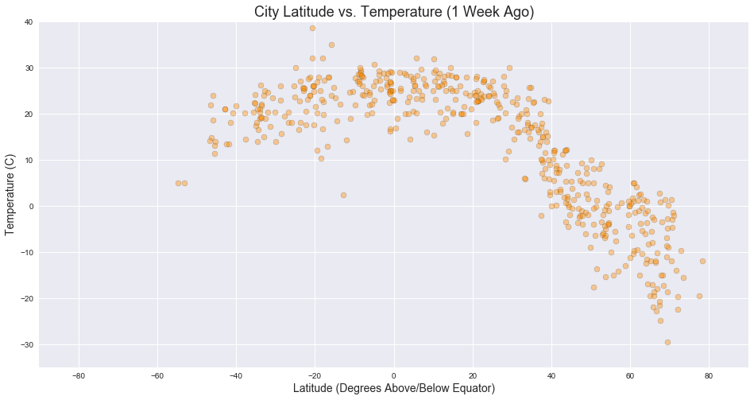
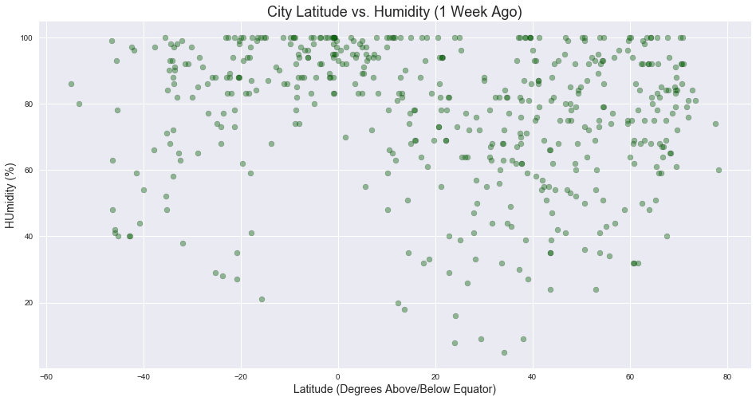

## WeatherPy

The objective of this exercise is to plot various weather characteristics of randomly selected cities against those cities' latitude in order to demonstrate whether proximity to the equator correlates with temperature, wind speed, humidity, and cloudiness.

Based on the data below, here are a few of the observable trends:

- There is a strong correlation between proximity to the equator and temperature.
- Points show much less association between other characteristics, like wind speed and humidity, and latitude. The points are much more evenly distributed, suggesting that the association between and proximity to the equator is is stronger than between proximity to the equator and other measurements.
- Cities South of the equator may be more likely to have a higher humidity regardless of proximity to the equator - there are more points with lower humidities north of the equator, according to the humidity plot.


```python
#Import a BUNCH of libraries and the API key for Open Weather Map API
import json
import os
import requests
import pandas as pd
import numpy as np
import random
import matplotlib.pyplot as plt
from citipy import citipy
from config import api_key
import time
import seaborn as sns
sns.set()

#Establish lists to store weather data
lat_list = []
temp_list = []
city_list = []
country_list = []
city_id_list = []
humidity_list = []
cloudiness_list = []
wind_speed_list = []
city_no_counter = 0

#Look back to one week ago, selecting a 24 hour period with start and end times
current_time = time.time()
pull_time_start = current_time - 691200
pull_time_end = current_time - 604800

#Specify font formatting for plots
plot_title_fonts = {'family':'sans-serif', 'size':18}
axis_label_fonts = {'family':'sans-serif', 'size':14}  
```


```python
#Create exception for duplicate entries to ensure unique entries and aid the script in dealing with duplicates

class Error(Exception):
   pass

class ValueNotUnique(Error):
   pass

```


```python
#Pull data! While loop ensures that the final set of city data includes the number of entries desired
while len(set(city_id_list)) < 500:
    try:
        current_lat = round(random.uniform(-90.0, 90.0), 6)
        current_lon = round(random.uniform(-180.0, 180), 6)
        current_city = citipy.nearest_city(current_lat, current_lon).city_name
        current_country = citipy.nearest_city(current_lat, current_lon).country_code
        query_url = f"http://api.openweathermap.org/data/2.5/weather?APPID={api_key}&units=imperial&q={current_city},{current_country}&type=hour&start={pull_time_start}&end={pull_time_end}"
        per_city_json = requests.get(query_url).json()
        #If there is no city ID, data is not qualified - skip entry
        if per_city_json['id']:
            #If the city ID already exists in the list, data is not qualified skip entry
            if per_city_json['id'] in set(city_id_list):
                #Let user know that the loop has been restarted
                print("City returned already exists in list - retrying a new entry.")
                raise ValueNotUnique
                break
            #If the city ID exists and is unique, add city data to city data lists    
            else:
                city_id_list.append(per_city_json['id'])
                lat_list.append(per_city_json['coord']['lat'])
                temp_list.append(per_city_json['main']['temp'])
                current_city = per_city_json['name']
                city_list.append(current_city)
                country_list.append(per_city_json['sys']['country'])
                humidity_list.append(per_city_json['main']['humidity'])
                cloudiness_list.append(per_city_json['clouds']['all'])
                wind_speed_list.append(per_city_json['wind']['speed'])
                city_no_counter = city_no_counter + 1
                #Print current status of data pull
                print(f"Currently processing city no. {city_no_counter}:\n{current_city}, {current_country}\nCity ID: {per_city_json['id']}\nRequest URL (minus API key): http://api.openweathermap.org/data/2.5/weather?APPID=SECRET&units=imperial&q={current_city},{current_country}&type=hour&start={pull_time_start}&end={pull_time_end}")
        #Determine whether or not an undesirable code has been returned - if so, pause data pull to prevent running
        #into caps
        else:
            cod = cod = per_city_json['cod']
            if cod != 200:
                time.sleep(60)
                #Let user know the script is on hold
                print('Waiting 1 minute before next API call.')
            else:
                print('No City ID returned - retrying a new entry.')
                pass
    #If there is an exception, restart while loop        
    except:
        pass


```

    Currently processing city no. 1:
    Kapaa, us
    City ID: 5848280
    Request URL (minus API key): http://api.openweathermap.org/data/2.5/weather?APPID=SECRET&units=imperial&q=Kapaa,us&type=hour&start=1521929489.4773319&end=1522015889.4773319
    Currently processing city no. 2:
    Laibin, cn
    City ID: 1804609
    Request URL (minus API key): http://api.openweathermap.org/data/2.5/weather?APPID=SECRET&units=imperial&q=Laibin,cn&type=hour&start=1521929489.4773319&end=1522015889.4773319
    Currently processing city no. 3:
    Albany, au
    City ID: 2077963
    Request URL (minus API key): http://api.openweathermap.org/data/2.5/weather?APPID=SECRET&units=imperial&q=Albany,au&type=hour&start=1521929489.4773319&end=1522015889.4773319
    Currently processing city no. 4:
    Port Moresby, pg
    City ID: 2088122
    Request URL (minus API key): http://api.openweathermap.org/data/2.5/weather?APPID=SECRET&units=imperial&q=Port Moresby,pg&type=hour&start=1521929489.4773319&end=1522015889.4773319
    Currently processing city no. 5:
    Hithadhoo, mv
    City ID: 1282256
    Request URL (minus API key): http://api.openweathermap.org/data/2.5/weather?APPID=SECRET&units=imperial&q=Hithadhoo,mv&type=hour&start=1521929489.4773319&end=1522015889.4773319
    Currently processing city no. 6:
    New Norfolk, au
    City ID: 2155415
    Request URL (minus API key): http://api.openweathermap.org/data/2.5/weather?APPID=SECRET&units=imperial&q=New Norfolk,au&type=hour&start=1521929489.4773319&end=1522015889.4773319
    Currently processing city no. 7:
    Morrope, pe
    City ID: 3694586
    Request URL (minus API key): http://api.openweathermap.org/data/2.5/weather?APPID=SECRET&units=imperial&q=Morrope,pe&type=hour&start=1521929489.4773319&end=1522015889.4773319
    Currently processing city no. 8:
    Ushuaia, ar
    City ID: 3833367
    Request URL (minus API key): http://api.openweathermap.org/data/2.5/weather?APPID=SECRET&units=imperial&q=Ushuaia,ar&type=hour&start=1521929489.4773319&end=1522015889.4773319
    Currently processing city no. 9:
    Bluff, nz
    City ID: 2206939
    Request URL (minus API key): http://api.openweathermap.org/data/2.5/weather?APPID=SECRET&units=imperial&q=Bluff,nz&type=hour&start=1521929489.4773319&end=1522015889.4773319
    Currently processing city no. 10:
    Mayo, ca
    City ID: 6068416
    Request URL (minus API key): http://api.openweathermap.org/data/2.5/weather?APPID=SECRET&units=imperial&q=Mayo,ca&type=hour&start=1521929489.4773319&end=1522015889.4773319
    Currently processing city no. 11:
    Busselton, au
    City ID: 2075265
    Request URL (minus API key): http://api.openweathermap.org/data/2.5/weather?APPID=SECRET&units=imperial&q=Busselton,au&type=hour&start=1521929489.4773319&end=1522015889.4773319
    City returned already exists in list - retrying a new entry.
    Currently processing city no. 12:
    Mezen, ru
    City ID: 527321
    Request URL (minus API key): http://api.openweathermap.org/data/2.5/weather?APPID=SECRET&units=imperial&q=Mezen,ru&type=hour&start=1521929489.4773319&end=1522015889.4773319
    Currently processing city no. 13:
    Norman Wells, ca
    City ID: 6089245
    Request URL (minus API key): http://api.openweathermap.org/data/2.5/weather?APPID=SECRET&units=imperial&q=Norman Wells,ca&type=hour&start=1521929489.4773319&end=1522015889.4773319
    Currently processing city no. 14:
    Butaritari, ki
    City ID: 2110227
    Request URL (minus API key): http://api.openweathermap.org/data/2.5/weather?APPID=SECRET&units=imperial&q=Butaritari,ki&type=hour&start=1521929489.4773319&end=1522015889.4773319
    Currently processing city no. 15:
    Port Elizabeth, za
    City ID: 964420
    Request URL (minus API key): http://api.openweathermap.org/data/2.5/weather?APPID=SECRET&units=imperial&q=Port Elizabeth,za&type=hour&start=1521929489.4773319&end=1522015889.4773319
    Currently processing city no. 16:
    Saldanha, za
    City ID: 3361934
    Request URL (minus API key): http://api.openweathermap.org/data/2.5/weather?APPID=SECRET&units=imperial&q=Saldanha,za&type=hour&start=1521929489.4773319&end=1522015889.4773319
    City returned already exists in list - retrying a new entry.
    Currently processing city no. 17:
    Mount Isa, au
    City ID: 2065594
    Request URL (minus API key): http://api.openweathermap.org/data/2.5/weather?APPID=SECRET&units=imperial&q=Mount Isa,au&type=hour&start=1521929489.4773319&end=1522015889.4773319
    Currently processing city no. 18:
    Hobart, au
    City ID: 2163355
    Request URL (minus API key): http://api.openweathermap.org/data/2.5/weather?APPID=SECRET&units=imperial&q=Hobart,au&type=hour&start=1521929489.4773319&end=1522015889.4773319
    Currently processing city no. 19:
    Bardstown, us
    City ID: 4283133
    Request URL (minus API key): http://api.openweathermap.org/data/2.5/weather?APPID=SECRET&units=imperial&q=Bardstown,us&type=hour&start=1521929489.4773319&end=1522015889.4773319
    Currently processing city no. 20:
    Kahului, us
    City ID: 5847411
    Request URL (minus API key): http://api.openweathermap.org/data/2.5/weather?APPID=SECRET&units=imperial&q=Kahului,us&type=hour&start=1521929489.4773319&end=1522015889.4773319
    Currently processing city no. 21:
    Port Alfred, za
    City ID: 964432
    Request URL (minus API key): http://api.openweathermap.org/data/2.5/weather?APPID=SECRET&units=imperial&q=Port Alfred,za&type=hour&start=1521929489.4773319&end=1522015889.4773319
    Currently processing city no. 22:
    Katsuura, jp
    City ID: 1865309
    Request URL (minus API key): http://api.openweathermap.org/data/2.5/weather?APPID=SECRET&units=imperial&q=Katsuura,jp&type=hour&start=1521929489.4773319&end=1522015889.4773319
    Currently processing city no. 23:
    Thompson, ca
    City ID: 6165406
    Request URL (minus API key): http://api.openweathermap.org/data/2.5/weather?APPID=SECRET&units=imperial&q=Thompson,ca&type=hour&start=1521929489.4773319&end=1522015889.4773319
    City returned already exists in list - retrying a new entry.
    City returned already exists in list - retrying a new entry.
    Currently processing city no. 24:
    Bethel, us
    City ID: 5880568
    Request URL (minus API key): http://api.openweathermap.org/data/2.5/weather?APPID=SECRET&units=imperial&q=Bethel,us&type=hour&start=1521929489.4773319&end=1522015889.4773319
    Currently processing city no. 25:
    Minab, ir
    City ID: 123941
    Request URL (minus API key): http://api.openweathermap.org/data/2.5/weather?APPID=SECRET&units=imperial&q=Minab,ir&type=hour&start=1521929489.4773319&end=1522015889.4773319
    Currently processing city no. 26:
    Vaini, to
    City ID: 4032243
    Request URL (minus API key): http://api.openweathermap.org/data/2.5/weather?APPID=SECRET&units=imperial&q=Vaini,to&type=hour&start=1521929489.4773319&end=1522015889.4773319
    Currently processing city no. 27:
    Mar del Plata, ar
    City ID: 3863379
    Request URL (minus API key): http://api.openweathermap.org/data/2.5/weather?APPID=SECRET&units=imperial&q=Mar del Plata,ar&type=hour&start=1521929489.4773319&end=1522015889.4773319
    Currently processing city no. 28:
    Sao Gabriel da Cachoeira, br
    City ID: 3662342
    Request URL (minus API key): http://api.openweathermap.org/data/2.5/weather?APPID=SECRET&units=imperial&q=Sao Gabriel da Cachoeira,br&type=hour&start=1521929489.4773319&end=1522015889.4773319
    Currently processing city no. 29:
    Salalah, om
    City ID: 286621
    Request URL (minus API key): http://api.openweathermap.org/data/2.5/weather?APPID=SECRET&units=imperial&q=Salalah,om&type=hour&start=1521929489.4773319&end=1522015889.4773319
    City returned already exists in list - retrying a new entry.
    Currently processing city no. 30:
    Sao Joao da Barra, br
    City ID: 3448903
    Request URL (minus API key): http://api.openweathermap.org/data/2.5/weather?APPID=SECRET&units=imperial&q=Sao Joao da Barra,br&type=hour&start=1521929489.4773319&end=1522015889.4773319
    City returned already exists in list - retrying a new entry.
    Currently processing city no. 31:
    Cape Town, za
    City ID: 3369157
    Request URL (minus API key): http://api.openweathermap.org/data/2.5/weather?APPID=SECRET&units=imperial&q=Cape Town,za&type=hour&start=1521929489.4773319&end=1522015889.4773319
    Currently processing city no. 32:
    Camacha, pt
    City ID: 2270385
    Request URL (minus API key): http://api.openweathermap.org/data/2.5/weather?APPID=SECRET&units=imperial&q=Camacha,pt&type=hour&start=1521929489.4773319&end=1522015889.4773319
    Currently processing city no. 33:
    Rikitea, pf
    City ID: 4030556
    Request URL (minus API key): http://api.openweathermap.org/data/2.5/weather?APPID=SECRET&units=imperial&q=Rikitea,pf&type=hour&start=1521929489.4773319&end=1522015889.4773319
    City returned already exists in list - retrying a new entry.
    Currently processing city no. 34:
    Alpena, us
    City ID: 4984075
    Request URL (minus API key): http://api.openweathermap.org/data/2.5/weather?APPID=SECRET&units=imperial&q=Alpena,us&type=hour&start=1521929489.4773319&end=1522015889.4773319
    Currently processing city no. 35:
    Paamiut, gl
    City ID: 3421193
    Request URL (minus API key): http://api.openweathermap.org/data/2.5/weather?APPID=SECRET&units=imperial&q=Paamiut,gl&type=hour&start=1521929489.4773319&end=1522015889.4773319
    Currently processing city no. 36:
    Teahupoo, pf
    City ID: 4033543
    Request URL (minus API key): http://api.openweathermap.org/data/2.5/weather?APPID=SECRET&units=imperial&q=Teahupoo,pf&type=hour&start=1521929489.4773319&end=1522015889.4773319
    City returned already exists in list - retrying a new entry.
    City returned already exists in list - retrying a new entry.
    Currently processing city no. 37:
    Lanigan, ca
    City ID: 6049515
    Request URL (minus API key): http://api.openweathermap.org/data/2.5/weather?APPID=SECRET&units=imperial&q=Lanigan,ca&type=hour&start=1521929489.4773319&end=1522015889.4773319
    City returned already exists in list - retrying a new entry.
    City returned already exists in list - retrying a new entry.
    City returned already exists in list - retrying a new entry.
    Currently processing city no. 38:
    Ulaanbaatar, mn
    City ID: 2028462
    Request URL (minus API key): http://api.openweathermap.org/data/2.5/weather?APPID=SECRET&units=imperial&q=Ulaanbaatar,mn&type=hour&start=1521929489.4773319&end=1522015889.4773319
    City returned already exists in list - retrying a new entry.
    City returned already exists in list - retrying a new entry.
    City returned already exists in list - retrying a new entry.
    Currently processing city no. 39:
    Morehead, pg
    City ID: 2090495
    Request URL (minus API key): http://api.openweathermap.org/data/2.5/weather?APPID=SECRET&units=imperial&q=Morehead,pg&type=hour&start=1521929489.4773319&end=1522015889.4773319
    City returned already exists in list - retrying a new entry.
    City returned already exists in list - retrying a new entry.
    City returned already exists in list - retrying a new entry.
    Currently processing city no. 40:
    Qaanaaq, gl
    City ID: 3831208
    Request URL (minus API key): http://api.openweathermap.org/data/2.5/weather?APPID=SECRET&units=imperial&q=Qaanaaq,gl&type=hour&start=1521929489.4773319&end=1522015889.4773319
    Currently processing city no. 41:
    Hermanus, za
    City ID: 3366880
    Request URL (minus API key): http://api.openweathermap.org/data/2.5/weather?APPID=SECRET&units=imperial&q=Hermanus,za&type=hour&start=1521929489.4773319&end=1522015889.4773319
    Currently processing city no. 42:
    Avarua, ck
    City ID: 4035715
    Request URL (minus API key): http://api.openweathermap.org/data/2.5/weather?APPID=SECRET&units=imperial&q=Avarua,ck&type=hour&start=1521929489.4773319&end=1522015889.4773319
    Currently processing city no. 43:
    Porto Tolle, it
    City ID: 3170070
    Request URL (minus API key): http://api.openweathermap.org/data/2.5/weather?APPID=SECRET&units=imperial&q=Porto Tolle,it&type=hour&start=1521929489.4773319&end=1522015889.4773319
    Currently processing city no. 44:
    Aljezur, pt
    City ID: 2271968
    Request URL (minus API key): http://api.openweathermap.org/data/2.5/weather?APPID=SECRET&units=imperial&q=Aljezur,pt&type=hour&start=1521929489.4773319&end=1522015889.4773319
    Currently processing city no. 45:
    Padang, id
    City ID: 1633419
    Request URL (minus API key): http://api.openweathermap.org/data/2.5/weather?APPID=SECRET&units=imperial&q=Padang,id&type=hour&start=1521929489.4773319&end=1522015889.4773319
    City returned already exists in list - retrying a new entry.
    City returned already exists in list - retrying a new entry.
    Currently processing city no. 46:
    Waipawa, nz
    City ID: 2185329
    Request URL (minus API key): http://api.openweathermap.org/data/2.5/weather?APPID=SECRET&units=imperial&q=Waipawa,nz&type=hour&start=1521929489.4773319&end=1522015889.4773319
    City returned already exists in list - retrying a new entry.
    Currently processing city no. 47:
    Saskylakh, ru
    City ID: 2017155
    Request URL (minus API key): http://api.openweathermap.org/data/2.5/weather?APPID=SECRET&units=imperial&q=Saskylakh,ru&type=hour&start=1521929489.4773319&end=1522015889.4773319
    Currently processing city no. 48:
    Comodoro Rivadavia, ar
    City ID: 3860443
    Request URL (minus API key): http://api.openweathermap.org/data/2.5/weather?APPID=SECRET&units=imperial&q=Comodoro Rivadavia,ar&type=hour&start=1521929489.4773319&end=1522015889.4773319
    City returned already exists in list - retrying a new entry.
    Currently processing city no. 49:
    Saquena, pe
    City ID: 3692020
    Request URL (minus API key): http://api.openweathermap.org/data/2.5/weather?APPID=SECRET&units=imperial&q=Saquena,pe&type=hour&start=1521929489.4773319&end=1522015889.4773319
    Currently processing city no. 50:
    Punta Arenas, cl
    City ID: 3874787
    Request URL (minus API key): http://api.openweathermap.org/data/2.5/weather?APPID=SECRET&units=imperial&q=Punta Arenas,cl&type=hour&start=1521929489.4773319&end=1522015889.4773319
    Currently processing city no. 51:
    Atuona, pf
    City ID: 4020109
    Request URL (minus API key): http://api.openweathermap.org/data/2.5/weather?APPID=SECRET&units=imperial&q=Atuona,pf&type=hour&start=1521929489.4773319&end=1522015889.4773319
    Currently processing city no. 52:
    Kermen, bg
    City ID: 730478
    Request URL (minus API key): http://api.openweathermap.org/data/2.5/weather?APPID=SECRET&units=imperial&q=Kermen,bg&type=hour&start=1521929489.4773319&end=1522015889.4773319
    City returned already exists in list - retrying a new entry.
    City returned already exists in list - retrying a new entry.
    City returned already exists in list - retrying a new entry.
    Currently processing city no. 53:
    Buala, sb
    City ID: 2109528
    Request URL (minus API key): http://api.openweathermap.org/data/2.5/weather?APPID=SECRET&units=imperial&q=Buala,sb&type=hour&start=1521929489.4773319&end=1522015889.4773319
    Currently processing city no. 54:
    Mushie, cd
    City ID: 2312249
    Request URL (minus API key): http://api.openweathermap.org/data/2.5/weather?APPID=SECRET&units=imperial&q=Mushie,cd&type=hour&start=1521929489.4773319&end=1522015889.4773319
    City returned already exists in list - retrying a new entry.
    City returned already exists in list - retrying a new entry.
    Currently processing city no. 55:
    Yangjiang, cn
    City ID: 1806408
    Request URL (minus API key): http://api.openweathermap.org/data/2.5/weather?APPID=SECRET&units=imperial&q=Yangjiang,cn&type=hour&start=1521929489.4773319&end=1522015889.4773319
    Currently processing city no. 56:
    Castro, cl
    City ID: 3896218
    Request URL (minus API key): http://api.openweathermap.org/data/2.5/weather?APPID=SECRET&units=imperial&q=Castro,cl&type=hour&start=1521929489.4773319&end=1522015889.4773319
    Currently processing city no. 57:
    Dikson, ru
    City ID: 1507390
    Request URL (minus API key): http://api.openweathermap.org/data/2.5/weather?APPID=SECRET&units=imperial&q=Dikson,ru&type=hour&start=1521929489.4773319&end=1522015889.4773319
    City returned already exists in list - retrying a new entry.
    City returned already exists in list - retrying a new entry.
    Currently processing city no. 58:
    Caravelas, br
    City ID: 3466980
    Request URL (minus API key): http://api.openweathermap.org/data/2.5/weather?APPID=SECRET&units=imperial&q=Caravelas,br&type=hour&start=1521929489.4773319&end=1522015889.4773319
    Currently processing city no. 59:
    Port Keats, au
    City ID: 2063039
    Request URL (minus API key): http://api.openweathermap.org/data/2.5/weather?APPID=SECRET&units=imperial&q=Port Keats,au&type=hour&start=1521929489.4773319&end=1522015889.4773319
    City returned already exists in list - retrying a new entry.
    Currently processing city no. 60:
    Diamantino, br
    City ID: 3464724
    Request URL (minus API key): http://api.openweathermap.org/data/2.5/weather?APPID=SECRET&units=imperial&q=Diamantino,br&type=hour&start=1521929489.4773319&end=1522015889.4773319
    Currently processing city no. 61:
    Axim, gh
    City ID: 2303611
    Request URL (minus API key): http://api.openweathermap.org/data/2.5/weather?APPID=SECRET&units=imperial&q=Axim,gh&type=hour&start=1521929489.4773319&end=1522015889.4773319
    Currently processing city no. 62:
    Kodiak, us
    City ID: 4407665
    Request URL (minus API key): http://api.openweathermap.org/data/2.5/weather?APPID=SECRET&units=imperial&q=Kodiak,us&type=hour&start=1521929489.4773319&end=1522015889.4773319
    Currently processing city no. 63:
    Severo-Kurilsk, ru
    City ID: 2121385
    Request URL (minus API key): http://api.openweathermap.org/data/2.5/weather?APPID=SECRET&units=imperial&q=Severo-Kurilsk,ru&type=hour&start=1521929489.4773319&end=1522015889.4773319
    Currently processing city no. 64:
    Bredasdorp, za
    City ID: 1015776
    Request URL (minus API key): http://api.openweathermap.org/data/2.5/weather?APPID=SECRET&units=imperial&q=Bredasdorp,za&type=hour&start=1521929489.4773319&end=1522015889.4773319
    City returned already exists in list - retrying a new entry.
    Currently processing city no. 65:
    Fortuna, us
    City ID: 5563839
    Request URL (minus API key): http://api.openweathermap.org/data/2.5/weather?APPID=SECRET&units=imperial&q=Fortuna,us&type=hour&start=1521929489.4773319&end=1522015889.4773319
    Currently processing city no. 66:
    Georgetown, sh
    City ID: 2411397
    Request URL (minus API key): http://api.openweathermap.org/data/2.5/weather?APPID=SECRET&units=imperial&q=Georgetown,sh&type=hour&start=1521929489.4773319&end=1522015889.4773319
    City returned already exists in list - retrying a new entry.
    Currently processing city no. 67:
    Ushtobe, kz
    City ID: 1517637
    Request URL (minus API key): http://api.openweathermap.org/data/2.5/weather?APPID=SECRET&units=imperial&q=Ushtobe,kz&type=hour&start=1521929489.4773319&end=1522015889.4773319
    Currently processing city no. 68:
    Cayenne, gf
    City ID: 3382160
    Request URL (minus API key): http://api.openweathermap.org/data/2.5/weather?APPID=SECRET&units=imperial&q=Cayenne,gf&type=hour&start=1521929489.4773319&end=1522015889.4773319
    Currently processing city no. 69:
    Leningradskiy, ru
    City ID: 2123814
    Request URL (minus API key): http://api.openweathermap.org/data/2.5/weather?APPID=SECRET&units=imperial&q=Leningradskiy,ru&type=hour&start=1521929489.4773319&end=1522015889.4773319
    Currently processing city no. 70:
    Westport, nz
    City ID: 2206900
    Request URL (minus API key): http://api.openweathermap.org/data/2.5/weather?APPID=SECRET&units=imperial&q=Westport,nz&type=hour&start=1521929489.4773319&end=1522015889.4773319
    Currently processing city no. 71:
    Riyadh, sa
    City ID: 108410
    Request URL (minus API key): http://api.openweathermap.org/data/2.5/weather?APPID=SECRET&units=imperial&q=Riyadh,sa&type=hour&start=1521929489.4773319&end=1522015889.4773319
    Currently processing city no. 72:
    Ribeira Grande, pt
    City ID: 3372707
    Request URL (minus API key): http://api.openweathermap.org/data/2.5/weather?APPID=SECRET&units=imperial&q=Ribeira Grande,pt&type=hour&start=1521929489.4773319&end=1522015889.4773319
    City returned already exists in list - retrying a new entry.
    City returned already exists in list - retrying a new entry.
    Currently processing city no. 73:
    Yerbogachen, ru
    City ID: 2012956
    Request URL (minus API key): http://api.openweathermap.org/data/2.5/weather?APPID=SECRET&units=imperial&q=Yerbogachen,ru&type=hour&start=1521929489.4773319&end=1522015889.4773319
    City returned already exists in list - retrying a new entry.
    Currently processing city no. 74:
    Pangnirtung, ca
    City ID: 6096551
    Request URL (minus API key): http://api.openweathermap.org/data/2.5/weather?APPID=SECRET&units=imperial&q=Pangnirtung,ca&type=hour&start=1521929489.4773319&end=1522015889.4773319
    City returned already exists in list - retrying a new entry.
    Currently processing city no. 75:
    Antsohihy, mg
    City ID: 1068971
    Request URL (minus API key): http://api.openweathermap.org/data/2.5/weather?APPID=SECRET&units=imperial&q=Antsohihy,mg&type=hour&start=1521929489.4773319&end=1522015889.4773319
    Currently processing city no. 76:
    Victoria, sc
    City ID: 241131
    Request URL (minus API key): http://api.openweathermap.org/data/2.5/weather?APPID=SECRET&units=imperial&q=Victoria,sc&type=hour&start=1521929489.4773319&end=1522015889.4773319
    Currently processing city no. 77:
    Dukat, ru
    City ID: 2125906
    Request URL (minus API key): http://api.openweathermap.org/data/2.5/weather?APPID=SECRET&units=imperial&q=Dukat,ru&type=hour&start=1521929489.4773319&end=1522015889.4773319
    City returned already exists in list - retrying a new entry.
    City returned already exists in list - retrying a new entry.
    City returned already exists in list - retrying a new entry.
    City returned already exists in list - retrying a new entry.
    Currently processing city no. 78:
    Aklavik, ca
    City ID: 5882953
    Request URL (minus API key): http://api.openweathermap.org/data/2.5/weather?APPID=SECRET&units=imperial&q=Aklavik,ca&type=hour&start=1521929489.4773319&end=1522015889.4773319
    City returned already exists in list - retrying a new entry.
    City returned already exists in list - retrying a new entry.
    Currently processing city no. 79:
    Sorland, no
    City ID: 3137469
    Request URL (minus API key): http://api.openweathermap.org/data/2.5/weather?APPID=SECRET&units=imperial&q=Sorland,no&type=hour&start=1521929489.4773319&end=1522015889.4773319
    Currently processing city no. 80:
    Aykhal, ru
    City ID: 2027296
    Request URL (minus API key): http://api.openweathermap.org/data/2.5/weather?APPID=SECRET&units=imperial&q=Aykhal,ru&type=hour&start=1521929489.4773319&end=1522015889.4773319
    City returned already exists in list - retrying a new entry.
    City returned already exists in list - retrying a new entry.
    Currently processing city no. 81:
    Tuktoyaktuk, ca
    City ID: 6170031
    Request URL (minus API key): http://api.openweathermap.org/data/2.5/weather?APPID=SECRET&units=imperial&q=Tuktoyaktuk,ca&type=hour&start=1521929489.4773319&end=1522015889.4773319
    Currently processing city no. 82:
    Grindavik, is
    City ID: 3416888
    Request URL (minus API key): http://api.openweathermap.org/data/2.5/weather?APPID=SECRET&units=imperial&q=Grindavik,is&type=hour&start=1521929489.4773319&end=1522015889.4773319
    Currently processing city no. 83:
    Chapais, ca
    City ID: 5919850
    Request URL (minus API key): http://api.openweathermap.org/data/2.5/weather?APPID=SECRET&units=imperial&q=Chapais,ca&type=hour&start=1521929489.4773319&end=1522015889.4773319
    Currently processing city no. 84:
    Tonantins, br
    City ID: 3661894
    Request URL (minus API key): http://api.openweathermap.org/data/2.5/weather?APPID=SECRET&units=imperial&q=Tonantins,br&type=hour&start=1521929489.4773319&end=1522015889.4773319
    City returned already exists in list - retrying a new entry.
    Currently processing city no. 85:
    Pisco, pe
    City ID: 3932145
    Request URL (minus API key): http://api.openweathermap.org/data/2.5/weather?APPID=SECRET&units=imperial&q=Pisco,pe&type=hour&start=1521929489.4773319&end=1522015889.4773319
    City returned already exists in list - retrying a new entry.
    City returned already exists in list - retrying a new entry.
    Currently processing city no. 86:
    Cherskiy, ru
    City ID: 2126199
    Request URL (minus API key): http://api.openweathermap.org/data/2.5/weather?APPID=SECRET&units=imperial&q=Cherskiy,ru&type=hour&start=1521929489.4773319&end=1522015889.4773319
    City returned already exists in list - retrying a new entry.
    City returned already exists in list - retrying a new entry.
    Currently processing city no. 87:
    Outjo, na
    City ID: 3353715
    Request URL (minus API key): http://api.openweathermap.org/data/2.5/weather?APPID=SECRET&units=imperial&q=Outjo,na&type=hour&start=1521929489.4773319&end=1522015889.4773319
    City returned already exists in list - retrying a new entry.
    City returned already exists in list - retrying a new entry.
    Currently processing city no. 88:
    Pevek, ru
    City ID: 2122090
    Request URL (minus API key): http://api.openweathermap.org/data/2.5/weather?APPID=SECRET&units=imperial&q=Pevek,ru&type=hour&start=1521929489.4773319&end=1522015889.4773319
    City returned already exists in list - retrying a new entry.
    City returned already exists in list - retrying a new entry.
    City returned already exists in list - retrying a new entry.
    City returned already exists in list - retrying a new entry.
    Currently processing city no. 89:
    Margate, za
    City ID: 978895
    Request URL (minus API key): http://api.openweathermap.org/data/2.5/weather?APPID=SECRET&units=imperial&q=Margate,za&type=hour&start=1521929489.4773319&end=1522015889.4773319
    Currently processing city no. 90:
    Hilo, us
    City ID: 5855927
    Request URL (minus API key): http://api.openweathermap.org/data/2.5/weather?APPID=SECRET&units=imperial&q=Hilo,us&type=hour&start=1521929489.4773319&end=1522015889.4773319
    Currently processing city no. 91:
    Palmer, us
    City ID: 5871146
    Request URL (minus API key): http://api.openweathermap.org/data/2.5/weather?APPID=SECRET&units=imperial&q=Palmer,us&type=hour&start=1521929489.4773319&end=1522015889.4773319
    Currently processing city no. 92:
    Ahipara, nz
    City ID: 2194098
    Request URL (minus API key): http://api.openweathermap.org/data/2.5/weather?APPID=SECRET&units=imperial&q=Ahipara,nz&type=hour&start=1521929489.4773319&end=1522015889.4773319
    City returned already exists in list - retrying a new entry.
    Currently processing city no. 93:
    Caohai, cn
    City ID: 1816028
    Request URL (minus API key): http://api.openweathermap.org/data/2.5/weather?APPID=SECRET&units=imperial&q=Caohai,cn&type=hour&start=1521929489.4773319&end=1522015889.4773319
    City returned already exists in list - retrying a new entry.
    Currently processing city no. 94:
    Henties Bay, na
    City ID: 3356832
    Request URL (minus API key): http://api.openweathermap.org/data/2.5/weather?APPID=SECRET&units=imperial&q=Henties Bay,na&type=hour&start=1521929489.4773319&end=1522015889.4773319
    City returned already exists in list - retrying a new entry.
    Currently processing city no. 95:
    Isangel, vu
    City ID: 2136825
    Request URL (minus API key): http://api.openweathermap.org/data/2.5/weather?APPID=SECRET&units=imperial&q=Isangel,vu&type=hour&start=1521929489.4773319&end=1522015889.4773319
    Currently processing city no. 96:
    Bambous Virieux, mu
    City ID: 1106677
    Request URL (minus API key): http://api.openweathermap.org/data/2.5/weather?APPID=SECRET&units=imperial&q=Bambous Virieux,mu&type=hour&start=1521929489.4773319&end=1522015889.4773319
    Currently processing city no. 97:
    Chuy, uy
    City ID: 3443061
    Request URL (minus API key): http://api.openweathermap.org/data/2.5/weather?APPID=SECRET&units=imperial&q=Chuy,uy&type=hour&start=1521929489.4773319&end=1522015889.4773319
    City returned already exists in list - retrying a new entry.
    Currently processing city no. 98:
    Khatanga, ru
    City ID: 2022572
    Request URL (minus API key): http://api.openweathermap.org/data/2.5/weather?APPID=SECRET&units=imperial&q=Khatanga,ru&type=hour&start=1521929489.4773319&end=1522015889.4773319
    City returned already exists in list - retrying a new entry.
    City returned already exists in list - retrying a new entry.
    City returned already exists in list - retrying a new entry.
    City returned already exists in list - retrying a new entry.
    Currently processing city no. 99:
    Puerto Baquerizo Moreno, ec
    City ID: 3652758
    Request URL (minus API key): http://api.openweathermap.org/data/2.5/weather?APPID=SECRET&units=imperial&q=Puerto Baquerizo Moreno,ec&type=hour&start=1521929489.4773319&end=1522015889.4773319
    City returned already exists in list - retrying a new entry.
    Currently processing city no. 100:
    Lebu, cl
    City ID: 3883457
    Request URL (minus API key): http://api.openweathermap.org/data/2.5/weather?APPID=SECRET&units=imperial&q=Lebu,cl&type=hour&start=1521929489.4773319&end=1522015889.4773319
    City returned already exists in list - retrying a new entry.
    City returned already exists in list - retrying a new entry.
    Currently processing city no. 101:
    Ahuimanu, us
    City ID: 5856516
    Request URL (minus API key): http://api.openweathermap.org/data/2.5/weather?APPID=SECRET&units=imperial&q=Ahuimanu,us&type=hour&start=1521929489.4773319&end=1522015889.4773319
    City returned already exists in list - retrying a new entry.
    Currently processing city no. 102:
    Westerland, de
    City ID: 2810284
    Request URL (minus API key): http://api.openweathermap.org/data/2.5/weather?APPID=SECRET&units=imperial&q=Westerland,de&type=hour&start=1521929489.4773319&end=1522015889.4773319
    Currently processing city no. 103:
    Nikolskoye, ru
    City ID: 546105
    Request URL (minus API key): http://api.openweathermap.org/data/2.5/weather?APPID=SECRET&units=imperial&q=Nikolskoye,ru&type=hour&start=1521929489.4773319&end=1522015889.4773319
    City returned already exists in list - retrying a new entry.
    City returned already exists in list - retrying a new entry.
    City returned already exists in list - retrying a new entry.
    City returned already exists in list - retrying a new entry.
    City returned already exists in list - retrying a new entry.
    Currently processing city no. 104:
    Mahebourg, mu
    City ID: 934322
    Request URL (minus API key): http://api.openweathermap.org/data/2.5/weather?APPID=SECRET&units=imperial&q=Mahebourg,mu&type=hour&start=1521929489.4773319&end=1522015889.4773319
    Currently processing city no. 105:
    Saint-Philippe, re
    City ID: 935215
    Request URL (minus API key): http://api.openweathermap.org/data/2.5/weather?APPID=SECRET&units=imperial&q=Saint-Philippe,re&type=hour&start=1521929489.4773319&end=1522015889.4773319
    City returned already exists in list - retrying a new entry.
    Currently processing city no. 106:
    Kavieng, pg
    City ID: 2094342
    Request URL (minus API key): http://api.openweathermap.org/data/2.5/weather?APPID=SECRET&units=imperial&q=Kavieng,pg&type=hour&start=1521929489.4773319&end=1522015889.4773319
    City returned already exists in list - retrying a new entry.
    City returned already exists in list - retrying a new entry.
    City returned already exists in list - retrying a new entry.
    City returned already exists in list - retrying a new entry.
    City returned already exists in list - retrying a new entry.
    Currently processing city no. 107:
    Fort-Shevchenko, kz
    City ID: 609906
    Request URL (minus API key): http://api.openweathermap.org/data/2.5/weather?APPID=SECRET&units=imperial&q=Fort-Shevchenko,kz&type=hour&start=1521929489.4773319&end=1522015889.4773319
    Currently processing city no. 108:
    Guerrero Negro, mx
    City ID: 4021858
    Request URL (minus API key): http://api.openweathermap.org/data/2.5/weather?APPID=SECRET&units=imperial&q=Guerrero Negro,mx&type=hour&start=1521929489.4773319&end=1522015889.4773319
    City returned already exists in list - retrying a new entry.
    Currently processing city no. 109:
    Port Macquarie, au
    City ID: 2152659
    Request URL (minus API key): http://api.openweathermap.org/data/2.5/weather?APPID=SECRET&units=imperial&q=Port Macquarie,au&type=hour&start=1521929489.4773319&end=1522015889.4773319
    City returned already exists in list - retrying a new entry.
    City returned already exists in list - retrying a new entry.
    City returned already exists in list - retrying a new entry.
    City returned already exists in list - retrying a new entry.
    City returned already exists in list - retrying a new entry.
    Currently processing city no. 110:
    Vardo, no
    City ID: 777019
    Request URL (minus API key): http://api.openweathermap.org/data/2.5/weather?APPID=SECRET&units=imperial&q=Vardo,no&type=hour&start=1521929489.4773319&end=1522015889.4773319
    City returned already exists in list - retrying a new entry.
    Currently processing city no. 111:
    Barrow, us
    City ID: 4252975
    Request URL (minus API key): http://api.openweathermap.org/data/2.5/weather?APPID=SECRET&units=imperial&q=Barrow,us&type=hour&start=1521929489.4773319&end=1522015889.4773319
    City returned already exists in list - retrying a new entry.
    City returned already exists in list - retrying a new entry.
    Currently processing city no. 112:
    San Cristobal, ec
    City ID: 3652567
    Request URL (minus API key): http://api.openweathermap.org/data/2.5/weather?APPID=SECRET&units=imperial&q=San Cristobal,ec&type=hour&start=1521929489.4773319&end=1522015889.4773319
    Currently processing city no. 113:
    Nanortalik, gl
    City ID: 3421765
    Request URL (minus API key): http://api.openweathermap.org/data/2.5/weather?APPID=SECRET&units=imperial&q=Nanortalik,gl&type=hour&start=1521929489.4773319&end=1522015889.4773319
    City returned already exists in list - retrying a new entry.
    City returned already exists in list - retrying a new entry.
    City returned already exists in list - retrying a new entry.
    Currently processing city no. 114:
    Neiafu, to
    City ID: 4032420
    Request URL (minus API key): http://api.openweathermap.org/data/2.5/weather?APPID=SECRET&units=imperial&q=Neiafu,to&type=hour&start=1521929489.4773319&end=1522015889.4773319
    City returned already exists in list - retrying a new entry.
    Currently processing city no. 115:
    Souillac, mu
    City ID: 933995
    Request URL (minus API key): http://api.openweathermap.org/data/2.5/weather?APPID=SECRET&units=imperial&q=Souillac,mu&type=hour&start=1521929489.4773319&end=1522015889.4773319
    Currently processing city no. 116:
    Jamestown, sh
    City ID: 3370903
    Request URL (minus API key): http://api.openweathermap.org/data/2.5/weather?APPID=SECRET&units=imperial&q=Jamestown,sh&type=hour&start=1521929489.4773319&end=1522015889.4773319
    Currently processing city no. 117:
    Vila Franca do Campo, pt
    City ID: 3372472
    Request URL (minus API key): http://api.openweathermap.org/data/2.5/weather?APPID=SECRET&units=imperial&q=Vila Franca do Campo,pt&type=hour&start=1521929489.4773319&end=1522015889.4773319
    Currently processing city no. 118:
    Lazaro Cardenas, mx
    City ID: 3996234
    Request URL (minus API key): http://api.openweathermap.org/data/2.5/weather?APPID=SECRET&units=imperial&q=Lazaro Cardenas,mx&type=hour&start=1521929489.4773319&end=1522015889.4773319
    Currently processing city no. 119:
    Lisala, cd
    City ID: 211734
    Request URL (minus API key): http://api.openweathermap.org/data/2.5/weather?APPID=SECRET&units=imperial&q=Lisala,cd&type=hour&start=1521929489.4773319&end=1522015889.4773319
    Currently processing city no. 120:
    Barahona, do
    City ID: 3492985
    Request URL (minus API key): http://api.openweathermap.org/data/2.5/weather?APPID=SECRET&units=imperial&q=Barahona,do&type=hour&start=1521929489.4773319&end=1522015889.4773319
    Currently processing city no. 121:
    Hasaki, jp
    City ID: 2112802
    Request URL (minus API key): http://api.openweathermap.org/data/2.5/weather?APPID=SECRET&units=imperial&q=Hasaki,jp&type=hour&start=1521929489.4773319&end=1522015889.4773319
    City returned already exists in list - retrying a new entry.
    Currently processing city no. 122:
    Bulolo, pg
    City ID: 2098869
    Request URL (minus API key): http://api.openweathermap.org/data/2.5/weather?APPID=SECRET&units=imperial&q=Bulolo,pg&type=hour&start=1521929489.4773319&end=1522015889.4773319
    City returned already exists in list - retrying a new entry.
    City returned already exists in list - retrying a new entry.
    Currently processing city no. 123:
    Mitu, co
    City ID: 3674676
    Request URL (minus API key): http://api.openweathermap.org/data/2.5/weather?APPID=SECRET&units=imperial&q=Mitu,co&type=hour&start=1521929489.4773319&end=1522015889.4773319
    City returned already exists in list - retrying a new entry.
    Currently processing city no. 124:
    Marrakesh, ma
    City ID: 2542997
    Request URL (minus API key): http://api.openweathermap.org/data/2.5/weather?APPID=SECRET&units=imperial&q=Marrakesh,ma&type=hour&start=1521929489.4773319&end=1522015889.4773319
    Currently processing city no. 125:
    Faanui, pf
    City ID: 4034551
    Request URL (minus API key): http://api.openweathermap.org/data/2.5/weather?APPID=SECRET&units=imperial&q=Faanui,pf&type=hour&start=1521929489.4773319&end=1522015889.4773319
    City returned already exists in list - retrying a new entry.
    Currently processing city no. 126:
    Tomatlan, mx
    City ID: 3981391
    Request URL (minus API key): http://api.openweathermap.org/data/2.5/weather?APPID=SECRET&units=imperial&q=Tomatlan,mx&type=hour&start=1521929489.4773319&end=1522015889.4773319
    City returned already exists in list - retrying a new entry.
    City returned already exists in list - retrying a new entry.
    Currently processing city no. 127:
    Hami, cn
    City ID: 1529484
    Request URL (minus API key): http://api.openweathermap.org/data/2.5/weather?APPID=SECRET&units=imperial&q=Hami,cn&type=hour&start=1521929489.4773319&end=1522015889.4773319
    Currently processing city no. 128:
    Carnarvon, au
    City ID: 2074865
    Request URL (minus API key): http://api.openweathermap.org/data/2.5/weather?APPID=SECRET&units=imperial&q=Carnarvon,au&type=hour&start=1521929489.4773319&end=1522015889.4773319
    City returned already exists in list - retrying a new entry.
    City returned already exists in list - retrying a new entry.
    City returned already exists in list - retrying a new entry.
    City returned already exists in list - retrying a new entry.
    Currently processing city no. 129:
    Namibe, ao
    City ID: 3347019
    Request URL (minus API key): http://api.openweathermap.org/data/2.5/weather?APPID=SECRET&units=imperial&q=Namibe,ao&type=hour&start=1521929489.4773319&end=1522015889.4773319
    City returned already exists in list - retrying a new entry.
    Currently processing city no. 130:
    Vanimo, pg
    City ID: 2084442
    Request URL (minus API key): http://api.openweathermap.org/data/2.5/weather?APPID=SECRET&units=imperial&q=Vanimo,pg&type=hour&start=1521929489.4773319&end=1522015889.4773319
    Currently processing city no. 131:
    Flin Flon, ca
    City ID: 5954718
    Request URL (minus API key): http://api.openweathermap.org/data/2.5/weather?APPID=SECRET&units=imperial&q=Flin Flon,ca&type=hour&start=1521929489.4773319&end=1522015889.4773319
    City returned already exists in list - retrying a new entry.
    Currently processing city no. 132:
    Husavik, is
    City ID: 2629833
    Request URL (minus API key): http://api.openweathermap.org/data/2.5/weather?APPID=SECRET&units=imperial&q=Husavik,is&type=hour&start=1521929489.4773319&end=1522015889.4773319
    Currently processing city no. 133:
    Innisfail, au
    City ID: 2162683
    Request URL (minus API key): http://api.openweathermap.org/data/2.5/weather?APPID=SECRET&units=imperial&q=Innisfail,au&type=hour&start=1521929489.4773319&end=1522015889.4773319
    City returned already exists in list - retrying a new entry.
    Currently processing city no. 134:
    Pangody, ru
    City ID: 1495626
    Request URL (minus API key): http://api.openweathermap.org/data/2.5/weather?APPID=SECRET&units=imperial&q=Pangody,ru&type=hour&start=1521929489.4773319&end=1522015889.4773319
    Currently processing city no. 135:
    Salinas, ec
    City ID: 3655673
    Request URL (minus API key): http://api.openweathermap.org/data/2.5/weather?APPID=SECRET&units=imperial&q=Salinas,ec&type=hour&start=1521929489.4773319&end=1522015889.4773319
    Currently processing city no. 136:
    Launceston, au
    City ID: 2160517
    Request URL (minus API key): http://api.openweathermap.org/data/2.5/weather?APPID=SECRET&units=imperial&q=Launceston,au&type=hour&start=1521929489.4773319&end=1522015889.4773319
    Currently processing city no. 137:
    Yellowknife, ca
    City ID: 6185377
    Request URL (minus API key): http://api.openweathermap.org/data/2.5/weather?APPID=SECRET&units=imperial&q=Yellowknife,ca&type=hour&start=1521929489.4773319&end=1522015889.4773319
    Currently processing city no. 138:
    Burla, ru
    City ID: 1508636
    Request URL (minus API key): http://api.openweathermap.org/data/2.5/weather?APPID=SECRET&units=imperial&q=Burla,ru&type=hour&start=1521929489.4773319&end=1522015889.4773319
    City returned already exists in list - retrying a new entry.
    City returned already exists in list - retrying a new entry.
    Currently processing city no. 139:
    Bandarbeyla, so
    City ID: 64814
    Request URL (minus API key): http://api.openweathermap.org/data/2.5/weather?APPID=SECRET&units=imperial&q=Bandarbeyla,so&type=hour&start=1521929489.4773319&end=1522015889.4773319
    City returned already exists in list - retrying a new entry.
    City returned already exists in list - retrying a new entry.
    City returned already exists in list - retrying a new entry.
    Currently processing city no. 140:
    Puerto Ayora, ec
    City ID: 3652764
    Request URL (minus API key): http://api.openweathermap.org/data/2.5/weather?APPID=SECRET&units=imperial&q=Puerto Ayora,ec&type=hour&start=1521929489.4773319&end=1522015889.4773319
    City returned already exists in list - retrying a new entry.
    Currently processing city no. 141:
    Jieshi, cn
    City ID: 1805857
    Request URL (minus API key): http://api.openweathermap.org/data/2.5/weather?APPID=SECRET&units=imperial&q=Jieshi,cn&type=hour&start=1521929489.4773319&end=1522015889.4773319
    City returned already exists in list - retrying a new entry.
    Currently processing city no. 142:
    Saquarema, br
    City ID: 3448011
    Request URL (minus API key): http://api.openweathermap.org/data/2.5/weather?APPID=SECRET&units=imperial&q=Saquarema,br&type=hour&start=1521929489.4773319&end=1522015889.4773319
    Currently processing city no. 143:
    Stykkisholmur, is
    City ID: 3412888
    Request URL (minus API key): http://api.openweathermap.org/data/2.5/weather?APPID=SECRET&units=imperial&q=Stykkisholmur,is&type=hour&start=1521929489.4773319&end=1522015889.4773319
    City returned already exists in list - retrying a new entry.
    City returned already exists in list - retrying a new entry.
    Currently processing city no. 144:
    Zachary, us
    City ID: 4346788
    Request URL (minus API key): http://api.openweathermap.org/data/2.5/weather?APPID=SECRET&units=imperial&q=Zachary,us&type=hour&start=1521929489.4773319&end=1522015889.4773319
    City returned already exists in list - retrying a new entry.
    Currently processing city no. 145:
    Ancud, cl
    City ID: 3899695
    Request URL (minus API key): http://api.openweathermap.org/data/2.5/weather?APPID=SECRET&units=imperial&q=Ancud,cl&type=hour&start=1521929489.4773319&end=1522015889.4773319
    City returned already exists in list - retrying a new entry.
    City returned already exists in list - retrying a new entry.
    City returned already exists in list - retrying a new entry.
    Currently processing city no. 146:
    Pandan, ph
    City ID: 1695555
    Request URL (minus API key): http://api.openweathermap.org/data/2.5/weather?APPID=SECRET&units=imperial&q=Pandan,ph&type=hour&start=1521929489.4773319&end=1522015889.4773319
    City returned already exists in list - retrying a new entry.
    City returned already exists in list - retrying a new entry.
    City returned already exists in list - retrying a new entry.
    Currently processing city no. 147:
    Omsukchan, ru
    City ID: 2122493
    Request URL (minus API key): http://api.openweathermap.org/data/2.5/weather?APPID=SECRET&units=imperial&q=Omsukchan,ru&type=hour&start=1521929489.4773319&end=1522015889.4773319
    Currently processing city no. 148:
    Arraial do Cabo, br
    City ID: 3471451
    Request URL (minus API key): http://api.openweathermap.org/data/2.5/weather?APPID=SECRET&units=imperial&q=Arraial do Cabo,br&type=hour&start=1521929489.4773319&end=1522015889.4773319
    City returned already exists in list - retrying a new entry.
    Currently processing city no. 149:
    East London, za
    City ID: 1006984
    Request URL (minus API key): http://api.openweathermap.org/data/2.5/weather?APPID=SECRET&units=imperial&q=East London,za&type=hour&start=1521929489.4773319&end=1522015889.4773319
    Currently processing city no. 150:
    Tiksi, ru
    City ID: 2015306
    Request URL (minus API key): http://api.openweathermap.org/data/2.5/weather?APPID=SECRET&units=imperial&q=Tiksi,ru&type=hour&start=1521929489.4773319&end=1522015889.4773319
    Currently processing city no. 151:
    Luderitz, na
    City ID: 3355672
    Request URL (minus API key): http://api.openweathermap.org/data/2.5/weather?APPID=SECRET&units=imperial&q=Luderitz,na&type=hour&start=1521929489.4773319&end=1522015889.4773319
    Currently processing city no. 152:
    Dwarka, in
    City ID: 1273294
    Request URL (minus API key): http://api.openweathermap.org/data/2.5/weather?APPID=SECRET&units=imperial&q=Dwarka,in&type=hour&start=1521929489.4773319&end=1522015889.4773319
    City returned already exists in list - retrying a new entry.
    City returned already exists in list - retrying a new entry.
    City returned already exists in list - retrying a new entry.
    Currently processing city no. 153:
    Aksu, cn
    City ID: 1529660
    Request URL (minus API key): http://api.openweathermap.org/data/2.5/weather?APPID=SECRET&units=imperial&q=Aksu,cn&type=hour&start=1521929489.4773319&end=1522015889.4773319
    Currently processing city no. 154:
    Cidreira, br
    City ID: 3466165
    Request URL (minus API key): http://api.openweathermap.org/data/2.5/weather?APPID=SECRET&units=imperial&q=Cidreira,br&type=hour&start=1521929489.4773319&end=1522015889.4773319
    City returned already exists in list - retrying a new entry.
    City returned already exists in list - retrying a new entry.
    Currently processing city no. 155:
    Great Yarmouth, gb
    City ID: 2647984
    Request URL (minus API key): http://api.openweathermap.org/data/2.5/weather?APPID=SECRET&units=imperial&q=Great Yarmouth,gb&type=hour&start=1521929489.4773319&end=1522015889.4773319
    City returned already exists in list - retrying a new entry.
    City returned already exists in list - retrying a new entry.
    Currently processing city no. 156:
    Suzuka, jp
    City ID: 1851348
    Request URL (minus API key): http://api.openweathermap.org/data/2.5/weather?APPID=SECRET&units=imperial&q=Suzuka,jp&type=hour&start=1521929489.4773319&end=1522015889.4773319
    Currently processing city no. 157:
    Hofn, is
    City ID: 2630299
    Request URL (minus API key): http://api.openweathermap.org/data/2.5/weather?APPID=SECRET&units=imperial&q=Hofn,is&type=hour&start=1521929489.4773319&end=1522015889.4773319
    City returned already exists in list - retrying a new entry.
    City returned already exists in list - retrying a new entry.
    City returned already exists in list - retrying a new entry.
    Currently processing city no. 158:
    Isla Aguada, mx
    City ID: 3526766
    Request URL (minus API key): http://api.openweathermap.org/data/2.5/weather?APPID=SECRET&units=imperial&q=Isla Aguada,mx&type=hour&start=1521929489.4773319&end=1522015889.4773319
    Currently processing city no. 159:
    Tasiilaq, gl
    City ID: 3424607
    Request URL (minus API key): http://api.openweathermap.org/data/2.5/weather?APPID=SECRET&units=imperial&q=Tasiilaq,gl&type=hour&start=1521929489.4773319&end=1522015889.4773319
    City returned already exists in list - retrying a new entry.
    Currently processing city no. 160:
    Cabo San Lucas, mx
    City ID: 3985710
    Request URL (minus API key): http://api.openweathermap.org/data/2.5/weather?APPID=SECRET&units=imperial&q=Cabo San Lucas,mx&type=hour&start=1521929489.4773319&end=1522015889.4773319
    City returned already exists in list - retrying a new entry.
    Currently processing city no. 161:
    Uaua, br
    City ID: 3385883
    Request URL (minus API key): http://api.openweathermap.org/data/2.5/weather?APPID=SECRET&units=imperial&q=Uaua,br&type=hour&start=1521929489.4773319&end=1522015889.4773319
    City returned already exists in list - retrying a new entry.
    Currently processing city no. 162:
    Deputatskiy, ru
    City ID: 2028164
    Request URL (minus API key): http://api.openweathermap.org/data/2.5/weather?APPID=SECRET&units=imperial&q=Deputatskiy,ru&type=hour&start=1521929489.4773319&end=1522015889.4773319
    City returned already exists in list - retrying a new entry.
    City returned already exists in list - retrying a new entry.
    City returned already exists in list - retrying a new entry.
    City returned already exists in list - retrying a new entry.
    City returned already exists in list - retrying a new entry.
    Currently processing city no. 163:
    Kaseda, jp
    City ID: 1859964
    Request URL (minus API key): http://api.openweathermap.org/data/2.5/weather?APPID=SECRET&units=imperial&q=Kaseda,jp&type=hour&start=1521929489.4773319&end=1522015889.4773319
    City returned already exists in list - retrying a new entry.
    City returned already exists in list - retrying a new entry.
    Currently processing city no. 164:
    Eydhafushi, mv
    City ID: 1337606
    Request URL (minus API key): http://api.openweathermap.org/data/2.5/weather?APPID=SECRET&units=imperial&q=Eydhafushi,mv&type=hour&start=1521929489.4773319&end=1522015889.4773319
    City returned already exists in list - retrying a new entry.
    Currently processing city no. 165:
    Lethem, gy
    City ID: 3379316
    Request URL (minus API key): http://api.openweathermap.org/data/2.5/weather?APPID=SECRET&units=imperial&q=Lethem,gy&type=hour&start=1521929489.4773319&end=1522015889.4773319
    City returned already exists in list - retrying a new entry.
    City returned already exists in list - retrying a new entry.
    Currently processing city no. 166:
    Hambantota, lk
    City ID: 1244926
    Request URL (minus API key): http://api.openweathermap.org/data/2.5/weather?APPID=SECRET&units=imperial&q=Hambantota,lk&type=hour&start=1521929489.4773319&end=1522015889.4773319
    City returned already exists in list - retrying a new entry.
    Currently processing city no. 167:
    Chernyshevskiy, ru
    City ID: 2025456
    Request URL (minus API key): http://api.openweathermap.org/data/2.5/weather?APPID=SECRET&units=imperial&q=Chernyshevskiy,ru&type=hour&start=1521929489.4773319&end=1522015889.4773319
    City returned already exists in list - retrying a new entry.
    City returned already exists in list - retrying a new entry.
    Currently processing city no. 168:
    Wuwei, cn
    City ID: 1803936
    Request URL (minus API key): http://api.openweathermap.org/data/2.5/weather?APPID=SECRET&units=imperial&q=Wuwei,cn&type=hour&start=1521929489.4773319&end=1522015889.4773319
    Currently processing city no. 169:
    Borogontsy, ru
    City ID: 2026160
    Request URL (minus API key): http://api.openweathermap.org/data/2.5/weather?APPID=SECRET&units=imperial&q=Borogontsy,ru&type=hour&start=1521929489.4773319&end=1522015889.4773319
    City returned already exists in list - retrying a new entry.
    Currently processing city no. 170:
    Chalus, ir
    City ID: 139223
    Request URL (minus API key): http://api.openweathermap.org/data/2.5/weather?APPID=SECRET&units=imperial&q=Chalus,ir&type=hour&start=1521929489.4773319&end=1522015889.4773319
    Currently processing city no. 171:
    Lima, pe
    City ID: 3936456
    Request URL (minus API key): http://api.openweathermap.org/data/2.5/weather?APPID=SECRET&units=imperial&q=Lima,pe&type=hour&start=1521929489.4773319&end=1522015889.4773319
    Currently processing city no. 172:
    Port Blair, in
    City ID: 1259385
    Request URL (minus API key): http://api.openweathermap.org/data/2.5/weather?APPID=SECRET&units=imperial&q=Port Blair,in&type=hour&start=1521929489.4773319&end=1522015889.4773319
    City returned already exists in list - retrying a new entry.
    City returned already exists in list - retrying a new entry.
    Currently processing city no. 173:
    Beringovskiy, ru
    City ID: 2126710
    Request URL (minus API key): http://api.openweathermap.org/data/2.5/weather?APPID=SECRET&units=imperial&q=Beringovskiy,ru&type=hour&start=1521929489.4773319&end=1522015889.4773319
    City returned already exists in list - retrying a new entry.
    City returned already exists in list - retrying a new entry.
    City returned already exists in list - retrying a new entry.
    City returned already exists in list - retrying a new entry.
    Currently processing city no. 174:
    Portland, au
    City ID: 2152668
    Request URL (minus API key): http://api.openweathermap.org/data/2.5/weather?APPID=SECRET&units=imperial&q=Portland,au&type=hour&start=1521929489.4773319&end=1522015889.4773319
    City returned already exists in list - retrying a new entry.
    City returned already exists in list - retrying a new entry.
    Currently processing city no. 175:
    Kruisfontein, za
    City ID: 986717
    Request URL (minus API key): http://api.openweathermap.org/data/2.5/weather?APPID=SECRET&units=imperial&q=Kruisfontein,za&type=hour&start=1521929489.4773319&end=1522015889.4773319
    City returned already exists in list - retrying a new entry.
    Currently processing city no. 176:
    Ust-Karsk, ru
    City ID: 2013942
    Request URL (minus API key): http://api.openweathermap.org/data/2.5/weather?APPID=SECRET&units=imperial&q=Ust-Karsk,ru&type=hour&start=1521929489.4773319&end=1522015889.4773319
    Currently processing city no. 177:
    Sinjar, iq
    City ID: 448149
    Request URL (minus API key): http://api.openweathermap.org/data/2.5/weather?APPID=SECRET&units=imperial&q=Sinjar,iq&type=hour&start=1521929489.4773319&end=1522015889.4773319
    City returned already exists in list - retrying a new entry.
    Currently processing city no. 178:
    Gushikawa, jp
    City ID: 1863495
    Request URL (minus API key): http://api.openweathermap.org/data/2.5/weather?APPID=SECRET&units=imperial&q=Gushikawa,jp&type=hour&start=1521929489.4773319&end=1522015889.4773319
    City returned already exists in list - retrying a new entry.
    Currently processing city no. 179:
    Ekhabi, ru
    City ID: 2122614
    Request URL (minus API key): http://api.openweathermap.org/data/2.5/weather?APPID=SECRET&units=imperial&q=Ekhabi,ru&type=hour&start=1521929489.4773319&end=1522015889.4773319
    City returned already exists in list - retrying a new entry.
    City returned already exists in list - retrying a new entry.
    Currently processing city no. 180:
    Halifax, ca
    City ID: 6324729
    Request URL (minus API key): http://api.openweathermap.org/data/2.5/weather?APPID=SECRET&units=imperial&q=Halifax,ca&type=hour&start=1521929489.4773319&end=1522015889.4773319
    Currently processing city no. 181:
    Abu Dhabi, ae
    City ID: 292968
    Request URL (minus API key): http://api.openweathermap.org/data/2.5/weather?APPID=SECRET&units=imperial&q=Abu Dhabi,ae&type=hour&start=1521929489.4773319&end=1522015889.4773319
    City returned already exists in list - retrying a new entry.
    Currently processing city no. 182:
    Mathbaria, bd
    City ID: 1185239
    Request URL (minus API key): http://api.openweathermap.org/data/2.5/weather?APPID=SECRET&units=imperial&q=Mathbaria,bd&type=hour&start=1521929489.4773319&end=1522015889.4773319
    Currently processing city no. 183:
    Brae, gb
    City ID: 2654970
    Request URL (minus API key): http://api.openweathermap.org/data/2.5/weather?APPID=SECRET&units=imperial&q=Brae,gb&type=hour&start=1521929489.4773319&end=1522015889.4773319
    City returned already exists in list - retrying a new entry.
    Currently processing city no. 184:
    Verkh-Chebula, ru
    City ID: 1487599
    Request URL (minus API key): http://api.openweathermap.org/data/2.5/weather?APPID=SECRET&units=imperial&q=Verkh-Chebula,ru&type=hour&start=1521929489.4773319&end=1522015889.4773319
    Currently processing city no. 185:
    Parana, br
    City ID: 3663516
    Request URL (minus API key): http://api.openweathermap.org/data/2.5/weather?APPID=SECRET&units=imperial&q=Parana,br&type=hour&start=1521929489.4773319&end=1522015889.4773319
    City returned already exists in list - retrying a new entry.
    Currently processing city no. 186:
    Majengo, tz
    City ID: 152743
    Request URL (minus API key): http://api.openweathermap.org/data/2.5/weather?APPID=SECRET&units=imperial&q=Majengo,tz&type=hour&start=1521929489.4773319&end=1522015889.4773319
    Currently processing city no. 187:
    Kijang, id
    City ID: 1640044
    Request URL (minus API key): http://api.openweathermap.org/data/2.5/weather?APPID=SECRET&units=imperial&q=Kijang,id&type=hour&start=1521929489.4773319&end=1522015889.4773319
    Currently processing city no. 188:
    Paso de Carrasco, uy
    City ID: 3441292
    Request URL (minus API key): http://api.openweathermap.org/data/2.5/weather?APPID=SECRET&units=imperial&q=Paso de Carrasco,uy&type=hour&start=1521929489.4773319&end=1522015889.4773319
    Currently processing city no. 189:
    Sechura, pe
    City ID: 3691954
    Request URL (minus API key): http://api.openweathermap.org/data/2.5/weather?APPID=SECRET&units=imperial&q=Sechura,pe&type=hour&start=1521929489.4773319&end=1522015889.4773319
    Currently processing city no. 190:
    Soyo, ao
    City ID: 2236967
    Request URL (minus API key): http://api.openweathermap.org/data/2.5/weather?APPID=SECRET&units=imperial&q=Soyo,ao&type=hour&start=1521929489.4773319&end=1522015889.4773319
    City returned already exists in list - retrying a new entry.
    City returned already exists in list - retrying a new entry.
    City returned already exists in list - retrying a new entry.
    Currently processing city no. 191:
    Nyimba, zm
    City ID: 900056
    Request URL (minus API key): http://api.openweathermap.org/data/2.5/weather?APPID=SECRET&units=imperial&q=Nyimba,zm&type=hour&start=1521929489.4773319&end=1522015889.4773319
    Currently processing city no. 192:
    Beloha, mg
    City ID: 1067565
    Request URL (minus API key): http://api.openweathermap.org/data/2.5/weather?APPID=SECRET&units=imperial&q=Beloha,mg&type=hour&start=1521929489.4773319&end=1522015889.4773319
    City returned already exists in list - retrying a new entry.
    Currently processing city no. 193:
    Kamenka, ru
    City ID: 553725
    Request URL (minus API key): http://api.openweathermap.org/data/2.5/weather?APPID=SECRET&units=imperial&q=Kamenka,ru&type=hour&start=1521929489.4773319&end=1522015889.4773319
    Currently processing city no. 194:
    Zharkent, kz
    City ID: 1520253
    Request URL (minus API key): http://api.openweathermap.org/data/2.5/weather?APPID=SECRET&units=imperial&q=Zharkent,kz&type=hour&start=1521929489.4773319&end=1522015889.4773319
    Currently processing city no. 195:
    Upernavik, gl
    City ID: 3418910
    Request URL (minus API key): http://api.openweathermap.org/data/2.5/weather?APPID=SECRET&units=imperial&q=Upernavik,gl&type=hour&start=1521929489.4773319&end=1522015889.4773319
    Currently processing city no. 196:
    Iqaluit, ca
    City ID: 5983720
    Request URL (minus API key): http://api.openweathermap.org/data/2.5/weather?APPID=SECRET&units=imperial&q=Iqaluit,ca&type=hour&start=1521929489.4773319&end=1522015889.4773319
    City returned already exists in list - retrying a new entry.
    Currently processing city no. 197:
    Ostrovnoy, ru
    City ID: 556268
    Request URL (minus API key): http://api.openweathermap.org/data/2.5/weather?APPID=SECRET&units=imperial&q=Ostrovnoy,ru&type=hour&start=1521929489.4773319&end=1522015889.4773319
    City returned already exists in list - retrying a new entry.
    Currently processing city no. 198:
    Martinsville, us
    City ID: 4771808
    Request URL (minus API key): http://api.openweathermap.org/data/2.5/weather?APPID=SECRET&units=imperial&q=Martinsville,us&type=hour&start=1521929489.4773319&end=1522015889.4773319
    Currently processing city no. 199:
    Tungor, ru
    City ID: 2120400
    Request URL (minus API key): http://api.openweathermap.org/data/2.5/weather?APPID=SECRET&units=imperial&q=Tungor,ru&type=hour&start=1521929489.4773319&end=1522015889.4773319
    City returned already exists in list - retrying a new entry.
    Currently processing city no. 200:
    Amot, no
    City ID: 3163198
    Request URL (minus API key): http://api.openweathermap.org/data/2.5/weather?APPID=SECRET&units=imperial&q=Amot,no&type=hour&start=1521929489.4773319&end=1522015889.4773319
    City returned already exists in list - retrying a new entry.
    City returned already exists in list - retrying a new entry.
    City returned already exists in list - retrying a new entry.
    City returned already exists in list - retrying a new entry.
    Currently processing city no. 201:
    Bathsheba, bb
    City ID: 3374083
    Request URL (minus API key): http://api.openweathermap.org/data/2.5/weather?APPID=SECRET&units=imperial&q=Bathsheba,bb&type=hour&start=1521929489.4773319&end=1522015889.4773319
    City returned already exists in list - retrying a new entry.
    Currently processing city no. 202:
    Flinders, au
    City ID: 6255012
    Request URL (minus API key): http://api.openweathermap.org/data/2.5/weather?APPID=SECRET&units=imperial&q=Flinders,au&type=hour&start=1521929489.4773319&end=1522015889.4773319
    City returned already exists in list - retrying a new entry.
    City returned already exists in list - retrying a new entry.
    Currently processing city no. 203:
    Lompoc, us
    City ID: 5367788
    Request URL (minus API key): http://api.openweathermap.org/data/2.5/weather?APPID=SECRET&units=imperial&q=Lompoc,us&type=hour&start=1521929489.4773319&end=1522015889.4773319
    City returned already exists in list - retrying a new entry.
    Currently processing city no. 204:
    Stokmarknes, no
    City ID: 3136690
    Request URL (minus API key): http://api.openweathermap.org/data/2.5/weather?APPID=SECRET&units=imperial&q=Stokmarknes,no&type=hour&start=1521929489.4773319&end=1522015889.4773319
    City returned already exists in list - retrying a new entry.
    Currently processing city no. 205:
    Saint George, bm
    City ID: 3573061
    Request URL (minus API key): http://api.openweathermap.org/data/2.5/weather?APPID=SECRET&units=imperial&q=Saint George,bm&type=hour&start=1521929489.4773319&end=1522015889.4773319
    City returned already exists in list - retrying a new entry.
    City returned already exists in list - retrying a new entry.
    City returned already exists in list - retrying a new entry.
    Currently processing city no. 206:
    Zhigansk, ru
    City ID: 2012530
    Request URL (minus API key): http://api.openweathermap.org/data/2.5/weather?APPID=SECRET&units=imperial&q=Zhigansk,ru&type=hour&start=1521929489.4773319&end=1522015889.4773319
    City returned already exists in list - retrying a new entry.
    Currently processing city no. 207:
    Quarai, br
    City ID: 3452179
    Request URL (minus API key): http://api.openweathermap.org/data/2.5/weather?APPID=SECRET&units=imperial&q=Quarai,br&type=hour&start=1521929489.4773319&end=1522015889.4773319
    City returned already exists in list - retrying a new entry.
    City returned already exists in list - retrying a new entry.
    Currently processing city no. 208:
    Ostrowiec Swietokrzyski, pl
    City ID: 762863
    Request URL (minus API key): http://api.openweathermap.org/data/2.5/weather?APPID=SECRET&units=imperial&q=Ostrowiec Swietokrzyski,pl&type=hour&start=1521929489.4773319&end=1522015889.4773319
    Currently processing city no. 209:
    Shar, kz
    City ID: 1519275
    Request URL (minus API key): http://api.openweathermap.org/data/2.5/weather?APPID=SECRET&units=imperial&q=Shar,kz&type=hour&start=1521929489.4773319&end=1522015889.4773319
    City returned already exists in list - retrying a new entry.
    City returned already exists in list - retrying a new entry.
    City returned already exists in list - retrying a new entry.
    City returned already exists in list - retrying a new entry.
    City returned already exists in list - retrying a new entry.
    City returned already exists in list - retrying a new entry.
    City returned already exists in list - retrying a new entry.
    Currently processing city no. 210:
    Port Hardy, ca
    City ID: 6111862
    Request URL (minus API key): http://api.openweathermap.org/data/2.5/weather?APPID=SECRET&units=imperial&q=Port Hardy,ca&type=hour&start=1521929489.4773319&end=1522015889.4773319
    City returned already exists in list - retrying a new entry.
    City returned already exists in list - retrying a new entry.
    City returned already exists in list - retrying a new entry.
    City returned already exists in list - retrying a new entry.
    Currently processing city no. 211:
    Grand Gaube, mu
    City ID: 934479
    Request URL (minus API key): http://api.openweathermap.org/data/2.5/weather?APPID=SECRET&units=imperial&q=Grand Gaube,mu&type=hour&start=1521929489.4773319&end=1522015889.4773319
    City returned already exists in list - retrying a new entry.
    City returned already exists in list - retrying a new entry.
    City returned already exists in list - retrying a new entry.
    City returned already exists in list - retrying a new entry.
    Currently processing city no. 212:
    Dingle, ie
    City ID: 2964782
    Request URL (minus API key): http://api.openweathermap.org/data/2.5/weather?APPID=SECRET&units=imperial&q=Dingle,ie&type=hour&start=1521929489.4773319&end=1522015889.4773319
    Currently processing city no. 213:
    Necochea, ar
    City ID: 3430443
    Request URL (minus API key): http://api.openweathermap.org/data/2.5/weather?APPID=SECRET&units=imperial&q=Necochea,ar&type=hour&start=1521929489.4773319&end=1522015889.4773319
    City returned already exists in list - retrying a new entry.
    Currently processing city no. 214:
    Fort Nelson, ca
    City ID: 5955902
    Request URL (minus API key): http://api.openweathermap.org/data/2.5/weather?APPID=SECRET&units=imperial&q=Fort Nelson,ca&type=hour&start=1521929489.4773319&end=1522015889.4773319
    Currently processing city no. 215:
    Alyangula, au
    City ID: 2079582
    Request URL (minus API key): http://api.openweathermap.org/data/2.5/weather?APPID=SECRET&units=imperial&q=Alyangula,au&type=hour&start=1521929489.4773319&end=1522015889.4773319
    City returned already exists in list - retrying a new entry.
    Currently processing city no. 216:
    Saint-Augustin, ca
    City ID: 6138501
    Request URL (minus API key): http://api.openweathermap.org/data/2.5/weather?APPID=SECRET&units=imperial&q=Saint-Augustin,ca&type=hour&start=1521929489.4773319&end=1522015889.4773319
    City returned already exists in list - retrying a new entry.
    City returned already exists in list - retrying a new entry.
    City returned already exists in list - retrying a new entry.
    City returned already exists in list - retrying a new entry.
    Currently processing city no. 217:
    Provideniya, ru
    City ID: 4031574
    Request URL (minus API key): http://api.openweathermap.org/data/2.5/weather?APPID=SECRET&units=imperial&q=Provideniya,ru&type=hour&start=1521929489.4773319&end=1522015889.4773319
    Currently processing city no. 218:
    Marienburg, sr
    City ID: 3383570
    Request URL (minus API key): http://api.openweathermap.org/data/2.5/weather?APPID=SECRET&units=imperial&q=Marienburg,sr&type=hour&start=1521929489.4773319&end=1522015889.4773319
    City returned already exists in list - retrying a new entry.
    City returned already exists in list - retrying a new entry.
    Currently processing city no. 219:
    Hobyo, so
    City ID: 57000
    Request URL (minus API key): http://api.openweathermap.org/data/2.5/weather?APPID=SECRET&units=imperial&q=Hobyo,so&type=hour&start=1521929489.4773319&end=1522015889.4773319
    Currently processing city no. 220:
    Broken Hill, au
    City ID: 2173911
    Request URL (minus API key): http://api.openweathermap.org/data/2.5/weather?APPID=SECRET&units=imperial&q=Broken Hill,au&type=hour&start=1521929489.4773319&end=1522015889.4773319
    City returned already exists in list - retrying a new entry.
    Currently processing city no. 221:
    Crixas, br
    City ID: 3465145
    Request URL (minus API key): http://api.openweathermap.org/data/2.5/weather?APPID=SECRET&units=imperial&q=Crixas,br&type=hour&start=1521929489.4773319&end=1522015889.4773319
    City returned already exists in list - retrying a new entry.
    City returned already exists in list - retrying a new entry.
    City returned already exists in list - retrying a new entry.
    City returned already exists in list - retrying a new entry.
    Currently processing city no. 222:
    Miyazu, jp
    City ID: 1856703
    Request URL (minus API key): http://api.openweathermap.org/data/2.5/weather?APPID=SECRET&units=imperial&q=Miyazu,jp&type=hour&start=1521929489.4773319&end=1522015889.4773319
    City returned already exists in list - retrying a new entry.
    Currently processing city no. 223:
    Davila, ph
    City ID: 1715335
    Request URL (minus API key): http://api.openweathermap.org/data/2.5/weather?APPID=SECRET&units=imperial&q=Davila,ph&type=hour&start=1521929489.4773319&end=1522015889.4773319
    City returned already exists in list - retrying a new entry.
    City returned already exists in list - retrying a new entry.
    City returned already exists in list - retrying a new entry.
    Currently processing city no. 224:
    Linjiang, cn
    City ID: 2036069
    Request URL (minus API key): http://api.openweathermap.org/data/2.5/weather?APPID=SECRET&units=imperial&q=Linjiang,cn&type=hour&start=1521929489.4773319&end=1522015889.4773319
    City returned already exists in list - retrying a new entry.
    City returned already exists in list - retrying a new entry.
    City returned already exists in list - retrying a new entry.
    City returned already exists in list - retrying a new entry.
    City returned already exists in list - retrying a new entry.
    City returned already exists in list - retrying a new entry.
    City returned already exists in list - retrying a new entry.
    Currently processing city no. 225:
    Izumo, jp
    City ID: 1861084
    Request URL (minus API key): http://api.openweathermap.org/data/2.5/weather?APPID=SECRET&units=imperial&q=Izumo,jp&type=hour&start=1521929489.4773319&end=1522015889.4773319
    City returned already exists in list - retrying a new entry.
    City returned already exists in list - retrying a new entry.
    City returned already exists in list - retrying a new entry.
    Currently processing city no. 226:
    Taungdwingyi, mm
    City ID: 1294041
    Request URL (minus API key): http://api.openweathermap.org/data/2.5/weather?APPID=SECRET&units=imperial&q=Taungdwingyi,mm&type=hour&start=1521929489.4773319&end=1522015889.4773319
    Currently processing city no. 227:
    Sitka, us
    City ID: 4267710
    Request URL (minus API key): http://api.openweathermap.org/data/2.5/weather?APPID=SECRET&units=imperial&q=Sitka,us&type=hour&start=1521929489.4773319&end=1522015889.4773319
    City returned already exists in list - retrying a new entry.
    City returned already exists in list - retrying a new entry.
    City returned already exists in list - retrying a new entry.
    City returned already exists in list - retrying a new entry.
    Currently processing city no. 228:
    Kota Kinabalu, my
    City ID: 1733432
    Request URL (minus API key): http://api.openweathermap.org/data/2.5/weather?APPID=SECRET&units=imperial&q=Kota Kinabalu,my&type=hour&start=1521929489.4773319&end=1522015889.4773319
    City returned already exists in list - retrying a new entry.
    City returned already exists in list - retrying a new entry.
    City returned already exists in list - retrying a new entry.
    City returned already exists in list - retrying a new entry.
    City returned already exists in list - retrying a new entry.
    City returned already exists in list - retrying a new entry.
    City returned already exists in list - retrying a new entry.
    Currently processing city no. 229:
    Sao Filipe, cv
    City ID: 3374210
    Request URL (minus API key): http://api.openweathermap.org/data/2.5/weather?APPID=SECRET&units=imperial&q=Sao Filipe,cv&type=hour&start=1521929489.4773319&end=1522015889.4773319
    Currently processing city no. 230:
    Obihiro, jp
    City ID: 2128815
    Request URL (minus API key): http://api.openweathermap.org/data/2.5/weather?APPID=SECRET&units=imperial&q=Obihiro,jp&type=hour&start=1521929489.4773319&end=1522015889.4773319
    Currently processing city no. 231:
    Batagay-Alyta, ru
    City ID: 2027042
    Request URL (minus API key): http://api.openweathermap.org/data/2.5/weather?APPID=SECRET&units=imperial&q=Batagay-Alyta,ru&type=hour&start=1521929489.4773319&end=1522015889.4773319
    City returned already exists in list - retrying a new entry.
    City returned already exists in list - retrying a new entry.
    Currently processing city no. 232:
    Dubai, ae
    City ID: 292223
    Request URL (minus API key): http://api.openweathermap.org/data/2.5/weather?APPID=SECRET&units=imperial&q=Dubai,ae&type=hour&start=1521929489.4773319&end=1522015889.4773319
    Currently processing city no. 233:
    Srivardhan, in
    City ID: 1255619
    Request URL (minus API key): http://api.openweathermap.org/data/2.5/weather?APPID=SECRET&units=imperial&q=Srivardhan,in&type=hour&start=1521929489.4773319&end=1522015889.4773319
    Currently processing city no. 234:
    San Carlos de Bariloche, ar
    City ID: 7647007
    Request URL (minus API key): http://api.openweathermap.org/data/2.5/weather?APPID=SECRET&units=imperial&q=San Carlos de Bariloche,ar&type=hour&start=1521929489.4773319&end=1522015889.4773319
    Currently processing city no. 235:
    Kaitangata, nz
    City ID: 2208248
    Request URL (minus API key): http://api.openweathermap.org/data/2.5/weather?APPID=SECRET&units=imperial&q=Kaitangata,nz&type=hour&start=1521929489.4773319&end=1522015889.4773319
    City returned already exists in list - retrying a new entry.
    City returned already exists in list - retrying a new entry.
    City returned already exists in list - retrying a new entry.
    City returned already exists in list - retrying a new entry.
    Currently processing city no. 236:
    Skibbereen, ie
    City ID: 2961459
    Request URL (minus API key): http://api.openweathermap.org/data/2.5/weather?APPID=SECRET&units=imperial&q=Skibbereen,ie&type=hour&start=1521929489.4773319&end=1522015889.4773319
    Currently processing city no. 237:
    Jalu, ly
    City ID: 86049
    Request URL (minus API key): http://api.openweathermap.org/data/2.5/weather?APPID=SECRET&units=imperial&q=Jalu,ly&type=hour&start=1521929489.4773319&end=1522015889.4773319
    Currently processing city no. 238:
    Sahuaripa, mx
    City ID: 3988265
    Request URL (minus API key): http://api.openweathermap.org/data/2.5/weather?APPID=SECRET&units=imperial&q=Sahuaripa,mx&type=hour&start=1521929489.4773319&end=1522015889.4773319
    Currently processing city no. 239:
    Dhuburi, in
    City ID: 1272694
    Request URL (minus API key): http://api.openweathermap.org/data/2.5/weather?APPID=SECRET&units=imperial&q=Dhuburi,in&type=hour&start=1521929489.4773319&end=1522015889.4773319
    City returned already exists in list - retrying a new entry.
    Currently processing city no. 240:
    Takoradi, gh
    City ID: 2294915
    Request URL (minus API key): http://api.openweathermap.org/data/2.5/weather?APPID=SECRET&units=imperial&q=Takoradi,gh&type=hour&start=1521929489.4773319&end=1522015889.4773319
    City returned already exists in list - retrying a new entry.
    City returned already exists in list - retrying a new entry.
    City returned already exists in list - retrying a new entry.
    City returned already exists in list - retrying a new entry.
    City returned already exists in list - retrying a new entry.
    City returned already exists in list - retrying a new entry.
    City returned already exists in list - retrying a new entry.
    City returned already exists in list - retrying a new entry.
    Currently processing city no. 241:
    Byron Bay, au
    City ID: 2172880
    Request URL (minus API key): http://api.openweathermap.org/data/2.5/weather?APPID=SECRET&units=imperial&q=Byron Bay,au&type=hour&start=1521929489.4773319&end=1522015889.4773319
    Currently processing city no. 242:
    Richards Bay, za
    City ID: 962367
    Request URL (minus API key): http://api.openweathermap.org/data/2.5/weather?APPID=SECRET&units=imperial&q=Richards Bay,za&type=hour&start=1521929489.4773319&end=1522015889.4773319
    Currently processing city no. 243:
    Marsh Harbour, bs
    City ID: 3571913
    Request URL (minus API key): http://api.openweathermap.org/data/2.5/weather?APPID=SECRET&units=imperial&q=Marsh Harbour,bs&type=hour&start=1521929489.4773319&end=1522015889.4773319
    Currently processing city no. 244:
    Whitehorse, ca
    City ID: 6180550
    Request URL (minus API key): http://api.openweathermap.org/data/2.5/weather?APPID=SECRET&units=imperial&q=Whitehorse,ca&type=hour&start=1521929489.4773319&end=1522015889.4773319
    City returned already exists in list - retrying a new entry.
    Currently processing city no. 245:
    Matara, lk
    City ID: 1235846
    Request URL (minus API key): http://api.openweathermap.org/data/2.5/weather?APPID=SECRET&units=imperial&q=Matara,lk&type=hour&start=1521929489.4773319&end=1522015889.4773319
    Currently processing city no. 246:
    Esperance, au
    City ID: 2071860
    Request URL (minus API key): http://api.openweathermap.org/data/2.5/weather?APPID=SECRET&units=imperial&q=Esperance,au&type=hour&start=1521929489.4773319&end=1522015889.4773319
    Currently processing city no. 247:
    Narsaq, gl
    City ID: 3421719
    Request URL (minus API key): http://api.openweathermap.org/data/2.5/weather?APPID=SECRET&units=imperial&q=Narsaq,gl&type=hour&start=1521929489.4773319&end=1522015889.4773319
    City returned already exists in list - retrying a new entry.
    City returned already exists in list - retrying a new entry.
    City returned already exists in list - retrying a new entry.
    Currently processing city no. 248:
    Pathardi, in
    City ID: 1260135
    Request URL (minus API key): http://api.openweathermap.org/data/2.5/weather?APPID=SECRET&units=imperial&q=Pathardi,in&type=hour&start=1521929489.4773319&end=1522015889.4773319
    Currently processing city no. 249:
    Bumba, cd
    City ID: 217745
    Request URL (minus API key): http://api.openweathermap.org/data/2.5/weather?APPID=SECRET&units=imperial&q=Bumba,cd&type=hour&start=1521929489.4773319&end=1522015889.4773319
    City returned already exists in list - retrying a new entry.
    Currently processing city no. 250:
    Meiktila, mm
    City ID: 1309793
    Request URL (minus API key): http://api.openweathermap.org/data/2.5/weather?APPID=SECRET&units=imperial&q=Meiktila,mm&type=hour&start=1521929489.4773319&end=1522015889.4773319
    City returned already exists in list - retrying a new entry.
    City returned already exists in list - retrying a new entry.
    City returned already exists in list - retrying a new entry.
    Currently processing city no. 251:
    Los Llanos de Aridane, es
    City ID: 2514651
    Request URL (minus API key): http://api.openweathermap.org/data/2.5/weather?APPID=SECRET&units=imperial&q=Los Llanos de Aridane,es&type=hour&start=1521929489.4773319&end=1522015889.4773319
    City returned already exists in list - retrying a new entry.
    City returned already exists in list - retrying a new entry.
    City returned already exists in list - retrying a new entry.
    City returned already exists in list - retrying a new entry.
    City returned already exists in list - retrying a new entry.
    City returned already exists in list - retrying a new entry.
    Currently processing city no. 252:
    Berdigestyakh, ru
    City ID: 2026861
    Request URL (minus API key): http://api.openweathermap.org/data/2.5/weather?APPID=SECRET&units=imperial&q=Berdigestyakh,ru&type=hour&start=1521929489.4773319&end=1522015889.4773319
    City returned already exists in list - retrying a new entry.
    City returned already exists in list - retrying a new entry.
    City returned already exists in list - retrying a new entry.
    Currently processing city no. 253:
    Itarema, br
    City ID: 3393692
    Request URL (minus API key): http://api.openweathermap.org/data/2.5/weather?APPID=SECRET&units=imperial&q=Itarema,br&type=hour&start=1521929489.4773319&end=1522015889.4773319
    City returned already exists in list - retrying a new entry.
    City returned already exists in list - retrying a new entry.
    City returned already exists in list - retrying a new entry.
    City returned already exists in list - retrying a new entry.
    City returned already exists in list - retrying a new entry.
    City returned already exists in list - retrying a new entry.
    Currently processing city no. 254:
    Bolotnoye, ru
    City ID: 1509819
    Request URL (minus API key): http://api.openweathermap.org/data/2.5/weather?APPID=SECRET&units=imperial&q=Bolotnoye,ru&type=hour&start=1521929489.4773319&end=1522015889.4773319
    Currently processing city no. 255:
    Sedona, us
    City ID: 5313667
    Request URL (minus API key): http://api.openweathermap.org/data/2.5/weather?APPID=SECRET&units=imperial&q=Sedona,us&type=hour&start=1521929489.4773319&end=1522015889.4773319
    City returned already exists in list - retrying a new entry.
    City returned already exists in list - retrying a new entry.
    City returned already exists in list - retrying a new entry.
    Currently processing city no. 256:
    Jamundi, co
    City ID: 3680387
    Request URL (minus API key): http://api.openweathermap.org/data/2.5/weather?APPID=SECRET&units=imperial&q=Jamundi,co&type=hour&start=1521929489.4773319&end=1522015889.4773319
    City returned already exists in list - retrying a new entry.
    Currently processing city no. 257:
    Nabire, id
    City ID: 1634614
    Request URL (minus API key): http://api.openweathermap.org/data/2.5/weather?APPID=SECRET&units=imperial&q=Nabire,id&type=hour&start=1521929489.4773319&end=1522015889.4773319
    Currently processing city no. 258:
    Lapas, gr
    City ID: 258584
    Request URL (minus API key): http://api.openweathermap.org/data/2.5/weather?APPID=SECRET&units=imperial&q=Lapas,gr&type=hour&start=1521929489.4773319&end=1522015889.4773319
    City returned already exists in list - retrying a new entry.
    City returned already exists in list - retrying a new entry.
    City returned already exists in list - retrying a new entry.
    Currently processing city no. 259:
    Havre-Saint-Pierre, ca
    City ID: 5972291
    Request URL (minus API key): http://api.openweathermap.org/data/2.5/weather?APPID=SECRET&units=imperial&q=Havre-Saint-Pierre,ca&type=hour&start=1521929489.4773319&end=1522015889.4773319
    Currently processing city no. 260:
    Mansoa, gw
    City ID: 2371467
    Request URL (minus API key): http://api.openweathermap.org/data/2.5/weather?APPID=SECRET&units=imperial&q=Mansoa,gw&type=hour&start=1521929489.4773319&end=1522015889.4773319
    Currently processing city no. 261:
    Nelson Bay, au
    City ID: 2155562
    Request URL (minus API key): http://api.openweathermap.org/data/2.5/weather?APPID=SECRET&units=imperial&q=Nelson Bay,au&type=hour&start=1521929489.4773319&end=1522015889.4773319
    Currently processing city no. 262:
    Bonavista, ca
    City ID: 5905393
    Request URL (minus API key): http://api.openweathermap.org/data/2.5/weather?APPID=SECRET&units=imperial&q=Bonavista,ca&type=hour&start=1521929489.4773319&end=1522015889.4773319
    Currently processing city no. 263:
    Khandbari, np
    City ID: 1283217
    Request URL (minus API key): http://api.openweathermap.org/data/2.5/weather?APPID=SECRET&units=imperial&q=Khandbari,np&type=hour&start=1521929489.4773319&end=1522015889.4773319
    Currently processing city no. 264:
    Springbok, za
    City ID: 3361142
    Request URL (minus API key): http://api.openweathermap.org/data/2.5/weather?APPID=SECRET&units=imperial&q=Springbok,za&type=hour&start=1521929489.4773319&end=1522015889.4773319
    Currently processing city no. 265:
    Tabou, ci
    City ID: 2281120
    Request URL (minus API key): http://api.openweathermap.org/data/2.5/weather?APPID=SECRET&units=imperial&q=Tabou,ci&type=hour&start=1521929489.4773319&end=1522015889.4773319
    City returned already exists in list - retrying a new entry.
    Currently processing city no. 266:
    Clyde River, ca
    City ID: 5924351
    Request URL (minus API key): http://api.openweathermap.org/data/2.5/weather?APPID=SECRET&units=imperial&q=Clyde River,ca&type=hour&start=1521929489.4773319&end=1522015889.4773319
    Currently processing city no. 267:
    Namtsy, ru
    City ID: 2019488
    Request URL (minus API key): http://api.openweathermap.org/data/2.5/weather?APPID=SECRET&units=imperial&q=Namtsy,ru&type=hour&start=1521929489.4773319&end=1522015889.4773319
    Currently processing city no. 268:
    Tatarka, ru
    City ID: 511012
    Request URL (minus API key): http://api.openweathermap.org/data/2.5/weather?APPID=SECRET&units=imperial&q=Tatarka,ru&type=hour&start=1521929489.4773319&end=1522015889.4773319
    Currently processing city no. 269:
    Bambanglipuro, id
    City ID: 1650434
    Request URL (minus API key): http://api.openweathermap.org/data/2.5/weather?APPID=SECRET&units=imperial&q=Bambanglipuro,id&type=hour&start=1521929489.4773319&end=1522015889.4773319
    City returned already exists in list - retrying a new entry.
    City returned already exists in list - retrying a new entry.
    City returned already exists in list - retrying a new entry.
    City returned already exists in list - retrying a new entry.
    Currently processing city no. 270:
    Vila Velha, br
    City ID: 6320062
    Request URL (minus API key): http://api.openweathermap.org/data/2.5/weather?APPID=SECRET&units=imperial&q=Vila Velha,br&type=hour&start=1521929489.4773319&end=1522015889.4773319
    City returned already exists in list - retrying a new entry.
    City returned already exists in list - retrying a new entry.
    City returned already exists in list - retrying a new entry.
    Currently processing city no. 271:
    Maceio, br
    City ID: 3395981
    Request URL (minus API key): http://api.openweathermap.org/data/2.5/weather?APPID=SECRET&units=imperial&q=Maceio,br&type=hour&start=1521929489.4773319&end=1522015889.4773319
    Currently processing city no. 272:
    Trelew, ar
    City ID: 3833883
    Request URL (minus API key): http://api.openweathermap.org/data/2.5/weather?APPID=SECRET&units=imperial&q=Trelew,ar&type=hour&start=1521929489.4773319&end=1522015889.4773319
    City returned already exists in list - retrying a new entry.
    City returned already exists in list - retrying a new entry.
    Currently processing city no. 273:
    Bykovo, ru
    City ID: 570315
    Request URL (minus API key): http://api.openweathermap.org/data/2.5/weather?APPID=SECRET&units=imperial&q=Bykovo,ru&type=hour&start=1521929489.4773319&end=1522015889.4773319
    Currently processing city no. 274:
    Shushtar, ir
    City ID: 114584
    Request URL (minus API key): http://api.openweathermap.org/data/2.5/weather?APPID=SECRET&units=imperial&q=Shushtar,ir&type=hour&start=1521929489.4773319&end=1522015889.4773319
    City returned already exists in list - retrying a new entry.
    Currently processing city no. 275:
    Kurunegala, lk
    City ID: 1237980
    Request URL (minus API key): http://api.openweathermap.org/data/2.5/weather?APPID=SECRET&units=imperial&q=Kurunegala,lk&type=hour&start=1521929489.4773319&end=1522015889.4773319
    City returned already exists in list - retrying a new entry.
    Currently processing city no. 276:
    Shubarshi, kz
    City ID: 608270
    Request URL (minus API key): http://api.openweathermap.org/data/2.5/weather?APPID=SECRET&units=imperial&q=Shubarshi,kz&type=hour&start=1521929489.4773319&end=1522015889.4773319
    Currently processing city no. 277:
    Ilam, ir
    City ID: 130802
    Request URL (minus API key): http://api.openweathermap.org/data/2.5/weather?APPID=SECRET&units=imperial&q=Ilam,ir&type=hour&start=1521929489.4773319&end=1522015889.4773319
    City returned already exists in list - retrying a new entry.
    City returned already exists in list - retrying a new entry.
    City returned already exists in list - retrying a new entry.
    City returned already exists in list - retrying a new entry.
    Currently processing city no. 278:
    Bitung, id
    City ID: 1648636
    Request URL (minus API key): http://api.openweathermap.org/data/2.5/weather?APPID=SECRET&units=imperial&q=Bitung,id&type=hour&start=1521929489.4773319&end=1522015889.4773319
    City returned already exists in list - retrying a new entry.
    City returned already exists in list - retrying a new entry.
    City returned already exists in list - retrying a new entry.
    Currently processing city no. 279:
    Port-Gentil, ga
    City ID: 2396518
    Request URL (minus API key): http://api.openweathermap.org/data/2.5/weather?APPID=SECRET&units=imperial&q=Port-Gentil,ga&type=hour&start=1521929489.4773319&end=1522015889.4773319
    Currently processing city no. 280:
    Dinga, pk
    City ID: 1179790
    Request URL (minus API key): http://api.openweathermap.org/data/2.5/weather?APPID=SECRET&units=imperial&q=Dinga,pk&type=hour&start=1521929489.4773319&end=1522015889.4773319
    City returned already exists in list - retrying a new entry.
    City returned already exists in list - retrying a new entry.
    City returned already exists in list - retrying a new entry.
    Currently processing city no. 281:
    Honningsvag, no
    City ID: 779554
    Request URL (minus API key): http://api.openweathermap.org/data/2.5/weather?APPID=SECRET&units=imperial&q=Honningsvag,no&type=hour&start=1521929489.4773319&end=1522015889.4773319
    City returned already exists in list - retrying a new entry.
    City returned already exists in list - retrying a new entry.
    City returned already exists in list - retrying a new entry.
    City returned already exists in list - retrying a new entry.
    Currently processing city no. 282:
    Sojat, in
    City ID: 1255860
    Request URL (minus API key): http://api.openweathermap.org/data/2.5/weather?APPID=SECRET&units=imperial&q=Sojat,in&type=hour&start=1521929489.4773319&end=1522015889.4773319
    City returned already exists in list - retrying a new entry.
    City returned already exists in list - retrying a new entry.
    City returned already exists in list - retrying a new entry.
    City returned already exists in list - retrying a new entry.
    City returned already exists in list - retrying a new entry.
    Currently processing city no. 283:
    Bouca, cf
    City ID: 2387890
    Request URL (minus API key): http://api.openweathermap.org/data/2.5/weather?APPID=SECRET&units=imperial&q=Bouca,cf&type=hour&start=1521929489.4773319&end=1522015889.4773319
    City returned already exists in list - retrying a new entry.
    Currently processing city no. 284:
    Pokhara, np
    City ID: 1282898
    Request URL (minus API key): http://api.openweathermap.org/data/2.5/weather?APPID=SECRET&units=imperial&q=Pokhara,np&type=hour&start=1521929489.4773319&end=1522015889.4773319
    Currently processing city no. 285:
    Te Anau, nz
    City ID: 2181625
    Request URL (minus API key): http://api.openweathermap.org/data/2.5/weather?APPID=SECRET&units=imperial&q=Te Anau,nz&type=hour&start=1521929489.4773319&end=1522015889.4773319
    City returned already exists in list - retrying a new entry.
    Currently processing city no. 286:
    Khandyga, ru
    City ID: 2022773
    Request URL (minus API key): http://api.openweathermap.org/data/2.5/weather?APPID=SECRET&units=imperial&q=Khandyga,ru&type=hour&start=1521929489.4773319&end=1522015889.4773319
    Currently processing city no. 287:
    Diego de Almagro, cl
    City ID: 3892454
    Request URL (minus API key): http://api.openweathermap.org/data/2.5/weather?APPID=SECRET&units=imperial&q=Diego de Almagro,cl&type=hour&start=1521929489.4773319&end=1522015889.4773319
    City returned already exists in list - retrying a new entry.
    City returned already exists in list - retrying a new entry.
    Currently processing city no. 288:
    Hohhot, cn
    City ID: 2036892
    Request URL (minus API key): http://api.openweathermap.org/data/2.5/weather?APPID=SECRET&units=imperial&q=Hohhot,cn&type=hour&start=1521929489.4773319&end=1522015889.4773319
    City returned already exists in list - retrying a new entry.
    City returned already exists in list - retrying a new entry.
    City returned already exists in list - retrying a new entry.
    City returned already exists in list - retrying a new entry.
    City returned already exists in list - retrying a new entry.
    City returned already exists in list - retrying a new entry.
    City returned already exists in list - retrying a new entry.
    City returned already exists in list - retrying a new entry.
    Currently processing city no. 289:
    Palmas de Monte Alto, br
    City ID: 3455447
    Request URL (minus API key): http://api.openweathermap.org/data/2.5/weather?APPID=SECRET&units=imperial&q=Palmas de Monte Alto,br&type=hour&start=1521929489.4773319&end=1522015889.4773319
    City returned already exists in list - retrying a new entry.
    City returned already exists in list - retrying a new entry.
    Currently processing city no. 290:
    Orsha, by
    City ID: 624079
    Request URL (minus API key): http://api.openweathermap.org/data/2.5/weather?APPID=SECRET&units=imperial&q=Orsha,by&type=hour&start=1521929489.4773319&end=1522015889.4773319
    Currently processing city no. 291:
    Along, in
    City ID: 1278969
    Request URL (minus API key): http://api.openweathermap.org/data/2.5/weather?APPID=SECRET&units=imperial&q=Along,in&type=hour&start=1521929489.4773319&end=1522015889.4773319
    City returned already exists in list - retrying a new entry.
    City returned already exists in list - retrying a new entry.
    City returned already exists in list - retrying a new entry.
    City returned already exists in list - retrying a new entry.
    City returned already exists in list - retrying a new entry.
    City returned already exists in list - retrying a new entry.
    City returned already exists in list - retrying a new entry.
    City returned already exists in list - retrying a new entry.
    City returned already exists in list - retrying a new entry.
    City returned already exists in list - retrying a new entry.
    City returned already exists in list - retrying a new entry.
    City returned already exists in list - retrying a new entry.
    City returned already exists in list - retrying a new entry.
    City returned already exists in list - retrying a new entry.
    Currently processing city no. 292:
    San Patricio, mx
    City ID: 3985168
    Request URL (minus API key): http://api.openweathermap.org/data/2.5/weather?APPID=SECRET&units=imperial&q=San Patricio,mx&type=hour&start=1521929489.4773319&end=1522015889.4773319
    Currently processing city no. 293:
    Selty, ru
    City ID: 497547
    Request URL (minus API key): http://api.openweathermap.org/data/2.5/weather?APPID=SECRET&units=imperial&q=Selty,ru&type=hour&start=1521929489.4773319&end=1522015889.4773319
    City returned already exists in list - retrying a new entry.
    City returned already exists in list - retrying a new entry.
    Currently processing city no. 294:
    Tilichiki, ru
    City ID: 2120591
    Request URL (minus API key): http://api.openweathermap.org/data/2.5/weather?APPID=SECRET&units=imperial&q=Tilichiki,ru&type=hour&start=1521929489.4773319&end=1522015889.4773319
    City returned already exists in list - retrying a new entry.
    City returned already exists in list - retrying a new entry.
    City returned already exists in list - retrying a new entry.
    City returned already exists in list - retrying a new entry.
    City returned already exists in list - retrying a new entry.
    Currently processing city no. 295:
    Bilma, ne
    City ID: 2446796
    Request URL (minus API key): http://api.openweathermap.org/data/2.5/weather?APPID=SECRET&units=imperial&q=Bilma,ne&type=hour&start=1521929489.4773319&end=1522015889.4773319
    City returned already exists in list - retrying a new entry.
    Currently processing city no. 296:
    Mae Sai, th
    City ID: 1152194
    Request URL (minus API key): http://api.openweathermap.org/data/2.5/weather?APPID=SECRET&units=imperial&q=Mae Sai,th&type=hour&start=1521929489.4773319&end=1522015889.4773319
    Currently processing city no. 297:
    Thouars, fr
    City ID: 2972695
    Request URL (minus API key): http://api.openweathermap.org/data/2.5/weather?APPID=SECRET&units=imperial&q=Thouars,fr&type=hour&start=1521929489.4773319&end=1522015889.4773319
    City returned already exists in list - retrying a new entry.
    Currently processing city no. 298:
    Dunedin, nz
    City ID: 2191562
    Request URL (minus API key): http://api.openweathermap.org/data/2.5/weather?APPID=SECRET&units=imperial&q=Dunedin,nz&type=hour&start=1521929489.4773319&end=1522015889.4773319
    Currently processing city no. 299:
    Kavaratti, in
    City ID: 1267390
    Request URL (minus API key): http://api.openweathermap.org/data/2.5/weather?APPID=SECRET&units=imperial&q=Kavaratti,in&type=hour&start=1521929489.4773319&end=1522015889.4773319
    City returned already exists in list - retrying a new entry.
    City returned already exists in list - retrying a new entry.
    City returned already exists in list - retrying a new entry.
    City returned already exists in list - retrying a new entry.
    City returned already exists in list - retrying a new entry.
    Currently processing city no. 300:
    Durango, us
    City ID: 5420241
    Request URL (minus API key): http://api.openweathermap.org/data/2.5/weather?APPID=SECRET&units=imperial&q=Durango,us&type=hour&start=1521929489.4773319&end=1522015889.4773319
    City returned already exists in list - retrying a new entry.
    City returned already exists in list - retrying a new entry.
    City returned already exists in list - retrying a new entry.
    City returned already exists in list - retrying a new entry.
    City returned already exists in list - retrying a new entry.
    Currently processing city no. 301:
    Joao Pinheiro, br
    City ID: 3459785
    Request URL (minus API key): http://api.openweathermap.org/data/2.5/weather?APPID=SECRET&units=imperial&q=Joao Pinheiro,br&type=hour&start=1521929489.4773319&end=1522015889.4773319
    City returned already exists in list - retrying a new entry.
    City returned already exists in list - retrying a new entry.
    City returned already exists in list - retrying a new entry.
    City returned already exists in list - retrying a new entry.
    City returned already exists in list - retrying a new entry.
    City returned already exists in list - retrying a new entry.
    City returned already exists in list - retrying a new entry.
    City returned already exists in list - retrying a new entry.
    City returned already exists in list - retrying a new entry.
    Currently processing city no. 302:
    Vao, nc
    City ID: 2137773
    Request URL (minus API key): http://api.openweathermap.org/data/2.5/weather?APPID=SECRET&units=imperial&q=Vao,nc&type=hour&start=1521929489.4773319&end=1522015889.4773319
    City returned already exists in list - retrying a new entry.
    City returned already exists in list - retrying a new entry.
    Currently processing city no. 303:
    Tuatapere, nz
    City ID: 2180815
    Request URL (minus API key): http://api.openweathermap.org/data/2.5/weather?APPID=SECRET&units=imperial&q=Tuatapere,nz&type=hour&start=1521929489.4773319&end=1522015889.4773319
    City returned already exists in list - retrying a new entry.
    City returned already exists in list - retrying a new entry.
    Currently processing city no. 304:
    Santa Marta, co
    City ID: 3668605
    Request URL (minus API key): http://api.openweathermap.org/data/2.5/weather?APPID=SECRET&units=imperial&q=Santa Marta,co&type=hour&start=1521929489.4773319&end=1522015889.4773319
    City returned already exists in list - retrying a new entry.
    City returned already exists in list - retrying a new entry.
    City returned already exists in list - retrying a new entry.
    Currently processing city no. 305:
    Waingapu, id
    City ID: 1622318
    Request URL (minus API key): http://api.openweathermap.org/data/2.5/weather?APPID=SECRET&units=imperial&q=Waingapu,id&type=hour&start=1521929489.4773319&end=1522015889.4773319
    City returned already exists in list - retrying a new entry.
    City returned already exists in list - retrying a new entry.
    City returned already exists in list - retrying a new entry.
    City returned already exists in list - retrying a new entry.
    City returned already exists in list - retrying a new entry.
    City returned already exists in list - retrying a new entry.
    City returned already exists in list - retrying a new entry.
    City returned already exists in list - retrying a new entry.
    City returned already exists in list - retrying a new entry.
    City returned already exists in list - retrying a new entry.
    City returned already exists in list - retrying a new entry.
    City returned already exists in list - retrying a new entry.
    Currently processing city no. 306:
    Zlitan, ly
    City ID: 2208485
    Request URL (minus API key): http://api.openweathermap.org/data/2.5/weather?APPID=SECRET&units=imperial&q=Zlitan,ly&type=hour&start=1521929489.4773319&end=1522015889.4773319
    City returned already exists in list - retrying a new entry.
    City returned already exists in list - retrying a new entry.
    City returned already exists in list - retrying a new entry.
    Currently processing city no. 307:
    Darhan, mn
    City ID: 2031964
    Request URL (minus API key): http://api.openweathermap.org/data/2.5/weather?APPID=SECRET&units=imperial&q=Darhan,mn&type=hour&start=1521929489.4773319&end=1522015889.4773319
    Currently processing city no. 308:
    Evensk, ru
    City ID: 2125693
    Request URL (minus API key): http://api.openweathermap.org/data/2.5/weather?APPID=SECRET&units=imperial&q=Evensk,ru&type=hour&start=1521929489.4773319&end=1522015889.4773319
    City returned already exists in list - retrying a new entry.
    City returned already exists in list - retrying a new entry.
    City returned already exists in list - retrying a new entry.
    Currently processing city no. 309:
    Derzhavinsk, kz
    City ID: 1524606
    Request URL (minus API key): http://api.openweathermap.org/data/2.5/weather?APPID=SECRET&units=imperial&q=Derzhavinsk,kz&type=hour&start=1521929489.4773319&end=1522015889.4773319
    Currently processing city no. 310:
    Bela, pk
    City ID: 1182998
    Request URL (minus API key): http://api.openweathermap.org/data/2.5/weather?APPID=SECRET&units=imperial&q=Bela,pk&type=hour&start=1521929489.4773319&end=1522015889.4773319
    City returned already exists in list - retrying a new entry.
    City returned already exists in list - retrying a new entry.
    City returned already exists in list - retrying a new entry.
    City returned already exists in list - retrying a new entry.
    City returned already exists in list - retrying a new entry.
    Currently processing city no. 311:
    Caucaia, br
    City ID: 3402429
    Request URL (minus API key): http://api.openweathermap.org/data/2.5/weather?APPID=SECRET&units=imperial&q=Caucaia,br&type=hour&start=1521929489.4773319&end=1522015889.4773319
    City returned already exists in list - retrying a new entry.
    City returned already exists in list - retrying a new entry.
    City returned already exists in list - retrying a new entry.
    Currently processing city no. 312:
    Serpa, pt
    City ID: 2263049
    Request URL (minus API key): http://api.openweathermap.org/data/2.5/weather?APPID=SECRET&units=imperial&q=Serpa,pt&type=hour&start=1521929489.4773319&end=1522015889.4773319
    City returned already exists in list - retrying a new entry.
    City returned already exists in list - retrying a new entry.
    City returned already exists in list - retrying a new entry.
    Currently processing city no. 313:
    Taoudenni, ml
    City ID: 2450173
    Request URL (minus API key): http://api.openweathermap.org/data/2.5/weather?APPID=SECRET&units=imperial&q=Taoudenni,ml&type=hour&start=1521929489.4773319&end=1522015889.4773319
    City returned already exists in list - retrying a new entry.
    City returned already exists in list - retrying a new entry.
    City returned already exists in list - retrying a new entry.
    City returned already exists in list - retrying a new entry.
    City returned already exists in list - retrying a new entry.
    City returned already exists in list - retrying a new entry.
    Currently processing city no. 314:
    Kyabram, au
    City ID: 2160910
    Request URL (minus API key): http://api.openweathermap.org/data/2.5/weather?APPID=SECRET&units=imperial&q=Kyabram,au&type=hour&start=1521929489.4773319&end=1522015889.4773319
    Currently processing city no. 315:
    Natal, br
    City ID: 3394023
    Request URL (minus API key): http://api.openweathermap.org/data/2.5/weather?APPID=SECRET&units=imperial&q=Natal,br&type=hour&start=1521929489.4773319&end=1522015889.4773319
    City returned already exists in list - retrying a new entry.
    Currently processing city no. 316:
    Muros, es
    City ID: 3115824
    Request URL (minus API key): http://api.openweathermap.org/data/2.5/weather?APPID=SECRET&units=imperial&q=Muros,es&type=hour&start=1521929489.4773319&end=1522015889.4773319
    City returned already exists in list - retrying a new entry.
    City returned already exists in list - retrying a new entry.
    Currently processing city no. 317:
    Viedma, ar
    City ID: 3832899
    Request URL (minus API key): http://api.openweathermap.org/data/2.5/weather?APPID=SECRET&units=imperial&q=Viedma,ar&type=hour&start=1521929489.4773319&end=1522015889.4773319
    Currently processing city no. 318:
    Arcata, us
    City ID: 5558953
    Request URL (minus API key): http://api.openweathermap.org/data/2.5/weather?APPID=SECRET&units=imperial&q=Arcata,us&type=hour&start=1521929489.4773319&end=1522015889.4773319
    City returned already exists in list - retrying a new entry.
    City returned already exists in list - retrying a new entry.
    City returned already exists in list - retrying a new entry.
    Currently processing city no. 319:
    Cogon, ph
    City ID: 1714956
    Request URL (minus API key): http://api.openweathermap.org/data/2.5/weather?APPID=SECRET&units=imperial&q=Cogon,ph&type=hour&start=1521929489.4773319&end=1522015889.4773319
    Currently processing city no. 320:
    Sistranda, no
    City ID: 3139597
    Request URL (minus API key): http://api.openweathermap.org/data/2.5/weather?APPID=SECRET&units=imperial&q=Sistranda,no&type=hour&start=1521929489.4773319&end=1522015889.4773319
    Currently processing city no. 321:
    Lahaina, us
    City ID: 5849996
    Request URL (minus API key): http://api.openweathermap.org/data/2.5/weather?APPID=SECRET&units=imperial&q=Lahaina,us&type=hour&start=1521929489.4773319&end=1522015889.4773319
    City returned already exists in list - retrying a new entry.
    City returned already exists in list - retrying a new entry.
    City returned already exists in list - retrying a new entry.
    Currently processing city no. 322:
    Teya, ru
    City ID: 1489656
    Request URL (minus API key): http://api.openweathermap.org/data/2.5/weather?APPID=SECRET&units=imperial&q=Teya,ru&type=hour&start=1521929489.4773319&end=1522015889.4773319
    City returned already exists in list - retrying a new entry.
    City returned already exists in list - retrying a new entry.
    City returned already exists in list - retrying a new entry.
    City returned already exists in list - retrying a new entry.
    Currently processing city no. 323:
    Oistins, bb
    City ID: 3373652
    Request URL (minus API key): http://api.openweathermap.org/data/2.5/weather?APPID=SECRET&units=imperial&q=Oistins,bb&type=hour&start=1521929489.4773319&end=1522015889.4773319
    City returned already exists in list - retrying a new entry.
    Currently processing city no. 324:
    Winona, us
    City ID: 5053156
    Request URL (minus API key): http://api.openweathermap.org/data/2.5/weather?APPID=SECRET&units=imperial&q=Winona,us&type=hour&start=1521929489.4773319&end=1522015889.4773319
    City returned already exists in list - retrying a new entry.
    Currently processing city no. 325:
    Tigil, ru
    City ID: 2120612
    Request URL (minus API key): http://api.openweathermap.org/data/2.5/weather?APPID=SECRET&units=imperial&q=Tigil,ru&type=hour&start=1521929489.4773319&end=1522015889.4773319
    City returned already exists in list - retrying a new entry.
    Currently processing city no. 326:
    Ocotal, ni
    City ID: 3617448
    Request URL (minus API key): http://api.openweathermap.org/data/2.5/weather?APPID=SECRET&units=imperial&q=Ocotal,ni&type=hour&start=1521929489.4773319&end=1522015889.4773319
    Currently processing city no. 327:
    Peachland, ca
    City ID: 6100086
    Request URL (minus API key): http://api.openweathermap.org/data/2.5/weather?APPID=SECRET&units=imperial&q=Peachland,ca&type=hour&start=1521929489.4773319&end=1522015889.4773319
    City returned already exists in list - retrying a new entry.
    City returned already exists in list - retrying a new entry.
    City returned already exists in list - retrying a new entry.
    City returned already exists in list - retrying a new entry.
    City returned already exists in list - retrying a new entry.
    City returned already exists in list - retrying a new entry.
    City returned already exists in list - retrying a new entry.
    Currently processing city no. 328:
    Mitchell, us
    City ID: 5229794
    Request URL (minus API key): http://api.openweathermap.org/data/2.5/weather?APPID=SECRET&units=imperial&q=Mitchell,us&type=hour&start=1521929489.4773319&end=1522015889.4773319
    City returned already exists in list - retrying a new entry.
    City returned already exists in list - retrying a new entry.
    City returned already exists in list - retrying a new entry.
    City returned already exists in list - retrying a new entry.
    City returned already exists in list - retrying a new entry.
    City returned already exists in list - retrying a new entry.
    City returned already exists in list - retrying a new entry.
    City returned already exists in list - retrying a new entry.
    City returned already exists in list - retrying a new entry.
    City returned already exists in list - retrying a new entry.
    City returned already exists in list - retrying a new entry.
    City returned already exists in list - retrying a new entry.
    Currently processing city no. 329:
    Klaksvik, fo
    City ID: 2618795
    Request URL (minus API key): http://api.openweathermap.org/data/2.5/weather?APPID=SECRET&units=imperial&q=Klaksvik,fo&type=hour&start=1521929489.4773319&end=1522015889.4773319
    City returned already exists in list - retrying a new entry.
    City returned already exists in list - retrying a new entry.
    Currently processing city no. 330:
    Marawi, sd
    City ID: 370481
    Request URL (minus API key): http://api.openweathermap.org/data/2.5/weather?APPID=SECRET&units=imperial&q=Marawi,sd&type=hour&start=1521929489.4773319&end=1522015889.4773319
    Currently processing city no. 331:
    Prudentopolis, br
    City ID: 3452216
    Request URL (minus API key): http://api.openweathermap.org/data/2.5/weather?APPID=SECRET&units=imperial&q=Prudentopolis,br&type=hour&start=1521929489.4773319&end=1522015889.4773319
    Currently processing city no. 332:
    Horsham, au
    City ID: 2163055
    Request URL (minus API key): http://api.openweathermap.org/data/2.5/weather?APPID=SECRET&units=imperial&q=Horsham,au&type=hour&start=1521929489.4773319&end=1522015889.4773319
    City returned already exists in list - retrying a new entry.
    City returned already exists in list - retrying a new entry.
    City returned already exists in list - retrying a new entry.
    Currently processing city no. 333:
    Port Hedland, au
    City ID: 2063042
    Request URL (minus API key): http://api.openweathermap.org/data/2.5/weather?APPID=SECRET&units=imperial&q=Port Hedland,au&type=hour&start=1521929489.4773319&end=1522015889.4773319
    City returned already exists in list - retrying a new entry.
    City returned already exists in list - retrying a new entry.
    Currently processing city no. 334:
    Savannah Bight, hn
    City ID: 3601402
    Request URL (minus API key): http://api.openweathermap.org/data/2.5/weather?APPID=SECRET&units=imperial&q=Savannah Bight,hn&type=hour&start=1521929489.4773319&end=1522015889.4773319
    City returned already exists in list - retrying a new entry.
    City returned already exists in list - retrying a new entry.
    Currently processing city no. 335:
    Poya, nc
    City ID: 2138522
    Request URL (minus API key): http://api.openweathermap.org/data/2.5/weather?APPID=SECRET&units=imperial&q=Poya,nc&type=hour&start=1521929489.4773319&end=1522015889.4773319
    City returned already exists in list - retrying a new entry.
    City returned already exists in list - retrying a new entry.
    City returned already exists in list - retrying a new entry.
    City returned already exists in list - retrying a new entry.
    City returned already exists in list - retrying a new entry.
    City returned already exists in list - retrying a new entry.
    Currently processing city no. 336:
    Zwedru, lr
    City ID: 2272491
    Request URL (minus API key): http://api.openweathermap.org/data/2.5/weather?APPID=SECRET&units=imperial&q=Zwedru,lr&type=hour&start=1521929489.4773319&end=1522015889.4773319
    Currently processing city no. 337:
    Taloqan, af
    City ID: 1123004
    Request URL (minus API key): http://api.openweathermap.org/data/2.5/weather?APPID=SECRET&units=imperial&q=Taloqan,af&type=hour&start=1521929489.4773319&end=1522015889.4773319
    City returned already exists in list - retrying a new entry.
    City returned already exists in list - retrying a new entry.
    City returned already exists in list - retrying a new entry.
    City returned already exists in list - retrying a new entry.
    Currently processing city no. 338:
    Okhotsk, ru
    City ID: 2122605
    Request URL (minus API key): http://api.openweathermap.org/data/2.5/weather?APPID=SECRET&units=imperial&q=Okhotsk,ru&type=hour&start=1521929489.4773319&end=1522015889.4773319
    City returned already exists in list - retrying a new entry.
    City returned already exists in list - retrying a new entry.
    City returned already exists in list - retrying a new entry.
    Currently processing city no. 339:
    Huarmey, pe
    City ID: 3939168
    Request URL (minus API key): http://api.openweathermap.org/data/2.5/weather?APPID=SECRET&units=imperial&q=Huarmey,pe&type=hour&start=1521929489.4773319&end=1522015889.4773319
    Currently processing city no. 340:
    Mecca, sa
    City ID: 104515
    Request URL (minus API key): http://api.openweathermap.org/data/2.5/weather?APPID=SECRET&units=imperial&q=Mecca,sa&type=hour&start=1521929489.4773319&end=1522015889.4773319
    Currently processing city no. 341:
    Jumla, np
    City ID: 1283285
    Request URL (minus API key): http://api.openweathermap.org/data/2.5/weather?APPID=SECRET&units=imperial&q=Jumla,np&type=hour&start=1521929489.4773319&end=1522015889.4773319
    City returned already exists in list - retrying a new entry.
    Currently processing city no. 342:
    Klyuchi, ru
    City ID: 1503153
    Request URL (minus API key): http://api.openweathermap.org/data/2.5/weather?APPID=SECRET&units=imperial&q=Klyuchi,ru&type=hour&start=1521929489.4773319&end=1522015889.4773319
    City returned already exists in list - retrying a new entry.
    City returned already exists in list - retrying a new entry.
    City returned already exists in list - retrying a new entry.
    City returned already exists in list - retrying a new entry.
    Currently processing city no. 343:
    Betsiamites, ca
    City ID: 6945992
    Request URL (minus API key): http://api.openweathermap.org/data/2.5/weather?APPID=SECRET&units=imperial&q=Betsiamites,ca&type=hour&start=1521929489.4773319&end=1522015889.4773319
    Currently processing city no. 344:
    Black River, jm
    City ID: 3491355
    Request URL (minus API key): http://api.openweathermap.org/data/2.5/weather?APPID=SECRET&units=imperial&q=Black River,jm&type=hour&start=1521929489.4773319&end=1522015889.4773319
    City returned already exists in list - retrying a new entry.
    City returned already exists in list - retrying a new entry.
    Currently processing city no. 345:
    Haines Junction, ca
    City ID: 5969025
    Request URL (minus API key): http://api.openweathermap.org/data/2.5/weather?APPID=SECRET&units=imperial&q=Haines Junction,ca&type=hour&start=1521929489.4773319&end=1522015889.4773319
    City returned already exists in list - retrying a new entry.
    Currently processing city no. 346:
    Marfino, ru
    City ID: 503977
    Request URL (minus API key): http://api.openweathermap.org/data/2.5/weather?APPID=SECRET&units=imperial&q=Marfino,ru&type=hour&start=1521929489.4773319&end=1522015889.4773319
    Currently processing city no. 347:
    Bubaque, gw
    City ID: 2374583
    Request URL (minus API key): http://api.openweathermap.org/data/2.5/weather?APPID=SECRET&units=imperial&q=Bubaque,gw&type=hour&start=1521929489.4773319&end=1522015889.4773319
    City returned already exists in list - retrying a new entry.
    Currently processing city no. 348:
    Maxixe, mz
    City ID: 1039536
    Request URL (minus API key): http://api.openweathermap.org/data/2.5/weather?APPID=SECRET&units=imperial&q=Maxixe,mz&type=hour&start=1521929489.4773319&end=1522015889.4773319
    City returned already exists in list - retrying a new entry.
    City returned already exists in list - retrying a new entry.
    City returned already exists in list - retrying a new entry.
    Currently processing city no. 349:
    Constitucion, mx
    City ID: 4011743
    Request URL (minus API key): http://api.openweathermap.org/data/2.5/weather?APPID=SECRET&units=imperial&q=Constitucion,mx&type=hour&start=1521929489.4773319&end=1522015889.4773319
    City returned already exists in list - retrying a new entry.
    City returned already exists in list - retrying a new entry.
    City returned already exists in list - retrying a new entry.
    City returned already exists in list - retrying a new entry.
    Currently processing city no. 350:
    Belyy Yar, ru
    City ID: 1510377
    Request URL (minus API key): http://api.openweathermap.org/data/2.5/weather?APPID=SECRET&units=imperial&q=Belyy Yar,ru&type=hour&start=1521929489.4773319&end=1522015889.4773319
    City returned already exists in list - retrying a new entry.
    City returned already exists in list - retrying a new entry.
    City returned already exists in list - retrying a new entry.
    City returned already exists in list - retrying a new entry.
    City returned already exists in list - retrying a new entry.
    City returned already exists in list - retrying a new entry.
    City returned already exists in list - retrying a new entry.
    City returned already exists in list - retrying a new entry.
    Currently processing city no. 351:
    Katano, jp
    City ID: 1853909
    Request URL (minus API key): http://api.openweathermap.org/data/2.5/weather?APPID=SECRET&units=imperial&q=Katano,jp&type=hour&start=1521929489.4773319&end=1522015889.4773319
    Currently processing city no. 352:
    Walvis Bay, na
    City ID: 3359638
    Request URL (minus API key): http://api.openweathermap.org/data/2.5/weather?APPID=SECRET&units=imperial&q=Walvis Bay,na&type=hour&start=1521929489.4773319&end=1522015889.4773319
    Currently processing city no. 353:
    Chacabuco, ar
    City ID: 3861953
    Request URL (minus API key): http://api.openweathermap.org/data/2.5/weather?APPID=SECRET&units=imperial&q=Chacabuco,ar&type=hour&start=1521929489.4773319&end=1522015889.4773319
    City returned already exists in list - retrying a new entry.
    City returned already exists in list - retrying a new entry.
    City returned already exists in list - retrying a new entry.
    City returned already exists in list - retrying a new entry.
    City returned already exists in list - retrying a new entry.
    City returned already exists in list - retrying a new entry.
    City returned already exists in list - retrying a new entry.
    Currently processing city no. 354:
    San Jose, gt
    City ID: 3590069
    Request URL (minus API key): http://api.openweathermap.org/data/2.5/weather?APPID=SECRET&units=imperial&q=San Jose,gt&type=hour&start=1521929489.4773319&end=1522015889.4773319
    Currently processing city no. 355:
    Palestine, us
    City ID: 4717232
    Request URL (minus API key): http://api.openweathermap.org/data/2.5/weather?APPID=SECRET&units=imperial&q=Palestine,us&type=hour&start=1521929489.4773319&end=1522015889.4773319
    City returned already exists in list - retrying a new entry.
    City returned already exists in list - retrying a new entry.
    City returned already exists in list - retrying a new entry.
    Currently processing city no. 356:
    Ohangaron, uz
    City ID: 1513072
    Request URL (minus API key): http://api.openweathermap.org/data/2.5/weather?APPID=SECRET&units=imperial&q=Ohangaron,uz&type=hour&start=1521929489.4773319&end=1522015889.4773319
    City returned already exists in list - retrying a new entry.
    Currently processing city no. 357:
    Kailua, us
    City ID: 5847486
    Request URL (minus API key): http://api.openweathermap.org/data/2.5/weather?APPID=SECRET&units=imperial&q=Kailua,us&type=hour&start=1521929489.4773319&end=1522015889.4773319
    City returned already exists in list - retrying a new entry.
    City returned already exists in list - retrying a new entry.
    Currently processing city no. 358:
    Kharakvasla, in
    City ID: 1266966
    Request URL (minus API key): http://api.openweathermap.org/data/2.5/weather?APPID=SECRET&units=imperial&q=Kharakvasla,in&type=hour&start=1521929489.4773319&end=1522015889.4773319
    Currently processing city no. 359:
    Sinnai, it
    City ID: 6539309
    Request URL (minus API key): http://api.openweathermap.org/data/2.5/weather?APPID=SECRET&units=imperial&q=Sinnai,it&type=hour&start=1521929489.4773319&end=1522015889.4773319
    Currently processing city no. 360:
    Adrar, dz
    City ID: 2508813
    Request URL (minus API key): http://api.openweathermap.org/data/2.5/weather?APPID=SECRET&units=imperial&q=Adrar,dz&type=hour&start=1521929489.4773319&end=1522015889.4773319
    Currently processing city no. 361:
    Buchanan, lr
    City ID: 2278158
    Request URL (minus API key): http://api.openweathermap.org/data/2.5/weather?APPID=SECRET&units=imperial&q=Buchanan,lr&type=hour&start=1521929489.4773319&end=1522015889.4773319
    Currently processing city no. 362:
    Victor Harbor, au
    City ID: 2059470
    Request URL (minus API key): http://api.openweathermap.org/data/2.5/weather?APPID=SECRET&units=imperial&q=Victor Harbor,au&type=hour&start=1521929489.4773319&end=1522015889.4773319
    City returned already exists in list - retrying a new entry.
    City returned already exists in list - retrying a new entry.
    City returned already exists in list - retrying a new entry.
    City returned already exists in list - retrying a new entry.
    City returned already exists in list - retrying a new entry.
    City returned already exists in list - retrying a new entry.
    Currently processing city no. 363:
    Straumen, no
    City ID: 3135728
    Request URL (minus API key): http://api.openweathermap.org/data/2.5/weather?APPID=SECRET&units=imperial&q=Straumen,no&type=hour&start=1521929489.4773319&end=1522015889.4773319
    City returned already exists in list - retrying a new entry.
    City returned already exists in list - retrying a new entry.
    City returned already exists in list - retrying a new entry.
    Currently processing city no. 364:
    Cheney, us
    City ID: 5789856
    Request URL (minus API key): http://api.openweathermap.org/data/2.5/weather?APPID=SECRET&units=imperial&q=Cheney,us&type=hour&start=1521929489.4773319&end=1522015889.4773319
    City returned already exists in list - retrying a new entry.
    City returned already exists in list - retrying a new entry.
    Currently processing city no. 365:
    Looc, ph
    City ID: 1717512
    Request URL (minus API key): http://api.openweathermap.org/data/2.5/weather?APPID=SECRET&units=imperial&q=Looc,ph&type=hour&start=1521929489.4773319&end=1522015889.4773319
    Currently processing city no. 366:
    Katakwi, ug
    City ID: 231947
    Request URL (minus API key): http://api.openweathermap.org/data/2.5/weather?APPID=SECRET&units=imperial&q=Katakwi,ug&type=hour&start=1521929489.4773319&end=1522015889.4773319
    City returned already exists in list - retrying a new entry.
    City returned already exists in list - retrying a new entry.
    City returned already exists in list - retrying a new entry.
    City returned already exists in list - retrying a new entry.
    City returned already exists in list - retrying a new entry.
    Currently processing city no. 367:
    Vestmanna, fo
    City ID: 2610343
    Request URL (minus API key): http://api.openweathermap.org/data/2.5/weather?APPID=SECRET&units=imperial&q=Vestmanna,fo&type=hour&start=1521929489.4773319&end=1522015889.4773319
    Currently processing city no. 368:
    Atar, mr
    City ID: 2381334
    Request URL (minus API key): http://api.openweathermap.org/data/2.5/weather?APPID=SECRET&units=imperial&q=Atar,mr&type=hour&start=1521929489.4773319&end=1522015889.4773319
    City returned already exists in list - retrying a new entry.
    City returned already exists in list - retrying a new entry.
    Currently processing city no. 369:
    Chokurdakh, ru
    City ID: 2126123
    Request URL (minus API key): http://api.openweathermap.org/data/2.5/weather?APPID=SECRET&units=imperial&q=Chokurdakh,ru&type=hour&start=1521929489.4773319&end=1522015889.4773319
    Currently processing city no. 370:
    Lavrentiya, ru
    City ID: 4031637
    Request URL (minus API key): http://api.openweathermap.org/data/2.5/weather?APPID=SECRET&units=imperial&q=Lavrentiya,ru&type=hour&start=1521929489.4773319&end=1522015889.4773319
    City returned already exists in list - retrying a new entry.
    City returned already exists in list - retrying a new entry.
    Currently processing city no. 371:
    Bay Roberts, ca
    City ID: 5895424
    Request URL (minus API key): http://api.openweathermap.org/data/2.5/weather?APPID=SECRET&units=imperial&q=Bay Roberts,ca&type=hour&start=1521929489.4773319&end=1522015889.4773319
    Currently processing city no. 372:
    Sretensk, ru
    City ID: 2016110
    Request URL (minus API key): http://api.openweathermap.org/data/2.5/weather?APPID=SECRET&units=imperial&q=Sretensk,ru&type=hour&start=1521929489.4773319&end=1522015889.4773319
    City returned already exists in list - retrying a new entry.
    City returned already exists in list - retrying a new entry.
    City returned already exists in list - retrying a new entry.
    Currently processing city no. 373:
    Kudahuvadhoo, mv
    City ID: 1337607
    Request URL (minus API key): http://api.openweathermap.org/data/2.5/weather?APPID=SECRET&units=imperial&q=Kudahuvadhoo,mv&type=hour&start=1521929489.4773319&end=1522015889.4773319
    City returned already exists in list - retrying a new entry.
    City returned already exists in list - retrying a new entry.
    City returned already exists in list - retrying a new entry.
    City returned already exists in list - retrying a new entry.
    Currently processing city no. 374:
    Verkhnevilyuysk, ru
    City ID: 2013639
    Request URL (minus API key): http://api.openweathermap.org/data/2.5/weather?APPID=SECRET&units=imperial&q=Verkhnevilyuysk,ru&type=hour&start=1521929489.4773319&end=1522015889.4773319
    City returned already exists in list - retrying a new entry.
    City returned already exists in list - retrying a new entry.
    Currently processing city no. 375:
    Imeni Poliny Osipenko, ru
    City ID: 2023584
    Request URL (minus API key): http://api.openweathermap.org/data/2.5/weather?APPID=SECRET&units=imperial&q=Imeni Poliny Osipenko,ru&type=hour&start=1521929489.4773319&end=1522015889.4773319
    Currently processing city no. 376:
    Pochutla, mx
    City ID: 3517970
    Request URL (minus API key): http://api.openweathermap.org/data/2.5/weather?APPID=SECRET&units=imperial&q=Pochutla,mx&type=hour&start=1521929489.4773319&end=1522015889.4773319
    City returned already exists in list - retrying a new entry.
    Currently processing city no. 377:
    Port Lincoln, au
    City ID: 2063036
    Request URL (minus API key): http://api.openweathermap.org/data/2.5/weather?APPID=SECRET&units=imperial&q=Port Lincoln,au&type=hour&start=1521929489.4773319&end=1522015889.4773319
    City returned already exists in list - retrying a new entry.
    City returned already exists in list - retrying a new entry.
    City returned already exists in list - retrying a new entry.
    Currently processing city no. 378:
    Maumere, id
    City ID: 1635815
    Request URL (minus API key): http://api.openweathermap.org/data/2.5/weather?APPID=SECRET&units=imperial&q=Maumere,id&type=hour&start=1521929489.4773319&end=1522015889.4773319
    City returned already exists in list - retrying a new entry.
    Currently processing city no. 379:
    Grover Beach, us
    City ID: 5354552
    Request URL (minus API key): http://api.openweathermap.org/data/2.5/weather?APPID=SECRET&units=imperial&q=Grover Beach,us&type=hour&start=1521929489.4773319&end=1522015889.4773319
    City returned already exists in list - retrying a new entry.
    Currently processing city no. 380:
    Watertown, us
    City ID: 5232741
    Request URL (minus API key): http://api.openweathermap.org/data/2.5/weather?APPID=SECRET&units=imperial&q=Watertown,us&type=hour&start=1521929489.4773319&end=1522015889.4773319
    City returned already exists in list - retrying a new entry.
    Currently processing city no. 381:
    Turbat, pk
    City ID: 1163054
    Request URL (minus API key): http://api.openweathermap.org/data/2.5/weather?APPID=SECRET&units=imperial&q=Turbat,pk&type=hour&start=1521929489.4773319&end=1522015889.4773319
    Currently processing city no. 382:
    Nikolayevka, ru
    City ID: 488635
    Request URL (minus API key): http://api.openweathermap.org/data/2.5/weather?APPID=SECRET&units=imperial&q=Nikolayevka,ru&type=hour&start=1521929489.4773319&end=1522015889.4773319
    City returned already exists in list - retrying a new entry.
    Currently processing city no. 383:
    Melfort, ca
    City ID: 6071876
    Request URL (minus API key): http://api.openweathermap.org/data/2.5/weather?APPID=SECRET&units=imperial&q=Melfort,ca&type=hour&start=1521929489.4773319&end=1522015889.4773319
    City returned already exists in list - retrying a new entry.
    Currently processing city no. 384:
    Sai Buri, th
    City ID: 1606851
    Request URL (minus API key): http://api.openweathermap.org/data/2.5/weather?APPID=SECRET&units=imperial&q=Sai Buri,th&type=hour&start=1521929489.4773319&end=1522015889.4773319
    City returned already exists in list - retrying a new entry.
    City returned already exists in list - retrying a new entry.
    City returned already exists in list - retrying a new entry.
    City returned already exists in list - retrying a new entry.
    City returned already exists in list - retrying a new entry.
    Currently processing city no. 385:
    Coracora, pe
    City ID: 3942259
    Request URL (minus API key): http://api.openweathermap.org/data/2.5/weather?APPID=SECRET&units=imperial&q=Coracora,pe&type=hour&start=1521929489.4773319&end=1522015889.4773319
    Currently processing city no. 386:
    Barra do Garcas, br
    City ID: 3470709
    Request URL (minus API key): http://api.openweathermap.org/data/2.5/weather?APPID=SECRET&units=imperial&q=Barra do Garcas,br&type=hour&start=1521929489.4773319&end=1522015889.4773319
    City returned already exists in list - retrying a new entry.
    City returned already exists in list - retrying a new entry.
    City returned already exists in list - retrying a new entry.
    Currently processing city no. 387:
    Plouzane, fr
    City ID: 2986626
    Request URL (minus API key): http://api.openweathermap.org/data/2.5/weather?APPID=SECRET&units=imperial&q=Plouzane,fr&type=hour&start=1521929489.4773319&end=1522015889.4773319
    Currently processing city no. 388:
    Sola, vu
    City ID: 2134814
    Request URL (minus API key): http://api.openweathermap.org/data/2.5/weather?APPID=SECRET&units=imperial&q=Sola,vu&type=hour&start=1521929489.4773319&end=1522015889.4773319
    City returned already exists in list - retrying a new entry.
    City returned already exists in list - retrying a new entry.
    City returned already exists in list - retrying a new entry.
    City returned already exists in list - retrying a new entry.
    City returned already exists in list - retrying a new entry.
    Currently processing city no. 389:
    Namatanai, pg
    City ID: 2090021
    Request URL (minus API key): http://api.openweathermap.org/data/2.5/weather?APPID=SECRET&units=imperial&q=Namatanai,pg&type=hour&start=1521929489.4773319&end=1522015889.4773319
    Currently processing city no. 390:
    Devils Lake, us
    City ID: 5058868
    Request URL (minus API key): http://api.openweathermap.org/data/2.5/weather?APPID=SECRET&units=imperial&q=Devils Lake,us&type=hour&start=1521929489.4773319&end=1522015889.4773319
    Currently processing city no. 391:
    Nizhniy Baskunchak, ru
    City ID: 520798
    Request URL (minus API key): http://api.openweathermap.org/data/2.5/weather?APPID=SECRET&units=imperial&q=Nizhniy Baskunchak,ru&type=hour&start=1521929489.4773319&end=1522015889.4773319
    City returned already exists in list - retrying a new entry.
    Currently processing city no. 392:
    Mana, gf
    City ID: 3381041
    Request URL (minus API key): http://api.openweathermap.org/data/2.5/weather?APPID=SECRET&units=imperial&q=Mana,gf&type=hour&start=1521929489.4773319&end=1522015889.4773319
    City returned already exists in list - retrying a new entry.
    Currently processing city no. 393:
    Misratah, ly
    City ID: 2214846
    Request URL (minus API key): http://api.openweathermap.org/data/2.5/weather?APPID=SECRET&units=imperial&q=Misratah,ly&type=hour&start=1521929489.4773319&end=1522015889.4773319
    City returned already exists in list - retrying a new entry.
    City returned already exists in list - retrying a new entry.
    Currently processing city no. 394:
    Rafsanjan, ir
    City ID: 118994
    Request URL (minus API key): http://api.openweathermap.org/data/2.5/weather?APPID=SECRET&units=imperial&q=Rafsanjan,ir&type=hour&start=1521929489.4773319&end=1522015889.4773319
    Currently processing city no. 395:
    Khvalynsk, ru
    City ID: 548982
    Request URL (minus API key): http://api.openweathermap.org/data/2.5/weather?APPID=SECRET&units=imperial&q=Khvalynsk,ru&type=hour&start=1521929489.4773319&end=1522015889.4773319
    City returned already exists in list - retrying a new entry.
    Currently processing city no. 396:
    Nobres, br
    City ID: 3456277
    Request URL (minus API key): http://api.openweathermap.org/data/2.5/weather?APPID=SECRET&units=imperial&q=Nobres,br&type=hour&start=1521929489.4773319&end=1522015889.4773319
    Currently processing city no. 397:
    Surt, ly
    City ID: 2210554
    Request URL (minus API key): http://api.openweathermap.org/data/2.5/weather?APPID=SECRET&units=imperial&q=Surt,ly&type=hour&start=1521929489.4773319&end=1522015889.4773319
    Currently processing city no. 398:
    Harper, lr
    City ID: 2276492
    Request URL (minus API key): http://api.openweathermap.org/data/2.5/weather?APPID=SECRET&units=imperial&q=Harper,lr&type=hour&start=1521929489.4773319&end=1522015889.4773319
    City returned already exists in list - retrying a new entry.
    City returned already exists in list - retrying a new entry.
    City returned already exists in list - retrying a new entry.
    City returned already exists in list - retrying a new entry.
    City returned already exists in list - retrying a new entry.
    Currently processing city no. 399:
    Ambilobe, mg
    City ID: 1082243
    Request URL (minus API key): http://api.openweathermap.org/data/2.5/weather?APPID=SECRET&units=imperial&q=Ambilobe,mg&type=hour&start=1521929489.4773319&end=1522015889.4773319
    City returned already exists in list - retrying a new entry.
    City returned already exists in list - retrying a new entry.
    Currently processing city no. 400:
    Talnakh, ru
    City ID: 1490256
    Request URL (minus API key): http://api.openweathermap.org/data/2.5/weather?APPID=SECRET&units=imperial&q=Talnakh,ru&type=hour&start=1521929489.4773319&end=1522015889.4773319
    City returned already exists in list - retrying a new entry.
    City returned already exists in list - retrying a new entry.
    Currently processing city no. 401:
    Puerto Narino, co
    City ID: 3671387
    Request URL (minus API key): http://api.openweathermap.org/data/2.5/weather?APPID=SECRET&units=imperial&q=Puerto Narino,co&type=hour&start=1521929489.4773319&end=1522015889.4773319
    Currently processing city no. 402:
    Sanawad, in
    City ID: 1257481
    Request URL (minus API key): http://api.openweathermap.org/data/2.5/weather?APPID=SECRET&units=imperial&q=Sanawad,in&type=hour&start=1521929489.4773319&end=1522015889.4773319
    Currently processing city no. 403:
    Narasannapeta, in
    City ID: 1261853
    Request URL (minus API key): http://api.openweathermap.org/data/2.5/weather?APPID=SECRET&units=imperial&q=Narasannapeta,in&type=hour&start=1521929489.4773319&end=1522015889.4773319
    City returned already exists in list - retrying a new entry.
    Currently processing city no. 404:
    Ponta do Sol, cv
    City ID: 3374346
    Request URL (minus API key): http://api.openweathermap.org/data/2.5/weather?APPID=SECRET&units=imperial&q=Ponta do Sol,cv&type=hour&start=1521929489.4773319&end=1522015889.4773319
    Currently processing city no. 405:
    Miraflores, co
    City ID: 3674735
    Request URL (minus API key): http://api.openweathermap.org/data/2.5/weather?APPID=SECRET&units=imperial&q=Miraflores,co&type=hour&start=1521929489.4773319&end=1522015889.4773319
    City returned already exists in list - retrying a new entry.
    Currently processing city no. 406:
    Eyl, so
    City ID: 60019
    Request URL (minus API key): http://api.openweathermap.org/data/2.5/weather?APPID=SECRET&units=imperial&q=Eyl,so&type=hour&start=1521929489.4773319&end=1522015889.4773319
    Currently processing city no. 407:
    Baruun-Urt, mn
    City ID: 2032614
    Request URL (minus API key): http://api.openweathermap.org/data/2.5/weather?APPID=SECRET&units=imperial&q=Baruun-Urt,mn&type=hour&start=1521929489.4773319&end=1522015889.4773319
    City returned already exists in list - retrying a new entry.
    Currently processing city no. 408:
    Ati, td
    City ID: 2436400
    Request URL (minus API key): http://api.openweathermap.org/data/2.5/weather?APPID=SECRET&units=imperial&q=Ati,td&type=hour&start=1521929489.4773319&end=1522015889.4773319
    City returned already exists in list - retrying a new entry.
    City returned already exists in list - retrying a new entry.
    City returned already exists in list - retrying a new entry.
    City returned already exists in list - retrying a new entry.
    City returned already exists in list - retrying a new entry.
    City returned already exists in list - retrying a new entry.
    City returned already exists in list - retrying a new entry.
    City returned already exists in list - retrying a new entry.
    City returned already exists in list - retrying a new entry.
    City returned already exists in list - retrying a new entry.
    Currently processing city no. 409:
    Roberval, ca
    City ID: 6125653
    Request URL (minus API key): http://api.openweathermap.org/data/2.5/weather?APPID=SECRET&units=imperial&q=Roberval,ca&type=hour&start=1521929489.4773319&end=1522015889.4773319
    City returned already exists in list - retrying a new entry.
    City returned already exists in list - retrying a new entry.
    City returned already exists in list - retrying a new entry.
    City returned already exists in list - retrying a new entry.
    Currently processing city no. 410:
    Ca Mau, vn
    City ID: 1586443
    Request URL (minus API key): http://api.openweathermap.org/data/2.5/weather?APPID=SECRET&units=imperial&q=Ca Mau,vn&type=hour&start=1521929489.4773319&end=1522015889.4773319
    City returned already exists in list - retrying a new entry.
    City returned already exists in list - retrying a new entry.
    Currently processing city no. 411:
    Saku, ee
    City ID: 588831
    Request URL (minus API key): http://api.openweathermap.org/data/2.5/weather?APPID=SECRET&units=imperial&q=Saku,ee&type=hour&start=1521929489.4773319&end=1522015889.4773319
    Currently processing city no. 412:
    Touros, br
    City ID: 3386213
    Request URL (minus API key): http://api.openweathermap.org/data/2.5/weather?APPID=SECRET&units=imperial&q=Touros,br&type=hour&start=1521929489.4773319&end=1522015889.4773319
    City returned already exists in list - retrying a new entry.
    Currently processing city no. 413:
    Coquimbo, cl
    City ID: 3893629
    Request URL (minus API key): http://api.openweathermap.org/data/2.5/weather?APPID=SECRET&units=imperial&q=Coquimbo,cl&type=hour&start=1521929489.4773319&end=1522015889.4773319
    Currently processing city no. 414:
    Acapulco, mx
    City ID: 3533462
    Request URL (minus API key): http://api.openweathermap.org/data/2.5/weather?APPID=SECRET&units=imperial&q=Acapulco,mx&type=hour&start=1521929489.4773319&end=1522015889.4773319
    Currently processing city no. 415:
    Myanaung, mm
    City ID: 1308204
    Request URL (minus API key): http://api.openweathermap.org/data/2.5/weather?APPID=SECRET&units=imperial&q=Myanaung,mm&type=hour&start=1521929489.4773319&end=1522015889.4773319
    City returned already exists in list - retrying a new entry.
    City returned already exists in list - retrying a new entry.
    City returned already exists in list - retrying a new entry.
    City returned already exists in list - retrying a new entry.
    City returned already exists in list - retrying a new entry.
    City returned already exists in list - retrying a new entry.
    City returned already exists in list - retrying a new entry.
    City returned already exists in list - retrying a new entry.
    City returned already exists in list - retrying a new entry.
    City returned already exists in list - retrying a new entry.
    Currently processing city no. 416:
    Chipiona, es
    City ID: 2519477
    Request URL (minus API key): http://api.openweathermap.org/data/2.5/weather?APPID=SECRET&units=imperial&q=Chipiona,es&type=hour&start=1521929489.4773319&end=1522015889.4773319
    City returned already exists in list - retrying a new entry.
    Currently processing city no. 417:
    Carutapera, br
    City ID: 3402648
    Request URL (minus API key): http://api.openweathermap.org/data/2.5/weather?APPID=SECRET&units=imperial&q=Carutapera,br&type=hour&start=1521929489.4773319&end=1522015889.4773319
    City returned already exists in list - retrying a new entry.
    City returned already exists in list - retrying a new entry.
    City returned already exists in list - retrying a new entry.
    City returned already exists in list - retrying a new entry.
    City returned already exists in list - retrying a new entry.
    City returned already exists in list - retrying a new entry.
    City returned already exists in list - retrying a new entry.
    City returned already exists in list - retrying a new entry.
    Currently processing city no. 418:
    Tornio, fi
    City ID: 637314
    Request URL (minus API key): http://api.openweathermap.org/data/2.5/weather?APPID=SECRET&units=imperial&q=Tornio,fi&type=hour&start=1521929489.4773319&end=1522015889.4773319
    Currently processing city no. 419:
    Sangre Grande, tt
    City ID: 7521944
    Request URL (minus API key): http://api.openweathermap.org/data/2.5/weather?APPID=SECRET&units=imperial&q=Sangre Grande,tt&type=hour&start=1521929489.4773319&end=1522015889.4773319
    Currently processing city no. 420:
    Palauig, ph
    City ID: 1696188
    Request URL (minus API key): http://api.openweathermap.org/data/2.5/weather?APPID=SECRET&units=imperial&q=Palauig,ph&type=hour&start=1521929489.4773319&end=1522015889.4773319
    City returned already exists in list - retrying a new entry.
    City returned already exists in list - retrying a new entry.
    Currently processing city no. 421:
    Engis, be
    City ID: 2798743
    Request URL (minus API key): http://api.openweathermap.org/data/2.5/weather?APPID=SECRET&units=imperial&q=Engis,be&type=hour&start=1521929489.4773319&end=1522015889.4773319
    City returned already exists in list - retrying a new entry.
    Currently processing city no. 422:
    Rio Grande, br
    City ID: 3451138
    Request URL (minus API key): http://api.openweathermap.org/data/2.5/weather?APPID=SECRET&units=imperial&q=Rio Grande,br&type=hour&start=1521929489.4773319&end=1522015889.4773319
    City returned already exists in list - retrying a new entry.
    City returned already exists in list - retrying a new entry.
    City returned already exists in list - retrying a new entry.
    City returned already exists in list - retrying a new entry.
    City returned already exists in list - retrying a new entry.
    City returned already exists in list - retrying a new entry.
    City returned already exists in list - retrying a new entry.
    Currently processing city no. 423:
    Simbahan, ph
    City ID: 1695180
    Request URL (minus API key): http://api.openweathermap.org/data/2.5/weather?APPID=SECRET&units=imperial&q=Simbahan,ph&type=hour&start=1521929489.4773319&end=1522015889.4773319
    Currently processing city no. 424:
    Zhetysay, kz
    City ID: 1516595
    Request URL (minus API key): http://api.openweathermap.org/data/2.5/weather?APPID=SECRET&units=imperial&q=Zhetysay,kz&type=hour&start=1521929489.4773319&end=1522015889.4773319
    Currently processing city no. 425:
    Kaniama, cd
    City ID: 214389
    Request URL (minus API key): http://api.openweathermap.org/data/2.5/weather?APPID=SECRET&units=imperial&q=Kaniama,cd&type=hour&start=1521929489.4773319&end=1522015889.4773319
    City returned already exists in list - retrying a new entry.
    City returned already exists in list - retrying a new entry.
    Currently processing city no. 426:
    Lagoa, pt
    City ID: 2267254
    Request URL (minus API key): http://api.openweathermap.org/data/2.5/weather?APPID=SECRET&units=imperial&q=Lagoa,pt&type=hour&start=1521929489.4773319&end=1522015889.4773319
    Currently processing city no. 427:
    Damaturu, ng
    City ID: 2345521
    Request URL (minus API key): http://api.openweathermap.org/data/2.5/weather?APPID=SECRET&units=imperial&q=Damaturu,ng&type=hour&start=1521929489.4773319&end=1522015889.4773319
    Currently processing city no. 428:
    Coihaique, cl
    City ID: 3894426
    Request URL (minus API key): http://api.openweathermap.org/data/2.5/weather?APPID=SECRET&units=imperial&q=Coihaique,cl&type=hour&start=1521929489.4773319&end=1522015889.4773319
    City returned already exists in list - retrying a new entry.
    Currently processing city no. 429:
    Brigantine, us
    City ID: 4500920
    Request URL (minus API key): http://api.openweathermap.org/data/2.5/weather?APPID=SECRET&units=imperial&q=Brigantine,us&type=hour&start=1521929489.4773319&end=1522015889.4773319
    City returned already exists in list - retrying a new entry.
    City returned already exists in list - retrying a new entry.
    City returned already exists in list - retrying a new entry.
    City returned already exists in list - retrying a new entry.
    City returned already exists in list - retrying a new entry.
    City returned already exists in list - retrying a new entry.
    Currently processing city no. 430:
    Kieta, pg
    City ID: 2094027
    Request URL (minus API key): http://api.openweathermap.org/data/2.5/weather?APPID=SECRET&units=imperial&q=Kieta,pg&type=hour&start=1521929489.4773319&end=1522015889.4773319
    City returned already exists in list - retrying a new entry.
    City returned already exists in list - retrying a new entry.
    Currently processing city no. 431:
    Punta Alta, ar
    City ID: 3429886
    Request URL (minus API key): http://api.openweathermap.org/data/2.5/weather?APPID=SECRET&units=imperial&q=Punta Alta,ar&type=hour&start=1521929489.4773319&end=1522015889.4773319
    Currently processing city no. 432:
    Eseka, cm
    City ID: 2231881
    Request URL (minus API key): http://api.openweathermap.org/data/2.5/weather?APPID=SECRET&units=imperial&q=Eseka,cm&type=hour&start=1521929489.4773319&end=1522015889.4773319
    Currently processing city no. 433:
    Puerto Carreno, co
    City ID: 3671519
    Request URL (minus API key): http://api.openweathermap.org/data/2.5/weather?APPID=SECRET&units=imperial&q=Puerto Carreno,co&type=hour&start=1521929489.4773319&end=1522015889.4773319
    Currently processing city no. 434:
    Norrtalje, se
    City ID: 2688250
    Request URL (minus API key): http://api.openweathermap.org/data/2.5/weather?APPID=SECRET&units=imperial&q=Norrtalje,se&type=hour&start=1521929489.4773319&end=1522015889.4773319
    Currently processing city no. 435:
    Taft, ir
    City ID: 113632
    Request URL (minus API key): http://api.openweathermap.org/data/2.5/weather?APPID=SECRET&units=imperial&q=Taft,ir&type=hour&start=1521929489.4773319&end=1522015889.4773319
    City returned already exists in list - retrying a new entry.
    City returned already exists in list - retrying a new entry.
    City returned already exists in list - retrying a new entry.
    City returned already exists in list - retrying a new entry.
    City returned already exists in list - retrying a new entry.
    City returned already exists in list - retrying a new entry.
    City returned already exists in list - retrying a new entry.
    Currently processing city no. 436:
    Nadym, ru
    City ID: 1498087
    Request URL (minus API key): http://api.openweathermap.org/data/2.5/weather?APPID=SECRET&units=imperial&q=Nadym,ru&type=hour&start=1521929489.4773319&end=1522015889.4773319
    City returned already exists in list - retrying a new entry.
    City returned already exists in list - retrying a new entry.
    Currently processing city no. 437:
    Chekhov, ru
    City ID: 569591
    Request URL (minus API key): http://api.openweathermap.org/data/2.5/weather?APPID=SECRET&units=imperial&q=Chekhov,ru&type=hour&start=1521929489.4773319&end=1522015889.4773319
    City returned already exists in list - retrying a new entry.
    City returned already exists in list - retrying a new entry.
    Currently processing city no. 438:
    Tazovskiy, ru
    City ID: 1489853
    Request URL (minus API key): http://api.openweathermap.org/data/2.5/weather?APPID=SECRET&units=imperial&q=Tazovskiy,ru&type=hour&start=1521929489.4773319&end=1522015889.4773319
    City returned already exists in list - retrying a new entry.
    Currently processing city no. 439:
    Tabas, ir
    City ID: 113659
    Request URL (minus API key): http://api.openweathermap.org/data/2.5/weather?APPID=SECRET&units=imperial&q=Tabas,ir&type=hour&start=1521929489.4773319&end=1522015889.4773319
    Currently processing city no. 440:
    Blahodatne, ua
    City ID: 709835
    Request URL (minus API key): http://api.openweathermap.org/data/2.5/weather?APPID=SECRET&units=imperial&q=Blahodatne,ua&type=hour&start=1521929489.4773319&end=1522015889.4773319
    Currently processing city no. 441:
    Alta Floresta, br
    City ID: 6316343
    Request URL (minus API key): http://api.openweathermap.org/data/2.5/weather?APPID=SECRET&units=imperial&q=Alta Floresta,br&type=hour&start=1521929489.4773319&end=1522015889.4773319
    City returned already exists in list - retrying a new entry.
    City returned already exists in list - retrying a new entry.
    Currently processing city no. 442:
    Kiama, au
    City ID: 2161515
    Request URL (minus API key): http://api.openweathermap.org/data/2.5/weather?APPID=SECRET&units=imperial&q=Kiama,au&type=hour&start=1521929489.4773319&end=1522015889.4773319
    Currently processing city no. 443:
    Calhoun, us
    City ID: 4185657
    Request URL (minus API key): http://api.openweathermap.org/data/2.5/weather?APPID=SECRET&units=imperial&q=Calhoun,us&type=hour&start=1521929489.4773319&end=1522015889.4773319
    City returned already exists in list - retrying a new entry.
    City returned already exists in list - retrying a new entry.
    City returned already exists in list - retrying a new entry.
    Currently processing city no. 444:
    North Bend, us
    City ID: 5742974
    Request URL (minus API key): http://api.openweathermap.org/data/2.5/weather?APPID=SECRET&units=imperial&q=North Bend,us&type=hour&start=1521929489.4773319&end=1522015889.4773319
    City returned already exists in list - retrying a new entry.
    City returned already exists in list - retrying a new entry.
    Currently processing city no. 445:
    Fairbanks, us
    City ID: 5861897
    Request URL (minus API key): http://api.openweathermap.org/data/2.5/weather?APPID=SECRET&units=imperial&q=Fairbanks,us&type=hour&start=1521929489.4773319&end=1522015889.4773319
    City returned already exists in list - retrying a new entry.
    City returned already exists in list - retrying a new entry.
    Currently processing city no. 446:
    Shelburne, ca
    City ID: 6145890
    Request URL (minus API key): http://api.openweathermap.org/data/2.5/weather?APPID=SECRET&units=imperial&q=Shelburne,ca&type=hour&start=1521929489.4773319&end=1522015889.4773319
    City returned already exists in list - retrying a new entry.
    Currently processing city no. 447:
    Praia da Vitoria, pt
    City ID: 3372760
    Request URL (minus API key): http://api.openweathermap.org/data/2.5/weather?APPID=SECRET&units=imperial&q=Praia da Vitoria,pt&type=hour&start=1521929489.4773319&end=1522015889.4773319
    City returned already exists in list - retrying a new entry.
    City returned already exists in list - retrying a new entry.
    City returned already exists in list - retrying a new entry.
    Currently processing city no. 448:
    Krasnorechenskiy, ru
    City ID: 2021613
    Request URL (minus API key): http://api.openweathermap.org/data/2.5/weather?APPID=SECRET&units=imperial&q=Krasnorechenskiy,ru&type=hour&start=1521929489.4773319&end=1522015889.4773319
    Currently processing city no. 449:
    Plettenberg Bay, za
    City ID: 964712
    Request URL (minus API key): http://api.openweathermap.org/data/2.5/weather?APPID=SECRET&units=imperial&q=Plettenberg Bay,za&type=hour&start=1521929489.4773319&end=1522015889.4773319
    City returned already exists in list - retrying a new entry.
    City returned already exists in list - retrying a new entry.
    City returned already exists in list - retrying a new entry.
    City returned already exists in list - retrying a new entry.
    City returned already exists in list - retrying a new entry.
    City returned already exists in list - retrying a new entry.
    Currently processing city no. 450:
    Itoman, jp
    City ID: 1861280
    Request URL (minus API key): http://api.openweathermap.org/data/2.5/weather?APPID=SECRET&units=imperial&q=Itoman,jp&type=hour&start=1521929489.4773319&end=1522015889.4773319
    City returned already exists in list - retrying a new entry.
    Currently processing city no. 451:
    Cabedelo, br
    City ID: 3404558
    Request URL (minus API key): http://api.openweathermap.org/data/2.5/weather?APPID=SECRET&units=imperial&q=Cabedelo,br&type=hour&start=1521929489.4773319&end=1522015889.4773319
    City returned already exists in list - retrying a new entry.
    Currently processing city no. 452:
    Atasu, kz
    City ID: 1526041
    Request URL (minus API key): http://api.openweathermap.org/data/2.5/weather?APPID=SECRET&units=imperial&q=Atasu,kz&type=hour&start=1521929489.4773319&end=1522015889.4773319
    City returned already exists in list - retrying a new entry.
    City returned already exists in list - retrying a new entry.
    City returned already exists in list - retrying a new entry.
    City returned already exists in list - retrying a new entry.
    City returned already exists in list - retrying a new entry.
    Currently processing city no. 453:
    Ridgecrest, us
    City ID: 5387494
    Request URL (minus API key): http://api.openweathermap.org/data/2.5/weather?APPID=SECRET&units=imperial&q=Ridgecrest,us&type=hour&start=1521929489.4773319&end=1522015889.4773319
    Currently processing city no. 454:
    Nowa Deba, pl
    City ID: 763783
    Request URL (minus API key): http://api.openweathermap.org/data/2.5/weather?APPID=SECRET&units=imperial&q=Nowa Deba,pl&type=hour&start=1521929489.4773319&end=1522015889.4773319
    Currently processing city no. 455:
    Melipilla, cl
    City ID: 3880107
    Request URL (minus API key): http://api.openweathermap.org/data/2.5/weather?APPID=SECRET&units=imperial&q=Melipilla,cl&type=hour&start=1521929489.4773319&end=1522015889.4773319
    Currently processing city no. 456:
    Ketchikan, us
    City ID: 5554428
    Request URL (minus API key): http://api.openweathermap.org/data/2.5/weather?APPID=SECRET&units=imperial&q=Ketchikan,us&type=hour&start=1521929489.4773319&end=1522015889.4773319
    City returned already exists in list - retrying a new entry.
    City returned already exists in list - retrying a new entry.
    Currently processing city no. 457:
    Beinamar, td
    City ID: 2435708
    Request URL (minus API key): http://api.openweathermap.org/data/2.5/weather?APPID=SECRET&units=imperial&q=Beinamar,td&type=hour&start=1521929489.4773319&end=1522015889.4773319
    City returned already exists in list - retrying a new entry.
    City returned already exists in list - retrying a new entry.
    City returned already exists in list - retrying a new entry.
    City returned already exists in list - retrying a new entry.
    City returned already exists in list - retrying a new entry.
    City returned already exists in list - retrying a new entry.
    City returned already exists in list - retrying a new entry.
    City returned already exists in list - retrying a new entry.
    City returned already exists in list - retrying a new entry.
    City returned already exists in list - retrying a new entry.
    City returned already exists in list - retrying a new entry.
    City returned already exists in list - retrying a new entry.
    Currently processing city no. 458:
    Havoysund, no
    City ID: 779622
    Request URL (minus API key): http://api.openweathermap.org/data/2.5/weather?APPID=SECRET&units=imperial&q=Havoysund,no&type=hour&start=1521929489.4773319&end=1522015889.4773319
    City returned already exists in list - retrying a new entry.
    City returned already exists in list - retrying a new entry.
    City returned already exists in list - retrying a new entry.
    Currently processing city no. 459:
    Madison, us
    City ID: 5261457
    Request URL (minus API key): http://api.openweathermap.org/data/2.5/weather?APPID=SECRET&units=imperial&q=Madison,us&type=hour&start=1521929489.4773319&end=1522015889.4773319
    City returned already exists in list - retrying a new entry.
    Currently processing city no. 460:
    Novikovo, ru
    City ID: 487928
    Request URL (minus API key): http://api.openweathermap.org/data/2.5/weather?APPID=SECRET&units=imperial&q=Novikovo,ru&type=hour&start=1521929489.4773319&end=1522015889.4773319
    Currently processing city no. 461:
    Kashi, cn
    City ID: 1280849
    Request URL (minus API key): http://api.openweathermap.org/data/2.5/weather?APPID=SECRET&units=imperial&q=Kashi,cn&type=hour&start=1521929489.4773319&end=1522015889.4773319
    Currently processing city no. 462:
    Dalnerechensk, ru
    City ID: 2025159
    Request URL (minus API key): http://api.openweathermap.org/data/2.5/weather?APPID=SECRET&units=imperial&q=Dalnerechensk,ru&type=hour&start=1521929489.4773319&end=1522015889.4773319
    Currently processing city no. 463:
    Maniitsoq, gl
    City ID: 3421982
    Request URL (minus API key): http://api.openweathermap.org/data/2.5/weather?APPID=SECRET&units=imperial&q=Maniitsoq,gl&type=hour&start=1521929489.4773319&end=1522015889.4773319
    Currently processing city no. 464:
    Timra, se
    City ID: 2669047
    Request URL (minus API key): http://api.openweathermap.org/data/2.5/weather?APPID=SECRET&units=imperial&q=Timra,se&type=hour&start=1521929489.4773319&end=1522015889.4773319
    City returned already exists in list - retrying a new entry.
    City returned already exists in list - retrying a new entry.
    Currently processing city no. 465:
    Nemuro, jp
    City ID: 2128975
    Request URL (minus API key): http://api.openweathermap.org/data/2.5/weather?APPID=SECRET&units=imperial&q=Nemuro,jp&type=hour&start=1521929489.4773319&end=1522015889.4773319
    Currently processing city no. 466:
    Sobolevo, ru
    City ID: 525426
    Request URL (minus API key): http://api.openweathermap.org/data/2.5/weather?APPID=SECRET&units=imperial&q=Sobolevo,ru&type=hour&start=1521929489.4773319&end=1522015889.4773319
    Currently processing city no. 467:
    Mazagao, br
    City ID: 3395042
    Request URL (minus API key): http://api.openweathermap.org/data/2.5/weather?APPID=SECRET&units=imperial&q=Mazagao,br&type=hour&start=1521929489.4773319&end=1522015889.4773319
    City returned already exists in list - retrying a new entry.
    City returned already exists in list - retrying a new entry.
    Currently processing city no. 468:
    Soubre, ci
    City ID: 2598243
    Request URL (minus API key): http://api.openweathermap.org/data/2.5/weather?APPID=SECRET&units=imperial&q=Soubre,ci&type=hour&start=1521929489.4773319&end=1522015889.4773319
    City returned already exists in list - retrying a new entry.
    Currently processing city no. 469:
    Letnyaya Stavka, ru
    City ID: 535605
    Request URL (minus API key): http://api.openweathermap.org/data/2.5/weather?APPID=SECRET&units=imperial&q=Letnyaya Stavka,ru&type=hour&start=1521929489.4773319&end=1522015889.4773319
    City returned already exists in list - retrying a new entry.
    City returned already exists in list - retrying a new entry.
    City returned already exists in list - retrying a new entry.
    City returned already exists in list - retrying a new entry.
    City returned already exists in list - retrying a new entry.
    Currently processing city no. 470:
    Parfenyevo, ru
    City ID: 512576
    Request URL (minus API key): http://api.openweathermap.org/data/2.5/weather?APPID=SECRET&units=imperial&q=Parfenyevo,ru&type=hour&start=1521929489.4773319&end=1522015889.4773319
    City returned already exists in list - retrying a new entry.
    City returned already exists in list - retrying a new entry.
    City returned already exists in list - retrying a new entry.
    Currently processing city no. 471:
    Srednekolymsk, ru
    City ID: 2121025
    Request URL (minus API key): http://api.openweathermap.org/data/2.5/weather?APPID=SECRET&units=imperial&q=Srednekolymsk,ru&type=hour&start=1521929489.4773319&end=1522015889.4773319
    City returned already exists in list - retrying a new entry.
    City returned already exists in list - retrying a new entry.
    City returned already exists in list - retrying a new entry.
    Currently processing city no. 472:
    Andenes, no
    City ID: 3163146
    Request URL (minus API key): http://api.openweathermap.org/data/2.5/weather?APPID=SECRET&units=imperial&q=Andenes,no&type=hour&start=1521929489.4773319&end=1522015889.4773319
    City returned already exists in list - retrying a new entry.
    City returned already exists in list - retrying a new entry.
    Currently processing city no. 473:
    Terenos, br
    City ID: 3446619
    Request URL (minus API key): http://api.openweathermap.org/data/2.5/weather?APPID=SECRET&units=imperial&q=Terenos,br&type=hour&start=1521929489.4773319&end=1522015889.4773319
    Currently processing city no. 474:
    Nome, us
    City ID: 4732862
    Request URL (minus API key): http://api.openweathermap.org/data/2.5/weather?APPID=SECRET&units=imperial&q=Nome,us&type=hour&start=1521929489.4773319&end=1522015889.4773319
    City returned already exists in list - retrying a new entry.
    Currently processing city no. 475:
    Koroni, gr
    City ID: 259265
    Request URL (minus API key): http://api.openweathermap.org/data/2.5/weather?APPID=SECRET&units=imperial&q=Koroni,gr&type=hour&start=1521929489.4773319&end=1522015889.4773319
    Currently processing city no. 476:
    Salinopolis, br
    City ID: 3389822
    Request URL (minus API key): http://api.openweathermap.org/data/2.5/weather?APPID=SECRET&units=imperial&q=Salinopolis,br&type=hour&start=1521929489.4773319&end=1522015889.4773319
    City returned already exists in list - retrying a new entry.
    City returned already exists in list - retrying a new entry.
    City returned already exists in list - retrying a new entry.
    City returned already exists in list - retrying a new entry.
    City returned already exists in list - retrying a new entry.
    City returned already exists in list - retrying a new entry.
    City returned already exists in list - retrying a new entry.
    City returned already exists in list - retrying a new entry.
    City returned already exists in list - retrying a new entry.
    City returned already exists in list - retrying a new entry.
    City returned already exists in list - retrying a new entry.
    Currently processing city no. 477:
    Samfya, zm
    City ID: 899274
    Request URL (minus API key): http://api.openweathermap.org/data/2.5/weather?APPID=SECRET&units=imperial&q=Samfya,zm&type=hour&start=1521929489.4773319&end=1522015889.4773319
    City returned already exists in list - retrying a new entry.
    City returned already exists in list - retrying a new entry.
    Currently processing city no. 478:
    Te Kauwhata, nz
    City ID: 2181511
    Request URL (minus API key): http://api.openweathermap.org/data/2.5/weather?APPID=SECRET&units=imperial&q=Te Kauwhata,nz&type=hour&start=1521929489.4773319&end=1522015889.4773319
    City returned already exists in list - retrying a new entry.
    City returned already exists in list - retrying a new entry.
    Currently processing city no. 479:
    Martyush, ru
    City ID: 1499288
    Request URL (minus API key): http://api.openweathermap.org/data/2.5/weather?APPID=SECRET&units=imperial&q=Martyush,ru&type=hour&start=1521929489.4773319&end=1522015889.4773319
    City returned already exists in list - retrying a new entry.
    City returned already exists in list - retrying a new entry.
    Currently processing city no. 480:
    Nara, ml
    City ID: 6779095
    Request URL (minus API key): http://api.openweathermap.org/data/2.5/weather?APPID=SECRET&units=imperial&q=Nara,ml&type=hour&start=1521929489.4773319&end=1522015889.4773319
    City returned already exists in list - retrying a new entry.
    Currently processing city no. 481:
    Alofi, nu
    City ID: 4036284
    Request URL (minus API key): http://api.openweathermap.org/data/2.5/weather?APPID=SECRET&units=imperial&q=Alofi,nu&type=hour&start=1521929489.4773319&end=1522015889.4773319
    City returned already exists in list - retrying a new entry.
    City returned already exists in list - retrying a new entry.
    Currently processing city no. 482:
    Norilsk, ru
    City ID: 1497337
    Request URL (minus API key): http://api.openweathermap.org/data/2.5/weather?APPID=SECRET&units=imperial&q=Norilsk,ru&type=hour&start=1521929489.4773319&end=1522015889.4773319
    City returned already exists in list - retrying a new entry.
    City returned already exists in list - retrying a new entry.
    Currently processing city no. 483:
    Irbeyskoye, ru
    City ID: 1505529
    Request URL (minus API key): http://api.openweathermap.org/data/2.5/weather?APPID=SECRET&units=imperial&q=Irbeyskoye,ru&type=hour&start=1521929489.4773319&end=1522015889.4773319
    City returned already exists in list - retrying a new entry.
    City returned already exists in list - retrying a new entry.
    Currently processing city no. 484:
    Dakar, sn
    City ID: 2253354
    Request URL (minus API key): http://api.openweathermap.org/data/2.5/weather?APPID=SECRET&units=imperial&q=Dakar,sn&type=hour&start=1521929489.4773319&end=1522015889.4773319
    City returned already exists in list - retrying a new entry.
    Currently processing city no. 485:
    Statesville, us
    City ID: 4493316
    Request URL (minus API key): http://api.openweathermap.org/data/2.5/weather?APPID=SECRET&units=imperial&q=Statesville,us&type=hour&start=1521929489.4773319&end=1522015889.4773319
    City returned already exists in list - retrying a new entry.
    City returned already exists in list - retrying a new entry.
    City returned already exists in list - retrying a new entry.
    Currently processing city no. 486:
    Hamilton, bm
    City ID: 3573197
    Request URL (minus API key): http://api.openweathermap.org/data/2.5/weather?APPID=SECRET&units=imperial&q=Hamilton,bm&type=hour&start=1521929489.4773319&end=1522015889.4773319
    Currently processing city no. 487:
    Kurumkan, ru
    City ID: 2021188
    Request URL (minus API key): http://api.openweathermap.org/data/2.5/weather?APPID=SECRET&units=imperial&q=Kurumkan,ru&type=hour&start=1521929489.4773319&end=1522015889.4773319
    City returned already exists in list - retrying a new entry.
    Currently processing city no. 488:
    Westport, ie
    City ID: 2960970
    Request URL (minus API key): http://api.openweathermap.org/data/2.5/weather?APPID=SECRET&units=imperial&q=Westport,ie&type=hour&start=1521929489.4773319&end=1522015889.4773319
    City returned already exists in list - retrying a new entry.
    Currently processing city no. 489:
    Gao, ml
    City ID: 2457163
    Request URL (minus API key): http://api.openweathermap.org/data/2.5/weather?APPID=SECRET&units=imperial&q=Gao,ml&type=hour&start=1521929489.4773319&end=1522015889.4773319
    City returned already exists in list - retrying a new entry.
    Currently processing city no. 490:
    Ilulissat, gl
    City ID: 3423146
    Request URL (minus API key): http://api.openweathermap.org/data/2.5/weather?APPID=SECRET&units=imperial&q=Ilulissat,gl&type=hour&start=1521929489.4773319&end=1522015889.4773319
    Currently processing city no. 491:
    Ulety, ru
    City ID: 2014369
    Request URL (minus API key): http://api.openweathermap.org/data/2.5/weather?APPID=SECRET&units=imperial&q=Ulety,ru&type=hour&start=1521929489.4773319&end=1522015889.4773319
    City returned already exists in list - retrying a new entry.
    Currently processing city no. 492:
    Oranjemund, na
    City ID: 3354071
    Request URL (minus API key): http://api.openweathermap.org/data/2.5/weather?APPID=SECRET&units=imperial&q=Oranjemund,na&type=hour&start=1521929489.4773319&end=1522015889.4773319
    City returned already exists in list - retrying a new entry.
    City returned already exists in list - retrying a new entry.
    City returned already exists in list - retrying a new entry.
    City returned already exists in list - retrying a new entry.
    City returned already exists in list - retrying a new entry.
    City returned already exists in list - retrying a new entry.
    Currently processing city no. 493:
    Popondetta, pg
    City ID: 2088163
    Request URL (minus API key): http://api.openweathermap.org/data/2.5/weather?APPID=SECRET&units=imperial&q=Popondetta,pg&type=hour&start=1521929489.4773319&end=1522015889.4773319
    Currently processing city no. 494:
    Kuito, ao
    City ID: 3348078
    Request URL (minus API key): http://api.openweathermap.org/data/2.5/weather?APPID=SECRET&units=imperial&q=Kuito,ao&type=hour&start=1521929489.4773319&end=1522015889.4773319
    City returned already exists in list - retrying a new entry.
    City returned already exists in list - retrying a new entry.
    City returned already exists in list - retrying a new entry.
    City returned already exists in list - retrying a new entry.
    Currently processing city no. 495:
    Balezino, ru
    City ID: 579432
    Request URL (minus API key): http://api.openweathermap.org/data/2.5/weather?APPID=SECRET&units=imperial&q=Balezino,ru&type=hour&start=1521929489.4773319&end=1522015889.4773319
    City returned already exists in list - retrying a new entry.
    City returned already exists in list - retrying a new entry.
    Currently processing city no. 496:
    Nerang, au
    City ID: 2155542
    Request URL (minus API key): http://api.openweathermap.org/data/2.5/weather?APPID=SECRET&units=imperial&q=Nerang,au&type=hour&start=1521929489.4773319&end=1522015889.4773319
    City returned already exists in list - retrying a new entry.
    Currently processing city no. 497:
    Hokitika, nz
    City ID: 2206894
    Request URL (minus API key): http://api.openweathermap.org/data/2.5/weather?APPID=SECRET&units=imperial&q=Hokitika,nz&type=hour&start=1521929489.4773319&end=1522015889.4773319
    City returned already exists in list - retrying a new entry.
    Currently processing city no. 498:
    Leh, in
    City ID: 1264976
    Request URL (minus API key): http://api.openweathermap.org/data/2.5/weather?APPID=SECRET&units=imperial&q=Leh,in&type=hour&start=1521929489.4773319&end=1522015889.4773319
    City returned already exists in list - retrying a new entry.
    Currently processing city no. 499:
    Roma, au
    City ID: 2151187
    Request URL (minus API key): http://api.openweathermap.org/data/2.5/weather?APPID=SECRET&units=imperial&q=Roma,au&type=hour&start=1521929489.4773319&end=1522015889.4773319
    City returned already exists in list - retrying a new entry.
    City returned already exists in list - retrying a new entry.
    Currently processing city no. 500:
    Machico, pt
    City ID: 2266895
    Request URL (minus API key): http://api.openweathermap.org/data/2.5/weather?APPID=SECRET&units=imperial&q=Machico,pt&type=hour&start=1521929489.4773319&end=1522015889.4773319


# One note on the method used to gather this data:

There is a MUCH faster way to gather this data. While this code allows for a random pull, checked for uniqueness, this particular API offers a list of all City ID entries. It is much faster to select a number and use random.choice() to select City IDs and then look up results by City ID. This allows us to ensure that each City ID is a unique value before we pull our data. However, this does not include citipy's filter for cities over population 500 - the one notable drawback to the alternate method.


```python
#Create and organize DataFrame
rand_weather_pull_df = pd.DataFrame({'City':city_list,'City ID':city_id_list,'Country':country_list,'Temperature':temp_list,'Latitude':lat_list,'Humidity': humidity_list,'Wind Speed': wind_speed_list,'Cloudiness': cloudiness_list})
rand_weather_pull_df = rand_weather_pull_df[['City','Country','City ID','Latitude','Temperature','Wind Speed','Humidity','Cloudiness']]
rand_weather_pull_df.head()
```


<div>
<style scoped>
    .dataframe tbody tr th:only-of-type {
        vertical-align: middle;
    }

    .dataframe tbody tr th {
        vertical-align: top;
    }

    .dataframe thead th {
        text-align: right;
    }
</style>
<table border="1" class="dataframe">
  <thead>
    <tr style="text-align: right;">
      <th></th>
      <th>City</th>
      <th>Country</th>
      <th>City ID</th>
      <th>Latitude</th>
      <th>Temperature</th>
      <th>Wind Speed</th>
      <th>Humidity</th>
      <th>Cloudiness</th>
    </tr>
  </thead>
  <tbody>
    <tr>
      <th>0</th>
      <td>Kapaa</td>
      <td>US</td>
      <td>5848280</td>
      <td>22.08</td>
      <td>75.20</td>
      <td>4.03</td>
      <td>88</td>
      <td>75</td>
    </tr>
    <tr>
      <th>1</th>
      <td>Laibin</td>
      <td>CN</td>
      <td>1804609</td>
      <td>23.74</td>
      <td>67.29</td>
      <td>2.80</td>
      <td>94</td>
      <td>20</td>
    </tr>
    <tr>
      <th>2</th>
      <td>Albany</td>
      <td>AU</td>
      <td>2077963</td>
      <td>-35.02</td>
      <td>47.26</td>
      <td>3.47</td>
      <td>88</td>
      <td>0</td>
    </tr>
    <tr>
      <th>3</th>
      <td>Port Moresby</td>
      <td>PG</td>
      <td>2088122</td>
      <td>-9.47</td>
      <td>75.20</td>
      <td>5.82</td>
      <td>100</td>
      <td>20</td>
    </tr>
    <tr>
      <th>4</th>
      <td>Hithadhoo</td>
      <td>MV</td>
      <td>1282256</td>
      <td>-0.60</td>
      <td>85.69</td>
      <td>9.28</td>
      <td>99</td>
      <td>80</td>
    </tr>
  </tbody>
</table>
</div>


```python
#Plot temperature against latitude
weather_plot, temp = plt.subplots(figsize=(16,8))

temp.scatter(x=rand_weather_pull_df['Latitude'], y=rand_weather_pull_df['Temperature'], alpha=0.4, edgecolors='k',
            color='darkorange')
temp.set_title('City Latitude vs. Temperature (1 Week Ago)', fontdict=plot_title_fonts)
temp.set_ylabel('Temperature (C)', fontdict=axis_label_fonts)
temp.set_xlabel('Latitude (Degrees Above/Below Equator)', fontdict=axis_label_fonts)
temp.set_xlim(-90,90)
temp.set_ylim(-25,110)

#Save plot
temp_plot_save_path = os.path.join("saved-figures", "temp_plot.png")
plt.savefig(temp_plot_save_path, dpi=300)
```





```python
#Plot cloudiness against latitude
weather_plot, cloud = plt.subplots(figsize=(16,8))

cloud.scatter(x=rand_weather_pull_df['Latitude'], y=rand_weather_pull_df['Cloudiness'], alpha=0.4, edgecolors='k',
             color='dimgray')
cloud.set_title('City Latitude vs. Cloudiness', fontdict=plot_title_fonts)
cloud.set_ylabel('Wind Speed (MPH)', fontdict=axis_label_fonts)
cloud.set_xlabel('Latitude (Degrees Above/Below Equator)', fontdict=axis_label_fonts)
cloud.set_xlim(-90,90)
cloud.set_ylim(-5,105)

#Save plot
cloud_plot_save_path = os.path.join("saved-figures", "cloud_plot.png")
plt.savefig(cloud_plot_save_path, dpi=300)
```


```python
#Plot humidity against latitude
weather_plot, humid = plt.subplots(figsize=(16,8))
humid.scatter(x=rand_weather_pull_df['Latitude'], y=rand_weather_pull_df['Humidity'], alpha=0.4, edgecolors='k',
             color='darkgreen')
humid.set_title('City Latitude vs. Humidity (1 Week Ago)', fontdict=plot_title_fonts)
humid.set_ylabel('HUmidity (%)', fontdict=axis_label_fonts)
humid.set_xlabel('Latitude (Degrees Above/Below Equator)', fontdict=axis_label_fonts)
temp.set_xlim(-90,90)
temp.set_ylim(-5,105)

#Save plot
humid_plot_save_path = os.path.join("saved-figures", "humid_plot.png")
plt.savefig(humid_plot_save_path, dpi=300)
```





```python
#Plot wind speed against latitude
weather_plot, wind = plt.subplots(figsize=(16,8))
wind.scatter(x=rand_weather_pull_df['Latitude'], y=rand_weather_pull_df['Wind Speed'], alpha=0.4, edgecolors='k',
            color='gold')
wind.set_title('City Latitude vs. Wind Speed (1 Week Ago)', fontdict=plot_title_fonts)
wind.set_ylabel('Wind Speed (MPH)', fontdict=axis_label_fonts)
wind.set_xlabel('Latitude (Degrees Above/Below Equator)', fontdict=axis_label_fonts)
wind.set_xlim(-90,90)
wind.set_ylim(0,45)

#Save plot
wind_plot_save_path = os.path.join("saved-figures", "wind_plot.png")
plt.savefig(wind_plot_save_path, dpi=300)
```


```python
#Save DataFrame as csv
save_csv_path = os.path.join('weatherpy.csv')
rand_weather_pull_df.to_csv(save_csv_path, index=False)

```


    {'base': 'stations',
     'clouds': {'all': 20},
     'cod': 200,
     'coord': {'lat': 32.7, 'lon': -16.77},
     'dt': 1522620000,
     'id': 2266895,
     'main': {'humidity': 77,
      'pressure': 1010,
      'temp': 61.83,
      'temp_max': 62.6,
      'temp_min': 60.8},
     'name': 'Machico',
     'sys': {'country': 'PT',
      'id': 5952,
      'message': 0.0046,
      'sunrise': 1522565645,
      'sunset': 1522610862,
      'type': 1},
     'visibility': 10000,
     'weather': [{'description': 'few clouds',
       'icon': '02n',
       'id': 801,
       'main': 'Clouds'}],
     'wind': {'deg': 320, 'speed': 3.36}}


