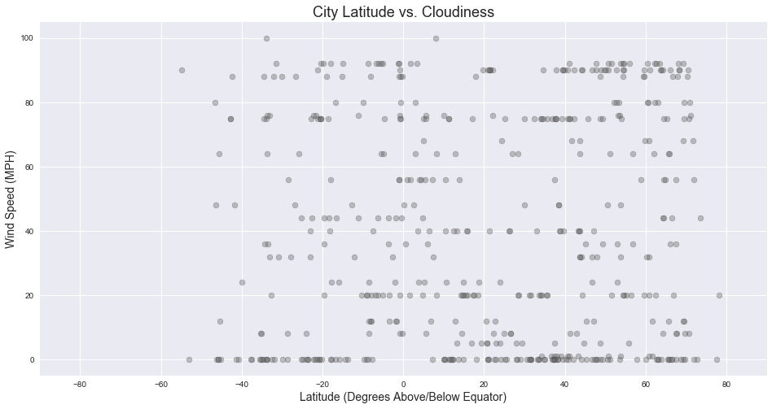

## WeatherPy

The objective of this exercise is to plot various weather characteristics of randomly selected cities against those cities' latitude in order to demonstrate whether proximity to the equator correlates with temperature, wind speed, humidity, and cloudiness.

Based on the data below, here are a few of the observable trends:

- There is a strong correlation between proximity to the equator and temperature.
- Points show much less association between other characteristics, like wind speed and humidity, and latitude. The points are much more evenly distributed, suggesting that the association between and proximity to the equator is is stronger than between proximity to the equator and other measurements.
- Cities South of the equator may be more likely to have a higher humidity regardless of proximity to the equator - there are more points with lower humidities north of the equator, according to the humidity plot.


```python
#Import a BUNCH of libraries and the API key for Open Weather Map API
import json
import os
import requests
import pandas as pd
import numpy as np
import random
import matplotlib.pyplot as plt
from citipy import citipy
from config import api_key
import time
import seaborn as sns
sns.set()

#Establish lists to store weather data
lat_list = []
temp_list = []
city_list = []
country_list = []
city_id_list = []
humidity_list = []
cloudiness_list = []
wind_speed_list = []
city_no_counter = 0

#Look back to one week ago, selecting a 24 hour period with start and end times
current_time = time.time()
pull_time_start = current_time - 691200
pull_time_end = current_time - 604800

#Specify font formatting for plots
plot_title_fonts = {'family':'sans-serif', 'size':18}
axis_label_fonts = {'family':'sans-serif', 'size':14}  
```


```python
#Create exception for duplicate entries to ensure unique entries and aid the script in dealing with duplicates

class Error(Exception):
   pass

class ValueNotUnique(Error):
   pass

```


```python
#Pull data! While loop ensures that the final set of city data includes the number of entries desired
while len(set(city_id_list)) < 500:
    try:
        current_lat = round(random.uniform(-90.0, 90.0), 6)
        current_lon = round(random.uniform(-180.0, 180), 6)
        current_city = citipy.nearest_city(current_lat, current_lon).city_name
        current_country = citipy.nearest_city(current_lat, current_lon).country_code
        query_url = f"http://api.openweathermap.org/data/2.5/weather?APPID={api_key}&units=metric&q={current_city},{current_country}&type=hour&start={pull_time_start}&end={pull_time_end}"
        per_city_json = requests.get(query_url).json()
        #If there is no city ID, data is not qualified - skip entry
        if per_city_json['id']:
            #If the city ID already exists in the list, data is not qualified skip entry
            if per_city_json['id'] in set(city_id_list):
                #Let user know that the loop has been restarted
                print("City returned already exists in list - retrying a new entry.")
                raise ValueNotUnique
                break
            #If the city ID exists and is unique, add city data to city data lists    
            else:
                city_id_list.append(per_city_json['id'])
                lat_list.append(per_city_json['coord']['lat'])
                temp_list.append(per_city_json['main']['temp'])
                current_city = per_city_json['name']
                city_list.append(current_city)
                country_list.append(per_city_json['sys']['country'])
                humidity_list.append(per_city_json['main']['humidity'])
                cloudiness_list.append(per_city_json['clouds']['all'])
                wind_speed_list.append(per_city_json['wind']['speed'])
                city_no_counter = city_no_counter + 1
                #Print current status of data pull
                print(f"Currently processing city no. {city_no_counter}:\n{current_city}, {current_country}\nCity ID: {per_city_json['id']}\nRequest URL (minus API key): http://api.openweathermap.org/data/2.5/weather?APPID=SECRET&units=imperial&q={current_city},{current_country}&type=hour&start={pull_time_start}&end={pull_time_end}")
        #Determine whether or not an undesirable code has been returned - if so, pause data pull to prevent running
        #into caps
        else:
            cod = cod = per_city_json['cod']
            if cod != 200:
                time.sleep(60)
                #Let user know the script is on hold
                print('Waiting 1 minute before next API call.')
            else:
                print('No City ID returned - retrying a new entry.')
                pass
    #If there is an exception, restart while loop        
    except:
        pass


```

    Currently processing city no. 1:
    Bathsheba, bb
    City ID: 3374083
    Request URL (minus API key): http://api.openweathermap.org/data/2.5/weather?APPID=SECRET&units=imperial&q=Bathsheba,bb&type=hour&start=1522027675.5241148&end=1522114075.5241148
    Currently processing city no. 2:
    Lityn, ua
    City ID: 702931
    Request URL (minus API key): http://api.openweathermap.org/data/2.5/weather?APPID=SECRET&units=imperial&q=Lityn,ua&type=hour&start=1522027675.5241148&end=1522114075.5241148
    Currently processing city no. 3:
    Fortuna, us
    City ID: 5563839
    Request URL (minus API key): http://api.openweathermap.org/data/2.5/weather?APPID=SECRET&units=imperial&q=Fortuna,us&type=hour&start=1522027675.5241148&end=1522114075.5241148
    Currently processing city no. 4:
    Hobart, au
    City ID: 2163355
    Request URL (minus API key): http://api.openweathermap.org/data/2.5/weather?APPID=SECRET&units=imperial&q=Hobart,au&type=hour&start=1522027675.5241148&end=1522114075.5241148
    Currently processing city no. 5:
    Nikko, jp
    City ID: 1855395
    Request URL (minus API key): http://api.openweathermap.org/data/2.5/weather?APPID=SECRET&units=imperial&q=Nikko,jp&type=hour&start=1522027675.5241148&end=1522114075.5241148
    Currently processing city no. 6:
    Tuktoyaktuk, ca
    City ID: 6170031
    Request URL (minus API key): http://api.openweathermap.org/data/2.5/weather?APPID=SECRET&units=imperial&q=Tuktoyaktuk,ca&type=hour&start=1522027675.5241148&end=1522114075.5241148
    Currently processing city no. 7:
    Vao, nc
    City ID: 2137773
    Request URL (minus API key): http://api.openweathermap.org/data/2.5/weather?APPID=SECRET&units=imperial&q=Vao,nc&type=hour&start=1522027675.5241148&end=1522114075.5241148
    Currently processing city no. 8:
    Clyde, nz
    City ID: 2192264
    Request URL (minus API key): http://api.openweathermap.org/data/2.5/weather?APPID=SECRET&units=imperial&q=Clyde,nz&type=hour&start=1522027675.5241148&end=1522114075.5241148
    Currently processing city no. 9:
    Yellowknife, ca
    City ID: 6185377
    Request URL (minus API key): http://api.openweathermap.org/data/2.5/weather?APPID=SECRET&units=imperial&q=Yellowknife,ca&type=hour&start=1522027675.5241148&end=1522114075.5241148
    Currently processing city no. 10:
    Lavrentiya, ru
    City ID: 4031637
    Request URL (minus API key): http://api.openweathermap.org/data/2.5/weather?APPID=SECRET&units=imperial&q=Lavrentiya,ru&type=hour&start=1522027675.5241148&end=1522114075.5241148
    Currently processing city no. 11:
    Ushuaia, ar
    City ID: 3833367
    Request URL (minus API key): http://api.openweathermap.org/data/2.5/weather?APPID=SECRET&units=imperial&q=Ushuaia,ar&type=hour&start=1522027675.5241148&end=1522114075.5241148
    Currently processing city no. 12:
    Busselton, au
    City ID: 2075265
    Request URL (minus API key): http://api.openweathermap.org/data/2.5/weather?APPID=SECRET&units=imperial&q=Busselton,au&type=hour&start=1522027675.5241148&end=1522114075.5241148
    Currently processing city no. 13:
    Puerto Ayora, ec
    City ID: 3652764
    Request URL (minus API key): http://api.openweathermap.org/data/2.5/weather?APPID=SECRET&units=imperial&q=Puerto Ayora,ec&type=hour&start=1522027675.5241148&end=1522114075.5241148
    Currently processing city no. 14:
    Souillac, mu
    City ID: 933995
    Request URL (minus API key): http://api.openweathermap.org/data/2.5/weather?APPID=SECRET&units=imperial&q=Souillac,mu&type=hour&start=1522027675.5241148&end=1522114075.5241148
    Currently processing city no. 15:
    Haines Junction, ca
    City ID: 5969025
    Request URL (minus API key): http://api.openweathermap.org/data/2.5/weather?APPID=SECRET&units=imperial&q=Haines Junction,ca&type=hour&start=1522027675.5241148&end=1522114075.5241148
    Currently processing city no. 16:
    Bredasdorp, za
    City ID: 1015776
    Request URL (minus API key): http://api.openweathermap.org/data/2.5/weather?APPID=SECRET&units=imperial&q=Bredasdorp,za&type=hour&start=1522027675.5241148&end=1522114075.5241148
    Currently processing city no. 17:
    Kapaa, us
    City ID: 5848280
    Request URL (minus API key): http://api.openweathermap.org/data/2.5/weather?APPID=SECRET&units=imperial&q=Kapaa,us&type=hour&start=1522027675.5241148&end=1522114075.5241148
    Currently processing city no. 18:
    Kiboga, ug
    City ID: 231550
    Request URL (minus API key): http://api.openweathermap.org/data/2.5/weather?APPID=SECRET&units=imperial&q=Kiboga,ug&type=hour&start=1522027675.5241148&end=1522114075.5241148
    Currently processing city no. 19:
    Maniitsoq, gl
    City ID: 3421982
    Request URL (minus API key): http://api.openweathermap.org/data/2.5/weather?APPID=SECRET&units=imperial&q=Maniitsoq,gl&type=hour&start=1522027675.5241148&end=1522114075.5241148
    Currently processing city no. 20:
    Port Hueneme, us
    City ID: 5384339
    Request URL (minus API key): http://api.openweathermap.org/data/2.5/weather?APPID=SECRET&units=imperial&q=Port Hueneme,us&type=hour&start=1522027675.5241148&end=1522114075.5241148
    Currently processing city no. 21:
    Qaanaaq, gl
    City ID: 3831208
    Request URL (minus API key): http://api.openweathermap.org/data/2.5/weather?APPID=SECRET&units=imperial&q=Qaanaaq,gl&type=hour&start=1522027675.5241148&end=1522114075.5241148
    Currently processing city no. 22:
    Clyde River, ca
    City ID: 5924351
    Request URL (minus API key): http://api.openweathermap.org/data/2.5/weather?APPID=SECRET&units=imperial&q=Clyde River,ca&type=hour&start=1522027675.5241148&end=1522114075.5241148
    Currently processing city no. 23:
    Hilo, us
    City ID: 5855927
    Request URL (minus API key): http://api.openweathermap.org/data/2.5/weather?APPID=SECRET&units=imperial&q=Hilo,us&type=hour&start=1522027675.5241148&end=1522114075.5241148
    Currently processing city no. 24:
    Waipawa, nz
    City ID: 2185329
    Request URL (minus API key): http://api.openweathermap.org/data/2.5/weather?APPID=SECRET&units=imperial&q=Waipawa,nz&type=hour&start=1522027675.5241148&end=1522114075.5241148
    Currently processing city no. 25:
    Hithadhoo, mv
    City ID: 1282256
    Request URL (minus API key): http://api.openweathermap.org/data/2.5/weather?APPID=SECRET&units=imperial&q=Hithadhoo,mv&type=hour&start=1522027675.5241148&end=1522114075.5241148
    City returned already exists in list - retrying a new entry.
    Currently processing city no. 26:
    New Norfolk, au
    City ID: 2155415
    Request URL (minus API key): http://api.openweathermap.org/data/2.5/weather?APPID=SECRET&units=imperial&q=New Norfolk,au&type=hour&start=1522027675.5241148&end=1522114075.5241148
    City returned already exists in list - retrying a new entry.
    Currently processing city no. 27:
    Kaitangata, nz
    City ID: 2208248
    Request URL (minus API key): http://api.openweathermap.org/data/2.5/weather?APPID=SECRET&units=imperial&q=Kaitangata,nz&type=hour&start=1522027675.5241148&end=1522114075.5241148
    Currently processing city no. 28:
    Choma, zm
    City ID: 917748
    Request URL (minus API key): http://api.openweathermap.org/data/2.5/weather?APPID=SECRET&units=imperial&q=Choma,zm&type=hour&start=1522027675.5241148&end=1522114075.5241148
    Currently processing city no. 29:
    Bambanglipuro, id
    City ID: 1650434
    Request URL (minus API key): http://api.openweathermap.org/data/2.5/weather?APPID=SECRET&units=imperial&q=Bambanglipuro,id&type=hour&start=1522027675.5241148&end=1522114075.5241148
    City returned already exists in list - retrying a new entry.
    Currently processing city no. 30:
    Lake Cowichan, ca
    City ID: 6048316
    Request URL (minus API key): http://api.openweathermap.org/data/2.5/weather?APPID=SECRET&units=imperial&q=Lake Cowichan,ca&type=hour&start=1522027675.5241148&end=1522114075.5241148
    City returned already exists in list - retrying a new entry.
    Currently processing city no. 31:
    Zhezkazgan, kz
    City ID: 1516589
    Request URL (minus API key): http://api.openweathermap.org/data/2.5/weather?APPID=SECRET&units=imperial&q=Zhezkazgan,kz&type=hour&start=1522027675.5241148&end=1522114075.5241148
    Currently processing city no. 32:
    Oranjestad, aw
    City ID: 3577154
    Request URL (minus API key): http://api.openweathermap.org/data/2.5/weather?APPID=SECRET&units=imperial&q=Oranjestad,aw&type=hour&start=1522027675.5241148&end=1522114075.5241148
    City returned already exists in list - retrying a new entry.
    Currently processing city no. 33:
    Bethel, us
    City ID: 5880568
    Request URL (minus API key): http://api.openweathermap.org/data/2.5/weather?APPID=SECRET&units=imperial&q=Bethel,us&type=hour&start=1522027675.5241148&end=1522114075.5241148
    Currently processing city no. 34:
    Igarka, ru
    City ID: 1505991
    Request URL (minus API key): http://api.openweathermap.org/data/2.5/weather?APPID=SECRET&units=imperial&q=Igarka,ru&type=hour&start=1522027675.5241148&end=1522114075.5241148
    Currently processing city no. 35:
    Mega, et
    City ID: 331259
    Request URL (minus API key): http://api.openweathermap.org/data/2.5/weather?APPID=SECRET&units=imperial&q=Mega,et&type=hour&start=1522027675.5241148&end=1522114075.5241148
    Currently processing city no. 36:
    Hermanus, za
    City ID: 3366880
    Request URL (minus API key): http://api.openweathermap.org/data/2.5/weather?APPID=SECRET&units=imperial&q=Hermanus,za&type=hour&start=1522027675.5241148&end=1522114075.5241148
    City returned already exists in list - retrying a new entry.
    Currently processing city no. 37:
    Santa Marta, co
    City ID: 3668605
    Request URL (minus API key): http://api.openweathermap.org/data/2.5/weather?APPID=SECRET&units=imperial&q=Santa Marta,co&type=hour&start=1522027675.5241148&end=1522114075.5241148
    Currently processing city no. 38:
    Castro, cl
    City ID: 3896218
    Request URL (minus API key): http://api.openweathermap.org/data/2.5/weather?APPID=SECRET&units=imperial&q=Castro,cl&type=hour&start=1522027675.5241148&end=1522114075.5241148
    Currently processing city no. 39:
    Albany, au
    City ID: 2077963
    Request URL (minus API key): http://api.openweathermap.org/data/2.5/weather?APPID=SECRET&units=imperial&q=Albany,au&type=hour&start=1522027675.5241148&end=1522114075.5241148
    Currently processing city no. 40:
    Klaksvik, fo
    City ID: 2618795
    Request URL (minus API key): http://api.openweathermap.org/data/2.5/weather?APPID=SECRET&units=imperial&q=Klaksvik,fo&type=hour&start=1522027675.5241148&end=1522114075.5241148
    Currently processing city no. 41:
    Turayf, sa
    City ID: 101312
    Request URL (minus API key): http://api.openweathermap.org/data/2.5/weather?APPID=SECRET&units=imperial&q=Turayf,sa&type=hour&start=1522027675.5241148&end=1522114075.5241148
    Currently processing city no. 42:
    Talnakh, ru
    City ID: 1490256
    Request URL (minus API key): http://api.openweathermap.org/data/2.5/weather?APPID=SECRET&units=imperial&q=Talnakh,ru&type=hour&start=1522027675.5241148&end=1522114075.5241148
    Currently processing city no. 43:
    South Yuba City, us
    City ID: 5397851
    Request URL (minus API key): http://api.openweathermap.org/data/2.5/weather?APPID=SECRET&units=imperial&q=South Yuba City,us&type=hour&start=1522027675.5241148&end=1522114075.5241148
    Currently processing city no. 44:
    Rikitea, pf
    City ID: 4030556
    Request URL (minus API key): http://api.openweathermap.org/data/2.5/weather?APPID=SECRET&units=imperial&q=Rikitea,pf&type=hour&start=1522027675.5241148&end=1522114075.5241148
    Currently processing city no. 45:
    Arraial do Cabo, br
    City ID: 3471451
    Request URL (minus API key): http://api.openweathermap.org/data/2.5/weather?APPID=SECRET&units=imperial&q=Arraial do Cabo,br&type=hour&start=1522027675.5241148&end=1522114075.5241148
    Currently processing city no. 46:
    Luderitz, na
    City ID: 3355672
    Request URL (minus API key): http://api.openweathermap.org/data/2.5/weather?APPID=SECRET&units=imperial&q=Luderitz,na&type=hour&start=1522027675.5241148&end=1522114075.5241148
    Currently processing city no. 47:
    Tazovskiy, ru
    City ID: 1489853
    Request URL (minus API key): http://api.openweathermap.org/data/2.5/weather?APPID=SECRET&units=imperial&q=Tazovskiy,ru&type=hour&start=1522027675.5241148&end=1522114075.5241148
    City returned already exists in list - retrying a new entry.
    Currently processing city no. 48:
    Atuona, pf
    City ID: 4020109
    Request URL (minus API key): http://api.openweathermap.org/data/2.5/weather?APPID=SECRET&units=imperial&q=Atuona,pf&type=hour&start=1522027675.5241148&end=1522114075.5241148
    City returned already exists in list - retrying a new entry.
    Currently processing city no. 49:
    Jieznas, lt
    City ID: 598854
    Request URL (minus API key): http://api.openweathermap.org/data/2.5/weather?APPID=SECRET&units=imperial&q=Jieznas,lt&type=hour&start=1522027675.5241148&end=1522114075.5241148
    Currently processing city no. 50:
    Tarko-Sale, ru
    City ID: 1490085
    Request URL (minus API key): http://api.openweathermap.org/data/2.5/weather?APPID=SECRET&units=imperial&q=Tarko-Sale,ru&type=hour&start=1522027675.5241148&end=1522114075.5241148
    City returned already exists in list - retrying a new entry.
    Currently processing city no. 51:
    Fougamou, ga
    City ID: 2400578
    Request URL (minus API key): http://api.openweathermap.org/data/2.5/weather?APPID=SECRET&units=imperial&q=Fougamou,ga&type=hour&start=1522027675.5241148&end=1522114075.5241148
    Currently processing city no. 52:
    Nueva Loja, ec
    City ID: 3655185
    Request URL (minus API key): http://api.openweathermap.org/data/2.5/weather?APPID=SECRET&units=imperial&q=Nueva Loja,ec&type=hour&start=1522027675.5241148&end=1522114075.5241148
    City returned already exists in list - retrying a new entry.
    Currently processing city no. 53:
    Liverpool, ca
    City ID: 6057856
    Request URL (minus API key): http://api.openweathermap.org/data/2.5/weather?APPID=SECRET&units=imperial&q=Liverpool,ca&type=hour&start=1522027675.5241148&end=1522114075.5241148
    Currently processing city no. 54:
    Kot Radha kishan, pk
    City ID: 1182829
    Request URL (minus API key): http://api.openweathermap.org/data/2.5/weather?APPID=SECRET&units=imperial&q=Kot Radha kishan,pk&type=hour&start=1522027675.5241148&end=1522114075.5241148
    Currently processing city no. 55:
    Port Alfred, za
    City ID: 964432
    Request URL (minus API key): http://api.openweathermap.org/data/2.5/weather?APPID=SECRET&units=imperial&q=Port Alfred,za&type=hour&start=1522027675.5241148&end=1522114075.5241148
    Currently processing city no. 56:
    Awbari, ly
    City ID: 2219235
    Request URL (minus API key): http://api.openweathermap.org/data/2.5/weather?APPID=SECRET&units=imperial&q=Awbari,ly&type=hour&start=1522027675.5241148&end=1522114075.5241148
    Currently processing city no. 57:
    Khatanga, ru
    City ID: 2022572
    Request URL (minus API key): http://api.openweathermap.org/data/2.5/weather?APPID=SECRET&units=imperial&q=Khatanga,ru&type=hour&start=1522027675.5241148&end=1522114075.5241148
    City returned already exists in list - retrying a new entry.
    City returned already exists in list - retrying a new entry.
    City returned already exists in list - retrying a new entry.
    City returned already exists in list - retrying a new entry.
    Currently processing city no. 58:
    Nichinan, jp
    City ID: 1855476
    Request URL (minus API key): http://api.openweathermap.org/data/2.5/weather?APPID=SECRET&units=imperial&q=Nichinan,jp&type=hour&start=1522027675.5241148&end=1522114075.5241148
    Currently processing city no. 59:
    Cayenne, gf
    City ID: 3382160
    Request URL (minus API key): http://api.openweathermap.org/data/2.5/weather?APPID=SECRET&units=imperial&q=Cayenne,gf&type=hour&start=1522027675.5241148&end=1522114075.5241148
    City returned already exists in list - retrying a new entry.
    Currently processing city no. 60:
    Nicoya, cr
    City ID: 3622716
    Request URL (minus API key): http://api.openweathermap.org/data/2.5/weather?APPID=SECRET&units=imperial&q=Nicoya,cr&type=hour&start=1522027675.5241148&end=1522114075.5241148
    City returned already exists in list - retrying a new entry.
    Currently processing city no. 61:
    Punta Arenas, cl
    City ID: 3874787
    Request URL (minus API key): http://api.openweathermap.org/data/2.5/weather?APPID=SECRET&units=imperial&q=Punta Arenas,cl&type=hour&start=1522027675.5241148&end=1522114075.5241148
    City returned already exists in list - retrying a new entry.
    City returned already exists in list - retrying a new entry.
    Currently processing city no. 62:
    Torbay, ca
    City ID: 6167817
    Request URL (minus API key): http://api.openweathermap.org/data/2.5/weather?APPID=SECRET&units=imperial&q=Torbay,ca&type=hour&start=1522027675.5241148&end=1522114075.5241148
    City returned already exists in list - retrying a new entry.
    City returned already exists in list - retrying a new entry.
    Currently processing city no. 63:
    Atambua, id
    City ID: 1651103
    Request URL (minus API key): http://api.openweathermap.org/data/2.5/weather?APPID=SECRET&units=imperial&q=Atambua,id&type=hour&start=1522027675.5241148&end=1522114075.5241148
    Currently processing city no. 64:
    Ozinki, ru
    City ID: 513328
    Request URL (minus API key): http://api.openweathermap.org/data/2.5/weather?APPID=SECRET&units=imperial&q=Ozinki,ru&type=hour&start=1522027675.5241148&end=1522114075.5241148
    Currently processing city no. 65:
    Vaini, to
    City ID: 4032243
    Request URL (minus API key): http://api.openweathermap.org/data/2.5/weather?APPID=SECRET&units=imperial&q=Vaini,to&type=hour&start=1522027675.5241148&end=1522114075.5241148
    Currently processing city no. 66:
    Zemio, cf
    City ID: 235826
    Request URL (minus API key): http://api.openweathermap.org/data/2.5/weather?APPID=SECRET&units=imperial&q=Zemio,cf&type=hour&start=1522027675.5241148&end=1522114075.5241148
    Currently processing city no. 67:
    Antalaha, mg
    City ID: 1071296
    Request URL (minus API key): http://api.openweathermap.org/data/2.5/weather?APPID=SECRET&units=imperial&q=Antalaha,mg&type=hour&start=1522027675.5241148&end=1522114075.5241148
    Currently processing city no. 68:
    Aykhal, ru
    City ID: 2027296
    Request URL (minus API key): http://api.openweathermap.org/data/2.5/weather?APPID=SECRET&units=imperial&q=Aykhal,ru&type=hour&start=1522027675.5241148&end=1522114075.5241148
    City returned already exists in list - retrying a new entry.
    City returned already exists in list - retrying a new entry.
    Currently processing city no. 69:
    Dwarka, in
    City ID: 1273294
    Request URL (minus API key): http://api.openweathermap.org/data/2.5/weather?APPID=SECRET&units=imperial&q=Dwarka,in&type=hour&start=1522027675.5241148&end=1522114075.5241148
    Currently processing city no. 70:
    Norman Wells, ca
    City ID: 6089245
    Request URL (minus API key): http://api.openweathermap.org/data/2.5/weather?APPID=SECRET&units=imperial&q=Norman Wells,ca&type=hour&start=1522027675.5241148&end=1522114075.5241148
    Currently processing city no. 71:
    Barrow, us
    City ID: 4252975
    Request URL (minus API key): http://api.openweathermap.org/data/2.5/weather?APPID=SECRET&units=imperial&q=Barrow,us&type=hour&start=1522027675.5241148&end=1522114075.5241148
    Currently processing city no. 72:
    Iqaluit, ca
    City ID: 5983720
    Request URL (minus API key): http://api.openweathermap.org/data/2.5/weather?APPID=SECRET&units=imperial&q=Iqaluit,ca&type=hour&start=1522027675.5241148&end=1522114075.5241148
    Currently processing city no. 73:
    Ribeira Grande, pt
    City ID: 3372707
    Request URL (minus API key): http://api.openweathermap.org/data/2.5/weather?APPID=SECRET&units=imperial&q=Ribeira Grande,pt&type=hour&start=1522027675.5241148&end=1522114075.5241148
    Currently processing city no. 74:
    Bambous Virieux, mu
    City ID: 1106677
    Request URL (minus API key): http://api.openweathermap.org/data/2.5/weather?APPID=SECRET&units=imperial&q=Bambous Virieux,mu&type=hour&start=1522027675.5241148&end=1522114075.5241148
    City returned already exists in list - retrying a new entry.
    City returned already exists in list - retrying a new entry.
    Currently processing city no. 75:
    Maraa, br
    City ID: 3663475
    Request URL (minus API key): http://api.openweathermap.org/data/2.5/weather?APPID=SECRET&units=imperial&q=Maraa,br&type=hour&start=1522027675.5241148&end=1522114075.5241148
    Currently processing city no. 76:
    Polunochnoye, ru
    City ID: 1494482
    Request URL (minus API key): http://api.openweathermap.org/data/2.5/weather?APPID=SECRET&units=imperial&q=Polunochnoye,ru&type=hour&start=1522027675.5241148&end=1522114075.5241148
    City returned already exists in list - retrying a new entry.
    Currently processing city no. 77:
    Tura, ru
    City ID: 2014833
    Request URL (minus API key): http://api.openweathermap.org/data/2.5/weather?APPID=SECRET&units=imperial&q=Tura,ru&type=hour&start=1522027675.5241148&end=1522114075.5241148
    Currently processing city no. 78:
    Camacha, pt
    City ID: 2270385
    Request URL (minus API key): http://api.openweathermap.org/data/2.5/weather?APPID=SECRET&units=imperial&q=Camacha,pt&type=hour&start=1522027675.5241148&end=1522114075.5241148
    Currently processing city no. 79:
    Ankazoabo, mg
    City ID: 1072879
    Request URL (minus API key): http://api.openweathermap.org/data/2.5/weather?APPID=SECRET&units=imperial&q=Ankazoabo,mg&type=hour&start=1522027675.5241148&end=1522114075.5241148
    Currently processing city no. 80:
    Okaihau, nz
    City ID: 2185786
    Request URL (minus API key): http://api.openweathermap.org/data/2.5/weather?APPID=SECRET&units=imperial&q=Okaihau,nz&type=hour&start=1522027675.5241148&end=1522114075.5241148
    City returned already exists in list - retrying a new entry.
    City returned already exists in list - retrying a new entry.
    City returned already exists in list - retrying a new entry.
    Currently processing city no. 81:
    Leningradskiy, ru
    City ID: 2123814
    Request URL (minus API key): http://api.openweathermap.org/data/2.5/weather?APPID=SECRET&units=imperial&q=Leningradskiy,ru&type=hour&start=1522027675.5241148&end=1522114075.5241148
    City returned already exists in list - retrying a new entry.
    Currently processing city no. 82:
    Cape Town, za
    City ID: 3369157
    Request URL (minus API key): http://api.openweathermap.org/data/2.5/weather?APPID=SECRET&units=imperial&q=Cape Town,za&type=hour&start=1522027675.5241148&end=1522114075.5241148
    Currently processing city no. 83:
    Negombo, lk
    City ID: 1233369
    Request URL (minus API key): http://api.openweathermap.org/data/2.5/weather?APPID=SECRET&units=imperial&q=Negombo,lk&type=hour&start=1522027675.5241148&end=1522114075.5241148
    Currently processing city no. 84:
    Dikson, ru
    City ID: 1507390
    Request URL (minus API key): http://api.openweathermap.org/data/2.5/weather?APPID=SECRET&units=imperial&q=Dikson,ru&type=hour&start=1522027675.5241148&end=1522114075.5241148
    Currently processing city no. 85:
    Bluff, nz
    City ID: 2206939
    Request URL (minus API key): http://api.openweathermap.org/data/2.5/weather?APPID=SECRET&units=imperial&q=Bluff,nz&type=hour&start=1522027675.5241148&end=1522114075.5241148
    City returned already exists in list - retrying a new entry.
    Currently processing city no. 86:
    Port-Gentil, ga
    City ID: 2396518
    Request URL (minus API key): http://api.openweathermap.org/data/2.5/weather?APPID=SECRET&units=imperial&q=Port-Gentil,ga&type=hour&start=1522027675.5241148&end=1522114075.5241148
    Currently processing city no. 87:
    Seoul, kr
    City ID: 1835848
    Request URL (minus API key): http://api.openweathermap.org/data/2.5/weather?APPID=SECRET&units=imperial&q=Seoul,kr&type=hour&start=1522027675.5241148&end=1522114075.5241148
    Currently processing city no. 88:
    Jaisalmer, in
    City ID: 1269507
    Request URL (minus API key): http://api.openweathermap.org/data/2.5/weather?APPID=SECRET&units=imperial&q=Jaisalmer,in&type=hour&start=1522027675.5241148&end=1522114075.5241148
    Currently processing city no. 89:
    Kimamba, tz
    City ID: 157366
    Request URL (minus API key): http://api.openweathermap.org/data/2.5/weather?APPID=SECRET&units=imperial&q=Kimamba,tz&type=hour&start=1522027675.5241148&end=1522114075.5241148
    Currently processing city no. 90:
    Palmer, us
    City ID: 5871146
    Request URL (minus API key): http://api.openweathermap.org/data/2.5/weather?APPID=SECRET&units=imperial&q=Palmer,us&type=hour&start=1522027675.5241148&end=1522114075.5241148
    City returned already exists in list - retrying a new entry.
    Currently processing city no. 91:
    Lebu, cl
    City ID: 3883457
    Request URL (minus API key): http://api.openweathermap.org/data/2.5/weather?APPID=SECRET&units=imperial&q=Lebu,cl&type=hour&start=1522027675.5241148&end=1522114075.5241148
    City returned already exists in list - retrying a new entry.
    City returned already exists in list - retrying a new entry.
    Currently processing city no. 92:
    Chuy, uy
    City ID: 3443061
    Request URL (minus API key): http://api.openweathermap.org/data/2.5/weather?APPID=SECRET&units=imperial&q=Chuy,uy&type=hour&start=1522027675.5241148&end=1522114075.5241148
    Currently processing city no. 93:
    Karasjok, no
    City ID: 779350
    Request URL (minus API key): http://api.openweathermap.org/data/2.5/weather?APPID=SECRET&units=imperial&q=Karasjok,no&type=hour&start=1522027675.5241148&end=1522114075.5241148
    Currently processing city no. 94:
    Ilulissat, gl
    City ID: 3423146
    Request URL (minus API key): http://api.openweathermap.org/data/2.5/weather?APPID=SECRET&units=imperial&q=Ilulissat,gl&type=hour&start=1522027675.5241148&end=1522114075.5241148
    City returned already exists in list - retrying a new entry.
    City returned already exists in list - retrying a new entry.
    Currently processing city no. 95:
    Vardo, no
    City ID: 777019
    Request URL (minus API key): http://api.openweathermap.org/data/2.5/weather?APPID=SECRET&units=imperial&q=Vardo,no&type=hour&start=1522027675.5241148&end=1522114075.5241148
    Currently processing city no. 96:
    Severo-Kurilsk, ru
    City ID: 2121385
    Request URL (minus API key): http://api.openweathermap.org/data/2.5/weather?APPID=SECRET&units=imperial&q=Severo-Kurilsk,ru&type=hour&start=1522027675.5241148&end=1522114075.5241148
    Currently processing city no. 97:
    East London, za
    City ID: 1006984
    Request URL (minus API key): http://api.openweathermap.org/data/2.5/weather?APPID=SECRET&units=imperial&q=East London,za&type=hour&start=1522027675.5241148&end=1522114075.5241148
    Currently processing city no. 98:
    Butaritari, ki
    City ID: 2110227
    Request URL (minus API key): http://api.openweathermap.org/data/2.5/weather?APPID=SECRET&units=imperial&q=Butaritari,ki&type=hour&start=1522027675.5241148&end=1522114075.5241148
    Currently processing city no. 99:
    Sobolevo, ru
    City ID: 525426
    Request URL (minus API key): http://api.openweathermap.org/data/2.5/weather?APPID=SECRET&units=imperial&q=Sobolevo,ru&type=hour&start=1522027675.5241148&end=1522114075.5241148
    City returned already exists in list - retrying a new entry.
    City returned already exists in list - retrying a new entry.
    City returned already exists in list - retrying a new entry.
    Currently processing city no. 100:
    Piacabucu, br
    City ID: 3454005
    Request URL (minus API key): http://api.openweathermap.org/data/2.5/weather?APPID=SECRET&units=imperial&q=Piacabucu,br&type=hour&start=1522027675.5241148&end=1522114075.5241148
    Currently processing city no. 101:
    Mar del Plata, ar
    City ID: 3863379
    Request URL (minus API key): http://api.openweathermap.org/data/2.5/weather?APPID=SECRET&units=imperial&q=Mar del Plata,ar&type=hour&start=1522027675.5241148&end=1522114075.5241148
    City returned already exists in list - retrying a new entry.
    Currently processing city no. 102:
    Mahebourg, mu
    City ID: 934322
    Request URL (minus API key): http://api.openweathermap.org/data/2.5/weather?APPID=SECRET&units=imperial&q=Mahebourg,mu&type=hour&start=1522027675.5241148&end=1522114075.5241148
    Currently processing city no. 103:
    Grindavik, is
    City ID: 3416888
    Request URL (minus API key): http://api.openweathermap.org/data/2.5/weather?APPID=SECRET&units=imperial&q=Grindavik,is&type=hour&start=1522027675.5241148&end=1522114075.5241148
    City returned already exists in list - retrying a new entry.
    Currently processing city no. 104:
    Bubaque, gw
    City ID: 2374583
    Request URL (minus API key): http://api.openweathermap.org/data/2.5/weather?APPID=SECRET&units=imperial&q=Bubaque,gw&type=hour&start=1522027675.5241148&end=1522114075.5241148
    Currently processing city no. 105:
    Avarua, ck
    City ID: 4035715
    Request URL (minus API key): http://api.openweathermap.org/data/2.5/weather?APPID=SECRET&units=imperial&q=Avarua,ck&type=hour&start=1522027675.5241148&end=1522114075.5241148
    Currently processing city no. 106:
    Paamiut, gl
    City ID: 3421193
    Request URL (minus API key): http://api.openweathermap.org/data/2.5/weather?APPID=SECRET&units=imperial&q=Paamiut,gl&type=hour&start=1522027675.5241148&end=1522114075.5241148
    City returned already exists in list - retrying a new entry.
    Currently processing city no. 107:
    Geraldton, au
    City ID: 2070998
    Request URL (minus API key): http://api.openweathermap.org/data/2.5/weather?APPID=SECRET&units=imperial&q=Geraldton,au&type=hour&start=1522027675.5241148&end=1522114075.5241148
    City returned already exists in list - retrying a new entry.
    Currently processing city no. 108:
    Saldanha, za
    City ID: 3361934
    Request URL (minus API key): http://api.openweathermap.org/data/2.5/weather?APPID=SECRET&units=imperial&q=Saldanha,za&type=hour&start=1522027675.5241148&end=1522114075.5241148
    Currently processing city no. 109:
    Westport, ie
    City ID: 2960970
    Request URL (minus API key): http://api.openweathermap.org/data/2.5/weather?APPID=SECRET&units=imperial&q=Westport,ie&type=hour&start=1522027675.5241148&end=1522114075.5241148
    City returned already exists in list - retrying a new entry.
    City returned already exists in list - retrying a new entry.
    City returned already exists in list - retrying a new entry.
    City returned already exists in list - retrying a new entry.
    City returned already exists in list - retrying a new entry.
    Currently processing city no. 110:
    San Cristobal, ec
    City ID: 3652567
    Request URL (minus API key): http://api.openweathermap.org/data/2.5/weather?APPID=SECRET&units=imperial&q=San Cristobal,ec&type=hour&start=1522027675.5241148&end=1522114075.5241148
    City returned already exists in list - retrying a new entry.
    City returned already exists in list - retrying a new entry.
    City returned already exists in list - retrying a new entry.
    Currently processing city no. 111:
    Sao Paulo de Olivenca, br
    City ID: 3662252
    Request URL (minus API key): http://api.openweathermap.org/data/2.5/weather?APPID=SECRET&units=imperial&q=Sao Paulo de Olivenca,br&type=hour&start=1522027675.5241148&end=1522114075.5241148
    Currently processing city no. 112:
    Port Lincoln, au
    City ID: 2063036
    Request URL (minus API key): http://api.openweathermap.org/data/2.5/weather?APPID=SECRET&units=imperial&q=Port Lincoln,au&type=hour&start=1522027675.5241148&end=1522114075.5241148
    Currently processing city no. 113:
    Sun Valley, us
    City ID: 5609286
    Request URL (minus API key): http://api.openweathermap.org/data/2.5/weather?APPID=SECRET&units=imperial&q=Sun Valley,us&type=hour&start=1522027675.5241148&end=1522114075.5241148
    Currently processing city no. 114:
    Penzance, gb
    City ID: 2640377
    Request URL (minus API key): http://api.openweathermap.org/data/2.5/weather?APPID=SECRET&units=imperial&q=Penzance,gb&type=hour&start=1522027675.5241148&end=1522114075.5241148
    City returned already exists in list - retrying a new entry.
    Currently processing city no. 115:
    Georgetown, sh
    City ID: 2411397
    Request URL (minus API key): http://api.openweathermap.org/data/2.5/weather?APPID=SECRET&units=imperial&q=Georgetown,sh&type=hour&start=1522027675.5241148&end=1522114075.5241148
    City returned already exists in list - retrying a new entry.
    Currently processing city no. 116:
    Prince Rupert, ca
    City ID: 6113406
    Request URL (minus API key): http://api.openweathermap.org/data/2.5/weather?APPID=SECRET&units=imperial&q=Prince Rupert,ca&type=hour&start=1522027675.5241148&end=1522114075.5241148
    Currently processing city no. 117:
    Lompoc, us
    City ID: 5367788
    Request URL (minus API key): http://api.openweathermap.org/data/2.5/weather?APPID=SECRET&units=imperial&q=Lompoc,us&type=hour&start=1522027675.5241148&end=1522114075.5241148
    Currently processing city no. 118:
    Ust-Nera, ru
    City ID: 2120048
    Request URL (minus API key): http://api.openweathermap.org/data/2.5/weather?APPID=SECRET&units=imperial&q=Ust-Nera,ru&type=hour&start=1522027675.5241148&end=1522114075.5241148
    Currently processing city no. 119:
    Nouadhibou, mr
    City ID: 2377457
    Request URL (minus API key): http://api.openweathermap.org/data/2.5/weather?APPID=SECRET&units=imperial&q=Nouadhibou,mr&type=hour&start=1522027675.5241148&end=1522114075.5241148
    Currently processing city no. 120:
    Port Elizabeth, za
    City ID: 964420
    Request URL (minus API key): http://api.openweathermap.org/data/2.5/weather?APPID=SECRET&units=imperial&q=Port Elizabeth,za&type=hour&start=1522027675.5241148&end=1522114075.5241148
    Currently processing city no. 121:
    Ahuimanu, us
    City ID: 5856516
    Request URL (minus API key): http://api.openweathermap.org/data/2.5/weather?APPID=SECRET&units=imperial&q=Ahuimanu,us&type=hour&start=1522027675.5241148&end=1522114075.5241148
    City returned already exists in list - retrying a new entry.
    City returned already exists in list - retrying a new entry.
    Currently processing city no. 122:
    Majene, id
    City ID: 1636806
    Request URL (minus API key): http://api.openweathermap.org/data/2.5/weather?APPID=SECRET&units=imperial&q=Majene,id&type=hour&start=1522027675.5241148&end=1522114075.5241148
    Currently processing city no. 123:
    Galveston, us
    City ID: 4920577
    Request URL (minus API key): http://api.openweathermap.org/data/2.5/weather?APPID=SECRET&units=imperial&q=Galveston,us&type=hour&start=1522027675.5241148&end=1522114075.5241148
    City returned already exists in list - retrying a new entry.
    Currently processing city no. 124:
    Porto Novo, cv
    City ID: 3374336
    Request URL (minus API key): http://api.openweathermap.org/data/2.5/weather?APPID=SECRET&units=imperial&q=Porto Novo,cv&type=hour&start=1522027675.5241148&end=1522114075.5241148
    Currently processing city no. 125:
    Tasiilaq, gl
    City ID: 3424607
    Request URL (minus API key): http://api.openweathermap.org/data/2.5/weather?APPID=SECRET&units=imperial&q=Tasiilaq,gl&type=hour&start=1522027675.5241148&end=1522114075.5241148
    Currently processing city no. 126:
    Myaundzha, ru
    City ID: 2123100
    Request URL (minus API key): http://api.openweathermap.org/data/2.5/weather?APPID=SECRET&units=imperial&q=Myaundzha,ru&type=hour&start=1522027675.5241148&end=1522114075.5241148
    City returned already exists in list - retrying a new entry.
    Currently processing city no. 127:
    Bull Savanna, jm
    City ID: 3491161
    Request URL (minus API key): http://api.openweathermap.org/data/2.5/weather?APPID=SECRET&units=imperial&q=Bull Savanna,jm&type=hour&start=1522027675.5241148&end=1522114075.5241148
    City returned already exists in list - retrying a new entry.
    Currently processing city no. 128:
    Verkhnyaya Toyma, ru
    City ID: 474470
    Request URL (minus API key): http://api.openweathermap.org/data/2.5/weather?APPID=SECRET&units=imperial&q=Verkhnyaya Toyma,ru&type=hour&start=1522027675.5241148&end=1522114075.5241148
    City returned already exists in list - retrying a new entry.
    Currently processing city no. 129:
    Marystown, ca
    City ID: 6067472
    Request URL (minus API key): http://api.openweathermap.org/data/2.5/weather?APPID=SECRET&units=imperial&q=Marystown,ca&type=hour&start=1522027675.5241148&end=1522114075.5241148
    City returned already exists in list - retrying a new entry.
    Currently processing city no. 130:
    Pacific Grove, us
    City ID: 5380437
    Request URL (minus API key): http://api.openweathermap.org/data/2.5/weather?APPID=SECRET&units=imperial&q=Pacific Grove,us&type=hour&start=1522027675.5241148&end=1522114075.5241148
    Currently processing city no. 131:
    Nizhniy Kuranakh, ru
    City ID: 2019135
    Request URL (minus API key): http://api.openweathermap.org/data/2.5/weather?APPID=SECRET&units=imperial&q=Nizhniy Kuranakh,ru&type=hour&start=1522027675.5241148&end=1522114075.5241148
    City returned already exists in list - retrying a new entry.
    Currently processing city no. 132:
    Turukhansk, ru
    City ID: 1488903
    Request URL (minus API key): http://api.openweathermap.org/data/2.5/weather?APPID=SECRET&units=imperial&q=Turukhansk,ru&type=hour&start=1522027675.5241148&end=1522114075.5241148
    Currently processing city no. 133:
    Erenhot, cn
    City ID: 2037485
    Request URL (minus API key): http://api.openweathermap.org/data/2.5/weather?APPID=SECRET&units=imperial&q=Erenhot,cn&type=hour&start=1522027675.5241148&end=1522114075.5241148
    Currently processing city no. 134:
    Umm Lajj, sa
    City ID: 100926
    Request URL (minus API key): http://api.openweathermap.org/data/2.5/weather?APPID=SECRET&units=imperial&q=Umm Lajj,sa&type=hour&start=1522027675.5241148&end=1522114075.5241148
    City returned already exists in list - retrying a new entry.
    Currently processing city no. 135:
    Grootfontein, na
    City ID: 3357114
    Request URL (minus API key): http://api.openweathermap.org/data/2.5/weather?APPID=SECRET&units=imperial&q=Grootfontein,na&type=hour&start=1522027675.5241148&end=1522114075.5241148
    Currently processing city no. 136:
    Jamestown, sh
    City ID: 3370903
    Request URL (minus API key): http://api.openweathermap.org/data/2.5/weather?APPID=SECRET&units=imperial&q=Jamestown,sh&type=hour&start=1522027675.5241148&end=1522114075.5241148
    City returned already exists in list - retrying a new entry.
    Currently processing city no. 137:
    Upernavik, gl
    City ID: 3418910
    Request URL (minus API key): http://api.openweathermap.org/data/2.5/weather?APPID=SECRET&units=imperial&q=Upernavik,gl&type=hour&start=1522027675.5241148&end=1522114075.5241148
    City returned already exists in list - retrying a new entry.
    Currently processing city no. 138:
    Cabo San Lucas, mx
    City ID: 3985710
    Request URL (minus API key): http://api.openweathermap.org/data/2.5/weather?APPID=SECRET&units=imperial&q=Cabo San Lucas,mx&type=hour&start=1522027675.5241148&end=1522114075.5241148
    City returned already exists in list - retrying a new entry.
    Currently processing city no. 139:
    Poopo, bo
    City ID: 3907685
    Request URL (minus API key): http://api.openweathermap.org/data/2.5/weather?APPID=SECRET&units=imperial&q=Poopo,bo&type=hour&start=1522027675.5241148&end=1522114075.5241148
    City returned already exists in list - retrying a new entry.
    City returned already exists in list - retrying a new entry.
    Currently processing city no. 140:
    Koster, za
    City ID: 987648
    Request URL (minus API key): http://api.openweathermap.org/data/2.5/weather?APPID=SECRET&units=imperial&q=Koster,za&type=hour&start=1522027675.5241148&end=1522114075.5241148
    City returned already exists in list - retrying a new entry.
    Currently processing city no. 141:
    Inirida, co
    City ID: 3671450
    Request URL (minus API key): http://api.openweathermap.org/data/2.5/weather?APPID=SECRET&units=imperial&q=Inirida,co&type=hour&start=1522027675.5241148&end=1522114075.5241148
    Currently processing city no. 142:
    San Patricio, mx
    City ID: 3985168
    Request URL (minus API key): http://api.openweathermap.org/data/2.5/weather?APPID=SECRET&units=imperial&q=San Patricio,mx&type=hour&start=1522027675.5241148&end=1522114075.5241148
    City returned already exists in list - retrying a new entry.
    City returned already exists in list - retrying a new entry.
    City returned already exists in list - retrying a new entry.
    City returned already exists in list - retrying a new entry.
    City returned already exists in list - retrying a new entry.
    Currently processing city no. 143:
    Gua Musang, my
    City ID: 1734651
    Request URL (minus API key): http://api.openweathermap.org/data/2.5/weather?APPID=SECRET&units=imperial&q=Gua Musang,my&type=hour&start=1522027675.5241148&end=1522114075.5241148
    Currently processing city no. 144:
    Livingston, gt
    City ID: 3593376
    Request URL (minus API key): http://api.openweathermap.org/data/2.5/weather?APPID=SECRET&units=imperial&q=Livingston,gt&type=hour&start=1522027675.5241148&end=1522114075.5241148
    City returned already exists in list - retrying a new entry.
    Currently processing city no. 145:
    Kysyl-Syr, ru
    City ID: 2021017
    Request URL (minus API key): http://api.openweathermap.org/data/2.5/weather?APPID=SECRET&units=imperial&q=Kysyl-Syr,ru&type=hour&start=1522027675.5241148&end=1522114075.5241148
    City returned already exists in list - retrying a new entry.
    Currently processing city no. 146:
    Lamont, ca
    City ID: 6049046
    Request URL (minus API key): http://api.openweathermap.org/data/2.5/weather?APPID=SECRET&units=imperial&q=Lamont,ca&type=hour&start=1522027675.5241148&end=1522114075.5241148
    City returned already exists in list - retrying a new entry.
    Currently processing city no. 147:
    Warmbad, na
    City ID: 3352263
    Request URL (minus API key): http://api.openweathermap.org/data/2.5/weather?APPID=SECRET&units=imperial&q=Warmbad,na&type=hour&start=1522027675.5241148&end=1522114075.5241148
    City returned already exists in list - retrying a new entry.
    Currently processing city no. 148:
    Yar-Sale, ru
    City ID: 1486321
    Request URL (minus API key): http://api.openweathermap.org/data/2.5/weather?APPID=SECRET&units=imperial&q=Yar-Sale,ru&type=hour&start=1522027675.5241148&end=1522114075.5241148
    City returned already exists in list - retrying a new entry.
    Currently processing city no. 149:
    Roald, no
    City ID: 3141667
    Request URL (minus API key): http://api.openweathermap.org/data/2.5/weather?APPID=SECRET&units=imperial&q=Roald,no&type=hour&start=1522027675.5241148&end=1522114075.5241148
    City returned already exists in list - retrying a new entry.
    City returned already exists in list - retrying a new entry.
    City returned already exists in list - retrying a new entry.
    City returned already exists in list - retrying a new entry.
    City returned already exists in list - retrying a new entry.
    City returned already exists in list - retrying a new entry.
    City returned already exists in list - retrying a new entry.
    Currently processing city no. 150:
    Caravelas, br
    City ID: 3466980
    Request URL (minus API key): http://api.openweathermap.org/data/2.5/weather?APPID=SECRET&units=imperial&q=Caravelas,br&type=hour&start=1522027675.5241148&end=1522114075.5241148
    City returned already exists in list - retrying a new entry.
    City returned already exists in list - retrying a new entry.
    Currently processing city no. 151:
    Derzhavinsk, kz
    City ID: 1524606
    Request URL (minus API key): http://api.openweathermap.org/data/2.5/weather?APPID=SECRET&units=imperial&q=Derzhavinsk,kz&type=hour&start=1522027675.5241148&end=1522114075.5241148
    City returned already exists in list - retrying a new entry.
    City returned already exists in list - retrying a new entry.
    Currently processing city no. 152:
    Shingu, jp
    City ID: 1847947
    Request URL (minus API key): http://api.openweathermap.org/data/2.5/weather?APPID=SECRET&units=imperial&q=Shingu,jp&type=hour&start=1522027675.5241148&end=1522114075.5241148
    Currently processing city no. 153:
    Berlevag, no
    City ID: 780687
    Request URL (minus API key): http://api.openweathermap.org/data/2.5/weather?APPID=SECRET&units=imperial&q=Berlevag,no&type=hour&start=1522027675.5241148&end=1522114075.5241148
    City returned already exists in list - retrying a new entry.
    City returned already exists in list - retrying a new entry.
    Currently processing city no. 154:
    Tiksi, ru
    City ID: 2015306
    Request URL (minus API key): http://api.openweathermap.org/data/2.5/weather?APPID=SECRET&units=imperial&q=Tiksi,ru&type=hour&start=1522027675.5241148&end=1522114075.5241148
    City returned already exists in list - retrying a new entry.
    City returned already exists in list - retrying a new entry.
    Currently processing city no. 155:
    Khash, ir
    City ID: 1160571
    Request URL (minus API key): http://api.openweathermap.org/data/2.5/weather?APPID=SECRET&units=imperial&q=Khash,ir&type=hour&start=1522027675.5241148&end=1522114075.5241148
    Currently processing city no. 156:
    Morgantown, us
    City ID: 4815352
    Request URL (minus API key): http://api.openweathermap.org/data/2.5/weather?APPID=SECRET&units=imperial&q=Morgantown,us&type=hour&start=1522027675.5241148&end=1522114075.5241148
    City returned already exists in list - retrying a new entry.
    Currently processing city no. 157:
    Miandrivazo, mg
    City ID: 1059051
    Request URL (minus API key): http://api.openweathermap.org/data/2.5/weather?APPID=SECRET&units=imperial&q=Miandrivazo,mg&type=hour&start=1522027675.5241148&end=1522114075.5241148
    Currently processing city no. 158:
    Akdepe, tm
    City ID: 601551
    Request URL (minus API key): http://api.openweathermap.org/data/2.5/weather?APPID=SECRET&units=imperial&q=Akdepe,tm&type=hour&start=1522027675.5241148&end=1522114075.5241148
    Currently processing city no. 159:
    Dingle, ie
    City ID: 2964782
    Request URL (minus API key): http://api.openweathermap.org/data/2.5/weather?APPID=SECRET&units=imperial&q=Dingle,ie&type=hour&start=1522027675.5241148&end=1522114075.5241148
    Currently processing city no. 160:
    Karwar, in
    City ID: 1267635
    Request URL (minus API key): http://api.openweathermap.org/data/2.5/weather?APPID=SECRET&units=imperial&q=Karwar,in&type=hour&start=1522027675.5241148&end=1522114075.5241148
    Currently processing city no. 161:
    Cumanayagua, cu
    City ID: 3562827
    Request URL (minus API key): http://api.openweathermap.org/data/2.5/weather?APPID=SECRET&units=imperial&q=Cumanayagua,cu&type=hour&start=1522027675.5241148&end=1522114075.5241148
    Currently processing city no. 162:
    Port Hardy, ca
    City ID: 6111862
    Request URL (minus API key): http://api.openweathermap.org/data/2.5/weather?APPID=SECRET&units=imperial&q=Port Hardy,ca&type=hour&start=1522027675.5241148&end=1522114075.5241148
    City returned already exists in list - retrying a new entry.
    City returned already exists in list - retrying a new entry.
    City returned already exists in list - retrying a new entry.
    City returned already exists in list - retrying a new entry.
    City returned already exists in list - retrying a new entry.
    City returned already exists in list - retrying a new entry.
    City returned already exists in list - retrying a new entry.
    City returned already exists in list - retrying a new entry.
    Currently processing city no. 163:
    Mount Isa, au
    City ID: 2065594
    Request URL (minus API key): http://api.openweathermap.org/data/2.5/weather?APPID=SECRET&units=imperial&q=Mount Isa,au&type=hour&start=1522027675.5241148&end=1522114075.5241148
    Currently processing city no. 164:
    Olga, ru
    City ID: 2018553
    Request URL (minus API key): http://api.openweathermap.org/data/2.5/weather?APPID=SECRET&units=imperial&q=Olga,ru&type=hour&start=1522027675.5241148&end=1522114075.5241148
    City returned already exists in list - retrying a new entry.
    Currently processing city no. 165:
    Lorengau, pg
    City ID: 2092164
    Request URL (minus API key): http://api.openweathermap.org/data/2.5/weather?APPID=SECRET&units=imperial&q=Lorengau,pg&type=hour&start=1522027675.5241148&end=1522114075.5241148
    City returned already exists in list - retrying a new entry.
    City returned already exists in list - retrying a new entry.
    Currently processing city no. 166:
    Nantucket, us
    City ID: 4944903
    Request URL (minus API key): http://api.openweathermap.org/data/2.5/weather?APPID=SECRET&units=imperial&q=Nantucket,us&type=hour&start=1522027675.5241148&end=1522114075.5241148
    City returned already exists in list - retrying a new entry.
    City returned already exists in list - retrying a new entry.
    City returned already exists in list - retrying a new entry.
    City returned already exists in list - retrying a new entry.
    City returned already exists in list - retrying a new entry.
    City returned already exists in list - retrying a new entry.
    Currently processing city no. 167:
    Viedma, ar
    City ID: 3832899
    Request URL (minus API key): http://api.openweathermap.org/data/2.5/weather?APPID=SECRET&units=imperial&q=Viedma,ar&type=hour&start=1522027675.5241148&end=1522114075.5241148
    Currently processing city no. 168:
    Bercel, hu
    City ID: 3055130
    Request URL (minus API key): http://api.openweathermap.org/data/2.5/weather?APPID=SECRET&units=imperial&q=Bercel,hu&type=hour&start=1522027675.5241148&end=1522114075.5241148
    Currently processing city no. 169:
    Bandar-e Lengeh, ir
    City ID: 141665
    Request URL (minus API key): http://api.openweathermap.org/data/2.5/weather?APPID=SECRET&units=imperial&q=Bandar-e Lengeh,ir&type=hour&start=1522027675.5241148&end=1522114075.5241148
    City returned already exists in list - retrying a new entry.
    City returned already exists in list - retrying a new entry.
    City returned already exists in list - retrying a new entry.
    Currently processing city no. 170:
    Shihezi, cn
    City ID: 1529195
    Request URL (minus API key): http://api.openweathermap.org/data/2.5/weather?APPID=SECRET&units=imperial&q=Shihezi,cn&type=hour&start=1522027675.5241148&end=1522114075.5241148
    City returned already exists in list - retrying a new entry.
    City returned already exists in list - retrying a new entry.
    City returned already exists in list - retrying a new entry.
    City returned already exists in list - retrying a new entry.
    City returned already exists in list - retrying a new entry.
    City returned already exists in list - retrying a new entry.
    City returned already exists in list - retrying a new entry.
    City returned already exists in list - retrying a new entry.
    City returned already exists in list - retrying a new entry.
    Currently processing city no. 171:
    Isla Mujeres, mx
    City ID: 3526756
    Request URL (minus API key): http://api.openweathermap.org/data/2.5/weather?APPID=SECRET&units=imperial&q=Isla Mujeres,mx&type=hour&start=1522027675.5241148&end=1522114075.5241148
    Currently processing city no. 172:
    Beringovskiy, ru
    City ID: 2126710
    Request URL (minus API key): http://api.openweathermap.org/data/2.5/weather?APPID=SECRET&units=imperial&q=Beringovskiy,ru&type=hour&start=1522027675.5241148&end=1522114075.5241148
    City returned already exists in list - retrying a new entry.
    Currently processing city no. 173:
    Aklavik, ca
    City ID: 5882953
    Request URL (minus API key): http://api.openweathermap.org/data/2.5/weather?APPID=SECRET&units=imperial&q=Aklavik,ca&type=hour&start=1522027675.5241148&end=1522114075.5241148
    City returned already exists in list - retrying a new entry.
    City returned already exists in list - retrying a new entry.
    City returned already exists in list - retrying a new entry.
    City returned already exists in list - retrying a new entry.
    Currently processing city no. 174:
    Les Cayes, ht
    City ID: 3728097
    Request URL (minus API key): http://api.openweathermap.org/data/2.5/weather?APPID=SECRET&units=imperial&q=Les Cayes,ht&type=hour&start=1522027675.5241148&end=1522114075.5241148
    Currently processing city no. 175:
    Ponta do Sol, cv
    City ID: 3374346
    Request URL (minus API key): http://api.openweathermap.org/data/2.5/weather?APPID=SECRET&units=imperial&q=Ponta do Sol,cv&type=hour&start=1522027675.5241148&end=1522114075.5241148
    City returned already exists in list - retrying a new entry.
    City returned already exists in list - retrying a new entry.
    Currently processing city no. 176:
    Grand-Lahou, ci
    City ID: 2288105
    Request URL (minus API key): http://api.openweathermap.org/data/2.5/weather?APPID=SECRET&units=imperial&q=Grand-Lahou,ci&type=hour&start=1522027675.5241148&end=1522114075.5241148
    City returned already exists in list - retrying a new entry.
    Currently processing city no. 177:
    Taywarah, af
    City ID: 1122464
    Request URL (minus API key): http://api.openweathermap.org/data/2.5/weather?APPID=SECRET&units=imperial&q=Taywarah,af&type=hour&start=1522027675.5241148&end=1522114075.5241148
    City returned already exists in list - retrying a new entry.
    City returned already exists in list - retrying a new entry.
    Currently processing city no. 178:
    Katsuura, jp
    City ID: 1865309
    Request URL (minus API key): http://api.openweathermap.org/data/2.5/weather?APPID=SECRET&units=imperial&q=Katsuura,jp&type=hour&start=1522027675.5241148&end=1522114075.5241148
    City returned already exists in list - retrying a new entry.
    City returned already exists in list - retrying a new entry.
    Currently processing city no. 179:
    Manta, ec
    City ID: 3654410
    Request URL (minus API key): http://api.openweathermap.org/data/2.5/weather?APPID=SECRET&units=imperial&q=Manta,ec&type=hour&start=1522027675.5241148&end=1522114075.5241148
    Currently processing city no. 180:
    Thompson, ca
    City ID: 6165406
    Request URL (minus API key): http://api.openweathermap.org/data/2.5/weather?APPID=SECRET&units=imperial&q=Thompson,ca&type=hour&start=1522027675.5241148&end=1522114075.5241148
    City returned already exists in list - retrying a new entry.
    Currently processing city no. 181:
    Launceston, au
    City ID: 2160517
    Request URL (minus API key): http://api.openweathermap.org/data/2.5/weather?APPID=SECRET&units=imperial&q=Launceston,au&type=hour&start=1522027675.5241148&end=1522114075.5241148
    City returned already exists in list - retrying a new entry.
    City returned already exists in list - retrying a new entry.
    City returned already exists in list - retrying a new entry.
    City returned already exists in list - retrying a new entry.
    City returned already exists in list - retrying a new entry.
    City returned already exists in list - retrying a new entry.
    City returned already exists in list - retrying a new entry.
    City returned already exists in list - retrying a new entry.
    City returned already exists in list - retrying a new entry.
    City returned already exists in list - retrying a new entry.
    Currently processing city no. 182:
    Shenjiamen, cn
    City ID: 1795632
    Request URL (minus API key): http://api.openweathermap.org/data/2.5/weather?APPID=SECRET&units=imperial&q=Shenjiamen,cn&type=hour&start=1522027675.5241148&end=1522114075.5241148
    City returned already exists in list - retrying a new entry.
    Currently processing city no. 183:
    Ancud, cl
    City ID: 3899695
    Request URL (minus API key): http://api.openweathermap.org/data/2.5/weather?APPID=SECRET&units=imperial&q=Ancud,cl&type=hour&start=1522027675.5241148&end=1522114075.5241148
    City returned already exists in list - retrying a new entry.
    Currently processing city no. 184:
    Owensboro, us
    City ID: 4303436
    Request URL (minus API key): http://api.openweathermap.org/data/2.5/weather?APPID=SECRET&units=imperial&q=Owensboro,us&type=hour&start=1522027675.5241148&end=1522114075.5241148
    Currently processing city no. 185:
    Ostrovnoy, ru
    City ID: 556268
    Request URL (minus API key): http://api.openweathermap.org/data/2.5/weather?APPID=SECRET&units=imperial&q=Ostrovnoy,ru&type=hour&start=1522027675.5241148&end=1522114075.5241148
    Currently processing city no. 186:
    Kruisfontein, za
    City ID: 986717
    Request URL (minus API key): http://api.openweathermap.org/data/2.5/weather?APPID=SECRET&units=imperial&q=Kruisfontein,za&type=hour&start=1522027675.5241148&end=1522114075.5241148
    Currently processing city no. 187:
    Kalininsk, ru
    City ID: 554199
    Request URL (minus API key): http://api.openweathermap.org/data/2.5/weather?APPID=SECRET&units=imperial&q=Kalininsk,ru&type=hour&start=1522027675.5241148&end=1522114075.5241148
    City returned already exists in list - retrying a new entry.
    Currently processing city no. 188:
    Itoman, jp
    City ID: 1861280
    Request URL (minus API key): http://api.openweathermap.org/data/2.5/weather?APPID=SECRET&units=imperial&q=Itoman,jp&type=hour&start=1522027675.5241148&end=1522114075.5241148
    City returned already exists in list - retrying a new entry.
    Currently processing city no. 189:
    Twistringen, de
    City ID: 2820643
    Request URL (minus API key): http://api.openweathermap.org/data/2.5/weather?APPID=SECRET&units=imperial&q=Twistringen,de&type=hour&start=1522027675.5241148&end=1522114075.5241148
    Currently processing city no. 190:
    Chokurdakh, ru
    City ID: 2126123
    Request URL (minus API key): http://api.openweathermap.org/data/2.5/weather?APPID=SECRET&units=imperial&q=Chokurdakh,ru&type=hour&start=1522027675.5241148&end=1522114075.5241148
    Currently processing city no. 191:
    Susangerd, ir
    City ID: 137268
    Request URL (minus API key): http://api.openweathermap.org/data/2.5/weather?APPID=SECRET&units=imperial&q=Susangerd,ir&type=hour&start=1522027675.5241148&end=1522114075.5241148
    City returned already exists in list - retrying a new entry.
    Currently processing city no. 192:
    West Milford, us
    City ID: 5106279
    Request URL (minus API key): http://api.openweathermap.org/data/2.5/weather?APPID=SECRET&units=imperial&q=West Milford,us&type=hour&start=1522027675.5241148&end=1522114075.5241148
    City returned already exists in list - retrying a new entry.
    Currently processing city no. 193:
    Moussoro, td
    City ID: 2427336
    Request URL (minus API key): http://api.openweathermap.org/data/2.5/weather?APPID=SECRET&units=imperial&q=Moussoro,td&type=hour&start=1522027675.5241148&end=1522114075.5241148
    City returned already exists in list - retrying a new entry.
    City returned already exists in list - retrying a new entry.
    City returned already exists in list - retrying a new entry.
    City returned already exists in list - retrying a new entry.
    Currently processing city no. 194:
    Saskylakh, ru
    City ID: 2017155
    Request URL (minus API key): http://api.openweathermap.org/data/2.5/weather?APPID=SECRET&units=imperial&q=Saskylakh,ru&type=hour&start=1522027675.5241148&end=1522114075.5241148
    City returned already exists in list - retrying a new entry.
    Currently processing city no. 195:
    Huancavelica, pe
    City ID: 3939470
    Request URL (minus API key): http://api.openweathermap.org/data/2.5/weather?APPID=SECRET&units=imperial&q=Huancavelica,pe&type=hour&start=1522027675.5241148&end=1522114075.5241148
    Currently processing city no. 196:
    Aden, ye
    City ID: 415189
    Request URL (minus API key): http://api.openweathermap.org/data/2.5/weather?APPID=SECRET&units=imperial&q=Aden,ye&type=hour&start=1522027675.5241148&end=1522114075.5241148
    City returned already exists in list - retrying a new entry.
    Currently processing city no. 197:
    Sitka, us
    City ID: 4267710
    Request URL (minus API key): http://api.openweathermap.org/data/2.5/weather?APPID=SECRET&units=imperial&q=Sitka,us&type=hour&start=1522027675.5241148&end=1522114075.5241148
    City returned already exists in list - retrying a new entry.
    City returned already exists in list - retrying a new entry.
    Currently processing city no. 198:
    Bonavista, ca
    City ID: 5905393
    Request URL (minus API key): http://api.openweathermap.org/data/2.5/weather?APPID=SECRET&units=imperial&q=Bonavista,ca&type=hour&start=1522027675.5241148&end=1522114075.5241148
    Currently processing city no. 199:
    Kabakovo, ru
    City ID: 554692
    Request URL (minus API key): http://api.openweathermap.org/data/2.5/weather?APPID=SECRET&units=imperial&q=Kabakovo,ru&type=hour&start=1522027675.5241148&end=1522114075.5241148
    Currently processing city no. 200:
    Olinda, br
    City ID: 3456160
    Request URL (minus API key): http://api.openweathermap.org/data/2.5/weather?APPID=SECRET&units=imperial&q=Olinda,br&type=hour&start=1522027675.5241148&end=1522114075.5241148
    City returned already exists in list - retrying a new entry.
    City returned already exists in list - retrying a new entry.
    City returned already exists in list - retrying a new entry.
    City returned already exists in list - retrying a new entry.
    Currently processing city no. 201:
    Rundu, na
    City ID: 3353383
    Request URL (minus API key): http://api.openweathermap.org/data/2.5/weather?APPID=SECRET&units=imperial&q=Rundu,na&type=hour&start=1522027675.5241148&end=1522114075.5241148
    Currently processing city no. 202:
    Te Anau, nz
    City ID: 2181625
    Request URL (minus API key): http://api.openweathermap.org/data/2.5/weather?APPID=SECRET&units=imperial&q=Te Anau,nz&type=hour&start=1522027675.5241148&end=1522114075.5241148
    City returned already exists in list - retrying a new entry.
    City returned already exists in list - retrying a new entry.
    Currently processing city no. 203:
    Tshela, cd
    City ID: 2311127
    Request URL (minus API key): http://api.openweathermap.org/data/2.5/weather?APPID=SECRET&units=imperial&q=Tshela,cd&type=hour&start=1522027675.5241148&end=1522114075.5241148
    City returned already exists in list - retrying a new entry.
    Currently processing city no. 204:
    Sibolga, id
    City ID: 1213855
    Request URL (minus API key): http://api.openweathermap.org/data/2.5/weather?APPID=SECRET&units=imperial&q=Sibolga,id&type=hour&start=1522027675.5241148&end=1522114075.5241148
    City returned already exists in list - retrying a new entry.
    City returned already exists in list - retrying a new entry.
    City returned already exists in list - retrying a new entry.
    City returned already exists in list - retrying a new entry.
    Currently processing city no. 205:
    Husavik, is
    City ID: 2629833
    Request URL (minus API key): http://api.openweathermap.org/data/2.5/weather?APPID=SECRET&units=imperial&q=Husavik,is&type=hour&start=1522027675.5241148&end=1522114075.5241148
    City returned already exists in list - retrying a new entry.
    Currently processing city no. 206:
    Victoria, sc
    City ID: 241131
    Request URL (minus API key): http://api.openweathermap.org/data/2.5/weather?APPID=SECRET&units=imperial&q=Victoria,sc&type=hour&start=1522027675.5241148&end=1522114075.5241148
    City returned already exists in list - retrying a new entry.
    City returned already exists in list - retrying a new entry.
    City returned already exists in list - retrying a new entry.
    City returned already exists in list - retrying a new entry.
    Currently processing city no. 207:
    Baruun-Urt, mn
    City ID: 2032614
    Request URL (minus API key): http://api.openweathermap.org/data/2.5/weather?APPID=SECRET&units=imperial&q=Baruun-Urt,mn&type=hour&start=1522027675.5241148&end=1522114075.5241148
    City returned already exists in list - retrying a new entry.
    City returned already exists in list - retrying a new entry.
    Currently processing city no. 208:
    Tilichiki, ru
    City ID: 2120591
    Request URL (minus API key): http://api.openweathermap.org/data/2.5/weather?APPID=SECRET&units=imperial&q=Tilichiki,ru&type=hour&start=1522027675.5241148&end=1522114075.5241148
    Currently processing city no. 209:
    Vila Franca do Campo, pt
    City ID: 3372472
    Request URL (minus API key): http://api.openweathermap.org/data/2.5/weather?APPID=SECRET&units=imperial&q=Vila Franca do Campo,pt&type=hour&start=1522027675.5241148&end=1522114075.5241148
    Currently processing city no. 210:
    Pevek, ru
    City ID: 2122090
    Request URL (minus API key): http://api.openweathermap.org/data/2.5/weather?APPID=SECRET&units=imperial&q=Pevek,ru&type=hour&start=1522027675.5241148&end=1522114075.5241148
    City returned already exists in list - retrying a new entry.
    Currently processing city no. 211:
    Makakilo City, us
    City ID: 5850554
    Request URL (minus API key): http://api.openweathermap.org/data/2.5/weather?APPID=SECRET&units=imperial&q=Makakilo City,us&type=hour&start=1522027675.5241148&end=1522114075.5241148
    Currently processing city no. 212:
    Antofagasta, cl
    City ID: 3899539
    Request URL (minus API key): http://api.openweathermap.org/data/2.5/weather?APPID=SECRET&units=imperial&q=Antofagasta,cl&type=hour&start=1522027675.5241148&end=1522114075.5241148
    Currently processing city no. 213:
    Bukachacha, ru
    City ID: 2026023
    Request URL (minus API key): http://api.openweathermap.org/data/2.5/weather?APPID=SECRET&units=imperial&q=Bukachacha,ru&type=hour&start=1522027675.5241148&end=1522114075.5241148
    City returned already exists in list - retrying a new entry.
    City returned already exists in list - retrying a new entry.
    Currently processing city no. 214:
    Serov, ru
    City ID: 1492663
    Request URL (minus API key): http://api.openweathermap.org/data/2.5/weather?APPID=SECRET&units=imperial&q=Serov,ru&type=hour&start=1522027675.5241148&end=1522114075.5241148
    City returned already exists in list - retrying a new entry.
    City returned already exists in list - retrying a new entry.
    Currently processing city no. 215:
    Sakaiminato, jp
    City ID: 1853174
    Request URL (minus API key): http://api.openweathermap.org/data/2.5/weather?APPID=SECRET&units=imperial&q=Sakaiminato,jp&type=hour&start=1522027675.5241148&end=1522114075.5241148
    City returned already exists in list - retrying a new entry.
    City returned already exists in list - retrying a new entry.
    Currently processing city no. 216:
    Tromso, no
    City ID: 3133895
    Request URL (minus API key): http://api.openweathermap.org/data/2.5/weather?APPID=SECRET&units=imperial&q=Tromso,no&type=hour&start=1522027675.5241148&end=1522114075.5241148
    City returned already exists in list - retrying a new entry.
    Currently processing city no. 217:
    Soyo, ao
    City ID: 2236967
    Request URL (minus API key): http://api.openweathermap.org/data/2.5/weather?APPID=SECRET&units=imperial&q=Soyo,ao&type=hour&start=1522027675.5241148&end=1522114075.5241148
    City returned already exists in list - retrying a new entry.
    City returned already exists in list - retrying a new entry.
    City returned already exists in list - retrying a new entry.
    Currently processing city no. 218:
    Bad Tolz, de
    City ID: 2953324
    Request URL (minus API key): http://api.openweathermap.org/data/2.5/weather?APPID=SECRET&units=imperial&q=Bad Tolz,de&type=hour&start=1522027675.5241148&end=1522114075.5241148
    Currently processing city no. 219:
    Buraydah, sa
    City ID: 107304
    Request URL (minus API key): http://api.openweathermap.org/data/2.5/weather?APPID=SECRET&units=imperial&q=Buraydah,sa&type=hour&start=1522027675.5241148&end=1522114075.5241148
    Currently processing city no. 220:
    Lagoa, pt
    City ID: 2267254
    Request URL (minus API key): http://api.openweathermap.org/data/2.5/weather?APPID=SECRET&units=imperial&q=Lagoa,pt&type=hour&start=1522027675.5241148&end=1522114075.5241148
    Currently processing city no. 221:
    Eyl, so
    City ID: 60019
    Request URL (minus API key): http://api.openweathermap.org/data/2.5/weather?APPID=SECRET&units=imperial&q=Eyl,so&type=hour&start=1522027675.5241148&end=1522114075.5241148
    City returned already exists in list - retrying a new entry.
    City returned already exists in list - retrying a new entry.
    Currently processing city no. 222:
    Esperance, au
    City ID: 2071860
    Request URL (minus API key): http://api.openweathermap.org/data/2.5/weather?APPID=SECRET&units=imperial&q=Esperance,au&type=hour&start=1522027675.5241148&end=1522114075.5241148
    Currently processing city no. 223:
    Kudahuvadhoo, mv
    City ID: 1337607
    Request URL (minus API key): http://api.openweathermap.org/data/2.5/weather?APPID=SECRET&units=imperial&q=Kudahuvadhoo,mv&type=hour&start=1522027675.5241148&end=1522114075.5241148
    Currently processing city no. 224:
    Brezno, sk
    City ID: 3060950
    Request URL (minus API key): http://api.openweathermap.org/data/2.5/weather?APPID=SECRET&units=imperial&q=Brezno,sk&type=hour&start=1522027675.5241148&end=1522114075.5241148
    City returned already exists in list - retrying a new entry.
    Currently processing city no. 225:
    Basco, ph
    City ID: 1726449
    Request URL (minus API key): http://api.openweathermap.org/data/2.5/weather?APPID=SECRET&units=imperial&q=Basco,ph&type=hour&start=1522027675.5241148&end=1522114075.5241148
    City returned already exists in list - retrying a new entry.
    City returned already exists in list - retrying a new entry.
    Currently processing city no. 226:
    Beaupre, ca
    City ID: 6325479
    Request URL (minus API key): http://api.openweathermap.org/data/2.5/weather?APPID=SECRET&units=imperial&q=Beaupre,ca&type=hour&start=1522027675.5241148&end=1522114075.5241148
    Currently processing city no. 227:
    Kununurra, au
    City ID: 2068110
    Request URL (minus API key): http://api.openweathermap.org/data/2.5/weather?APPID=SECRET&units=imperial&q=Kununurra,au&type=hour&start=1522027675.5241148&end=1522114075.5241148
    City returned already exists in list - retrying a new entry.
    City returned already exists in list - retrying a new entry.
    City returned already exists in list - retrying a new entry.
    City returned already exists in list - retrying a new entry.
    City returned already exists in list - retrying a new entry.
    City returned already exists in list - retrying a new entry.
    Currently processing city no. 228:
    Kytmanovo, ru
    City ID: 1500990
    Request URL (minus API key): http://api.openweathermap.org/data/2.5/weather?APPID=SECRET&units=imperial&q=Kytmanovo,ru&type=hour&start=1522027675.5241148&end=1522114075.5241148
    Currently processing city no. 229:
    Carnarvon, au
    City ID: 2074865
    Request URL (minus API key): http://api.openweathermap.org/data/2.5/weather?APPID=SECRET&units=imperial&q=Carnarvon,au&type=hour&start=1522027675.5241148&end=1522114075.5241148
    City returned already exists in list - retrying a new entry.
    City returned already exists in list - retrying a new entry.
    City returned already exists in list - retrying a new entry.
    Currently processing city no. 230:
    Champerico, gt
    City ID: 3598787
    Request URL (minus API key): http://api.openweathermap.org/data/2.5/weather?APPID=SECRET&units=imperial&q=Champerico,gt&type=hour&start=1522027675.5241148&end=1522114075.5241148
    City returned already exists in list - retrying a new entry.
    Currently processing city no. 231:
    Inuvik, ca
    City ID: 5983607
    Request URL (minus API key): http://api.openweathermap.org/data/2.5/weather?APPID=SECRET&units=imperial&q=Inuvik,ca&type=hour&start=1522027675.5241148&end=1522114075.5241148
    Currently processing city no. 232:
    Karratha, au
    City ID: 6620339
    Request URL (minus API key): http://api.openweathermap.org/data/2.5/weather?APPID=SECRET&units=imperial&q=Karratha,au&type=hour&start=1522027675.5241148&end=1522114075.5241148
    City returned already exists in list - retrying a new entry.
    Currently processing city no. 233:
    Forestville, ca
    City ID: 6944112
    Request URL (minus API key): http://api.openweathermap.org/data/2.5/weather?APPID=SECRET&units=imperial&q=Forestville,ca&type=hour&start=1522027675.5241148&end=1522114075.5241148
    Currently processing city no. 234:
    Belyy Yar, ru
    City ID: 1510377
    Request URL (minus API key): http://api.openweathermap.org/data/2.5/weather?APPID=SECRET&units=imperial&q=Belyy Yar,ru&type=hour&start=1522027675.5241148&end=1522114075.5241148
    City returned already exists in list - retrying a new entry.
    City returned already exists in list - retrying a new entry.
    Currently processing city no. 235:
    Luorong, cn
    City ID: 1801850
    Request URL (minus API key): http://api.openweathermap.org/data/2.5/weather?APPID=SECRET&units=imperial&q=Luorong,cn&type=hour&start=1522027675.5241148&end=1522114075.5241148
    Currently processing city no. 236:
    Hualmay, pe
    City ID: 3939761
    Request URL (minus API key): http://api.openweathermap.org/data/2.5/weather?APPID=SECRET&units=imperial&q=Hualmay,pe&type=hour&start=1522027675.5241148&end=1522114075.5241148
    City returned already exists in list - retrying a new entry.
    City returned already exists in list - retrying a new entry.
    Currently processing city no. 237:
    Kaduna, ng
    City ID: 2335727
    Request URL (minus API key): http://api.openweathermap.org/data/2.5/weather?APPID=SECRET&units=imperial&q=Kaduna,ng&type=hour&start=1522027675.5241148&end=1522114075.5241148
    City returned already exists in list - retrying a new entry.
    Currently processing city no. 238:
    Zeya, ru
    City ID: 2012593
    Request URL (minus API key): http://api.openweathermap.org/data/2.5/weather?APPID=SECRET&units=imperial&q=Zeya,ru&type=hour&start=1522027675.5241148&end=1522114075.5241148
    Currently processing city no. 239:
    Tornio, fi
    City ID: 637314
    Request URL (minus API key): http://api.openweathermap.org/data/2.5/weather?APPID=SECRET&units=imperial&q=Tornio,fi&type=hour&start=1522027675.5241148&end=1522114075.5241148
    City returned already exists in list - retrying a new entry.
    Currently processing city no. 240:
    Petropavlovsk-Kamchatskiy, ru
    City ID: 2122104
    Request URL (minus API key): http://api.openweathermap.org/data/2.5/weather?APPID=SECRET&units=imperial&q=Petropavlovsk-Kamchatskiy,ru&type=hour&start=1522027675.5241148&end=1522114075.5241148
    Currently processing city no. 241:
    Aswan, eg
    City ID: 359792
    Request URL (minus API key): http://api.openweathermap.org/data/2.5/weather?APPID=SECRET&units=imperial&q=Aswan,eg&type=hour&start=1522027675.5241148&end=1522114075.5241148
    City returned already exists in list - retrying a new entry.
    Currently processing city no. 242:
    Harper, lr
    City ID: 2276492
    Request URL (minus API key): http://api.openweathermap.org/data/2.5/weather?APPID=SECRET&units=imperial&q=Harper,lr&type=hour&start=1522027675.5241148&end=1522114075.5241148
    City returned already exists in list - retrying a new entry.
    City returned already exists in list - retrying a new entry.
    City returned already exists in list - retrying a new entry.
    Currently processing city no. 243:
    Rabo de Peixe, pt
    City ID: 3372745
    Request URL (minus API key): http://api.openweathermap.org/data/2.5/weather?APPID=SECRET&units=imperial&q=Rabo de Peixe,pt&type=hour&start=1522027675.5241148&end=1522114075.5241148
    City returned already exists in list - retrying a new entry.
    City returned already exists in list - retrying a new entry.
    City returned already exists in list - retrying a new entry.
    City returned already exists in list - retrying a new entry.
    City returned already exists in list - retrying a new entry.
    City returned already exists in list - retrying a new entry.
    City returned already exists in list - retrying a new entry.
    City returned already exists in list - retrying a new entry.
    City returned already exists in list - retrying a new entry.
    Currently processing city no. 244:
    Saint-Augustin, ca
    City ID: 6138501
    Request URL (minus API key): http://api.openweathermap.org/data/2.5/weather?APPID=SECRET&units=imperial&q=Saint-Augustin,ca&type=hour&start=1522027675.5241148&end=1522114075.5241148
    Currently processing city no. 245:
    Lillooet, ca
    City ID: 6945979
    Request URL (minus API key): http://api.openweathermap.org/data/2.5/weather?APPID=SECRET&units=imperial&q=Lillooet,ca&type=hour&start=1522027675.5241148&end=1522114075.5241148
    Currently processing city no. 246:
    Elesbao Veloso, br
    City ID: 3400920
    Request URL (minus API key): http://api.openweathermap.org/data/2.5/weather?APPID=SECRET&units=imperial&q=Elesbao Veloso,br&type=hour&start=1522027675.5241148&end=1522114075.5241148
    City returned already exists in list - retrying a new entry.
    City returned already exists in list - retrying a new entry.
    Currently processing city no. 247:
    Duayaw Nkwanta, gh
    City ID: 2301464
    Request URL (minus API key): http://api.openweathermap.org/data/2.5/weather?APPID=SECRET&units=imperial&q=Duayaw Nkwanta,gh&type=hour&start=1522027675.5241148&end=1522114075.5241148
    City returned already exists in list - retrying a new entry.
    City returned already exists in list - retrying a new entry.
    City returned already exists in list - retrying a new entry.
    Currently processing city no. 248:
    Exu, br
    City ID: 3400541
    Request URL (minus API key): http://api.openweathermap.org/data/2.5/weather?APPID=SECRET&units=imperial&q=Exu,br&type=hour&start=1522027675.5241148&end=1522114075.5241148
    City returned already exists in list - retrying a new entry.
    City returned already exists in list - retrying a new entry.
    City returned already exists in list - retrying a new entry.
    Currently processing city no. 249:
    Kodiak, us
    City ID: 4407665
    Request URL (minus API key): http://api.openweathermap.org/data/2.5/weather?APPID=SECRET&units=imperial&q=Kodiak,us&type=hour&start=1522027675.5241148&end=1522114075.5241148
    City returned already exists in list - retrying a new entry.
    City returned already exists in list - retrying a new entry.
    City returned already exists in list - retrying a new entry.
    Currently processing city no. 250:
    Yanai, jp
    City ID: 1848550
    Request URL (minus API key): http://api.openweathermap.org/data/2.5/weather?APPID=SECRET&units=imperial&q=Yanai,jp&type=hour&start=1522027675.5241148&end=1522114075.5241148
    Currently processing city no. 251:
    Adra, es
    City ID: 2522430
    Request URL (minus API key): http://api.openweathermap.org/data/2.5/weather?APPID=SECRET&units=imperial&q=Adra,es&type=hour&start=1522027675.5241148&end=1522114075.5241148
    City returned already exists in list - retrying a new entry.
    City returned already exists in list - retrying a new entry.
    City returned already exists in list - retrying a new entry.
    City returned already exists in list - retrying a new entry.
    City returned already exists in list - retrying a new entry.
    City returned already exists in list - retrying a new entry.
    Currently processing city no. 252:
    Manokwari, id
    City ID: 1636308
    Request URL (minus API key): http://api.openweathermap.org/data/2.5/weather?APPID=SECRET&units=imperial&q=Manokwari,id&type=hour&start=1522027675.5241148&end=1522114075.5241148
    City returned already exists in list - retrying a new entry.
    City returned already exists in list - retrying a new entry.
    Currently processing city no. 253:
    Chulman, ru
    City ID: 2025261
    Request URL (minus API key): http://api.openweathermap.org/data/2.5/weather?APPID=SECRET&units=imperial&q=Chulman,ru&type=hour&start=1522027675.5241148&end=1522114075.5241148
    City returned already exists in list - retrying a new entry.
    City returned already exists in list - retrying a new entry.
    City returned already exists in list - retrying a new entry.
    Currently processing city no. 254:
    Minsk, by
    City ID: 625144
    Request URL (minus API key): http://api.openweathermap.org/data/2.5/weather?APPID=SECRET&units=imperial&q=Minsk,by&type=hour&start=1522027675.5241148&end=1522114075.5241148
    City returned already exists in list - retrying a new entry.
    City returned already exists in list - retrying a new entry.
    Currently processing city no. 255:
    Praia da Vitoria, pt
    City ID: 3372760
    Request URL (minus API key): http://api.openweathermap.org/data/2.5/weather?APPID=SECRET&units=imperial&q=Praia da Vitoria,pt&type=hour&start=1522027675.5241148&end=1522114075.5241148
    City returned already exists in list - retrying a new entry.
    Currently processing city no. 256:
    Porto Torres, it
    City ID: 3170069
    Request URL (minus API key): http://api.openweathermap.org/data/2.5/weather?APPID=SECRET&units=imperial&q=Porto Torres,it&type=hour&start=1522027675.5241148&end=1522114075.5241148
    City returned already exists in list - retrying a new entry.
    City returned already exists in list - retrying a new entry.
    City returned already exists in list - retrying a new entry.
    City returned already exists in list - retrying a new entry.
    City returned already exists in list - retrying a new entry.
    City returned already exists in list - retrying a new entry.
    Currently processing city no. 257:
    La Ronge, ca
    City ID: 6050066
    Request URL (minus API key): http://api.openweathermap.org/data/2.5/weather?APPID=SECRET&units=imperial&q=La Ronge,ca&type=hour&start=1522027675.5241148&end=1522114075.5241148
    City returned already exists in list - retrying a new entry.
    City returned already exists in list - retrying a new entry.
    City returned already exists in list - retrying a new entry.
    City returned already exists in list - retrying a new entry.
    City returned already exists in list - retrying a new entry.
    Currently processing city no. 258:
    Staryy Nadym, ru
    City ID: 1490918
    Request URL (minus API key): http://api.openweathermap.org/data/2.5/weather?APPID=SECRET&units=imperial&q=Staryy Nadym,ru&type=hour&start=1522027675.5241148&end=1522114075.5241148
    City returned already exists in list - retrying a new entry.
    City returned already exists in list - retrying a new entry.
    City returned already exists in list - retrying a new entry.
    City returned already exists in list - retrying a new entry.
    City returned already exists in list - retrying a new entry.
    City returned already exists in list - retrying a new entry.
    Currently processing city no. 259:
    Half Moon Bay, us
    City ID: 5354943
    Request URL (minus API key): http://api.openweathermap.org/data/2.5/weather?APPID=SECRET&units=imperial&q=Half Moon Bay,us&type=hour&start=1522027675.5241148&end=1522114075.5241148
    City returned already exists in list - retrying a new entry.
    City returned already exists in list - retrying a new entry.
    Currently processing city no. 260:
    Boyolangu, id
    City ID: 1648082
    Request URL (minus API key): http://api.openweathermap.org/data/2.5/weather?APPID=SECRET&units=imperial&q=Boyolangu,id&type=hour&start=1522027675.5241148&end=1522114075.5241148
    Currently processing city no. 261:
    Kayes, ml
    City ID: 2455518
    Request URL (minus API key): http://api.openweathermap.org/data/2.5/weather?APPID=SECRET&units=imperial&q=Kayes,ml&type=hour&start=1522027675.5241148&end=1522114075.5241148
    City returned already exists in list - retrying a new entry.
    City returned already exists in list - retrying a new entry.
    Currently processing city no. 262:
    Santiago del Estero, ar
    City ID: 3835869
    Request URL (minus API key): http://api.openweathermap.org/data/2.5/weather?APPID=SECRET&units=imperial&q=Santiago del Estero,ar&type=hour&start=1522027675.5241148&end=1522114075.5241148
    City returned already exists in list - retrying a new entry.
    City returned already exists in list - retrying a new entry.
    Currently processing city no. 263:
    Beloha, mg
    City ID: 1067565
    Request URL (minus API key): http://api.openweathermap.org/data/2.5/weather?APPID=SECRET&units=imperial&q=Beloha,mg&type=hour&start=1522027675.5241148&end=1522114075.5241148
    City returned already exists in list - retrying a new entry.
    City returned already exists in list - retrying a new entry.
    Currently processing city no. 264:
    Gambela, et
    City ID: 337405
    Request URL (minus API key): http://api.openweathermap.org/data/2.5/weather?APPID=SECRET&units=imperial&q=Gambela,et&type=hour&start=1522027675.5241148&end=1522114075.5241148
    City returned already exists in list - retrying a new entry.
    City returned already exists in list - retrying a new entry.
    Currently processing city no. 265:
    Itamarandiba, br
    City ID: 3460825
    Request URL (minus API key): http://api.openweathermap.org/data/2.5/weather?APPID=SECRET&units=imperial&q=Itamarandiba,br&type=hour&start=1522027675.5241148&end=1522114075.5241148
    City returned already exists in list - retrying a new entry.
    Currently processing city no. 266:
    Ucluelet, ca
    City ID: 6171633
    Request URL (minus API key): http://api.openweathermap.org/data/2.5/weather?APPID=SECRET&units=imperial&q=Ucluelet,ca&type=hour&start=1522027675.5241148&end=1522114075.5241148
    City returned already exists in list - retrying a new entry.
    Currently processing city no. 267:
    Teya, ru
    City ID: 1489656
    Request URL (minus API key): http://api.openweathermap.org/data/2.5/weather?APPID=SECRET&units=imperial&q=Teya,ru&type=hour&start=1522027675.5241148&end=1522114075.5241148
    City returned already exists in list - retrying a new entry.
    City returned already exists in list - retrying a new entry.
    City returned already exists in list - retrying a new entry.
    Currently processing city no. 268:
    Sa Kaeo, th
    City ID: 1606807
    Request URL (minus API key): http://api.openweathermap.org/data/2.5/weather?APPID=SECRET&units=imperial&q=Sa Kaeo,th&type=hour&start=1522027675.5241148&end=1522114075.5241148
    Currently processing city no. 269:
    Constitucion, mx
    City ID: 4011743
    Request URL (minus API key): http://api.openweathermap.org/data/2.5/weather?APPID=SECRET&units=imperial&q=Constitucion,mx&type=hour&start=1522027675.5241148&end=1522114075.5241148
    City returned already exists in list - retrying a new entry.
    City returned already exists in list - retrying a new entry.
    City returned already exists in list - retrying a new entry.
    City returned already exists in list - retrying a new entry.
    City returned already exists in list - retrying a new entry.
    City returned already exists in list - retrying a new entry.
    Currently processing city no. 270:
    Tigil, ru
    City ID: 2120612
    Request URL (minus API key): http://api.openweathermap.org/data/2.5/weather?APPID=SECRET&units=imperial&q=Tigil,ru&type=hour&start=1522027675.5241148&end=1522114075.5241148
    City returned already exists in list - retrying a new entry.
    Currently processing city no. 271:
    Khorixas, na
    City ID: 3356213
    Request URL (minus API key): http://api.openweathermap.org/data/2.5/weather?APPID=SECRET&units=imperial&q=Khorixas,na&type=hour&start=1522027675.5241148&end=1522114075.5241148
    Currently processing city no. 272:
    Cherskiy, ru
    City ID: 2126199
    Request URL (minus API key): http://api.openweathermap.org/data/2.5/weather?APPID=SECRET&units=imperial&q=Cherskiy,ru&type=hour&start=1522027675.5241148&end=1522114075.5241148
    Currently processing city no. 273:
    Flinders, au
    City ID: 6255012
    Request URL (minus API key): http://api.openweathermap.org/data/2.5/weather?APPID=SECRET&units=imperial&q=Flinders,au&type=hour&start=1522027675.5241148&end=1522114075.5241148
    City returned already exists in list - retrying a new entry.
    City returned already exists in list - retrying a new entry.
    City returned already exists in list - retrying a new entry.
    City returned already exists in list - retrying a new entry.
    City returned already exists in list - retrying a new entry.
    City returned already exists in list - retrying a new entry.
    Currently processing city no. 274:
    Ahipara, nz
    City ID: 2194098
    Request URL (minus API key): http://api.openweathermap.org/data/2.5/weather?APPID=SECRET&units=imperial&q=Ahipara,nz&type=hour&start=1522027675.5241148&end=1522114075.5241148
    City returned already exists in list - retrying a new entry.
    Currently processing city no. 275:
    Pisco, pe
    City ID: 3932145
    Request URL (minus API key): http://api.openweathermap.org/data/2.5/weather?APPID=SECRET&units=imperial&q=Pisco,pe&type=hour&start=1522027675.5241148&end=1522114075.5241148
    City returned already exists in list - retrying a new entry.
    City returned already exists in list - retrying a new entry.
    Currently processing city no. 276:
    Praia, cv
    City ID: 3374333
    Request URL (minus API key): http://api.openweathermap.org/data/2.5/weather?APPID=SECRET&units=imperial&q=Praia,cv&type=hour&start=1522027675.5241148&end=1522114075.5241148
    City returned already exists in list - retrying a new entry.
    City returned already exists in list - retrying a new entry.
    Currently processing city no. 277:
    Zhigansk, ru
    City ID: 2012530
    Request URL (minus API key): http://api.openweathermap.org/data/2.5/weather?APPID=SECRET&units=imperial&q=Zhigansk,ru&type=hour&start=1522027675.5241148&end=1522114075.5241148
    City returned already exists in list - retrying a new entry.
    City returned already exists in list - retrying a new entry.
    City returned already exists in list - retrying a new entry.
    City returned already exists in list - retrying a new entry.
    Currently processing city no. 278:
    Provideniya, ru
    City ID: 4031574
    Request URL (minus API key): http://api.openweathermap.org/data/2.5/weather?APPID=SECRET&units=imperial&q=Provideniya,ru&type=hour&start=1522027675.5241148&end=1522114075.5241148
    Currently processing city no. 279:
    Ewa Beach, us
    City ID: 5855051
    Request URL (minus API key): http://api.openweathermap.org/data/2.5/weather?APPID=SECRET&units=imperial&q=Ewa Beach,us&type=hour&start=1522027675.5241148&end=1522114075.5241148
    City returned already exists in list - retrying a new entry.
    City returned already exists in list - retrying a new entry.
    City returned already exists in list - retrying a new entry.
    City returned already exists in list - retrying a new entry.
    Currently processing city no. 280:
    Matara, lk
    City ID: 1235846
    Request URL (minus API key): http://api.openweathermap.org/data/2.5/weather?APPID=SECRET&units=imperial&q=Matara,lk&type=hour&start=1522027675.5241148&end=1522114075.5241148
    City returned already exists in list - retrying a new entry.
    Currently processing city no. 281:
    Saint-Paul-les-Dax, fr
    City ID: 2977648
    Request URL (minus API key): http://api.openweathermap.org/data/2.5/weather?APPID=SECRET&units=imperial&q=Saint-Paul-les-Dax,fr&type=hour&start=1522027675.5241148&end=1522114075.5241148
    Currently processing city no. 282:
    Jieshi, cn
    City ID: 1805857
    Request URL (minus API key): http://api.openweathermap.org/data/2.5/weather?APPID=SECRET&units=imperial&q=Jieshi,cn&type=hour&start=1522027675.5241148&end=1522114075.5241148
    Currently processing city no. 283:
    Axim, gh
    City ID: 2303611
    Request URL (minus API key): http://api.openweathermap.org/data/2.5/weather?APPID=SECRET&units=imperial&q=Axim,gh&type=hour&start=1522027675.5241148&end=1522114075.5241148
    Currently processing city no. 284:
    Neiafu, to
    City ID: 4032420
    Request URL (minus API key): http://api.openweathermap.org/data/2.5/weather?APPID=SECRET&units=imperial&q=Neiafu,to&type=hour&start=1522027675.5241148&end=1522114075.5241148
    Currently processing city no. 285:
    Saint-Philippe, re
    City ID: 935215
    Request URL (minus API key): http://api.openweathermap.org/data/2.5/weather?APPID=SECRET&units=imperial&q=Saint-Philippe,re&type=hour&start=1522027675.5241148&end=1522114075.5241148
    City returned already exists in list - retrying a new entry.
    City returned already exists in list - retrying a new entry.
    City returned already exists in list - retrying a new entry.
    Currently processing city no. 286:
    Presidencia Roque Saenz Pena, ar
    City ID: 3840300
    Request URL (minus API key): http://api.openweathermap.org/data/2.5/weather?APPID=SECRET&units=imperial&q=Presidencia Roque Saenz Pena,ar&type=hour&start=1522027675.5241148&end=1522114075.5241148
    City returned already exists in list - retrying a new entry.
    City returned already exists in list - retrying a new entry.
    Currently processing city no. 287:
    Tena, ec
    City ID: 3650721
    Request URL (minus API key): http://api.openweathermap.org/data/2.5/weather?APPID=SECRET&units=imperial&q=Tena,ec&type=hour&start=1522027675.5241148&end=1522114075.5241148
    City returned already exists in list - retrying a new entry.
    Currently processing city no. 288:
    Toamasina, mg
    City ID: 1053384
    Request URL (minus API key): http://api.openweathermap.org/data/2.5/weather?APPID=SECRET&units=imperial&q=Toamasina,mg&type=hour&start=1522027675.5241148&end=1522114075.5241148
    City returned already exists in list - retrying a new entry.
    City returned already exists in list - retrying a new entry.
    City returned already exists in list - retrying a new entry.
    City returned already exists in list - retrying a new entry.
    Currently processing city no. 289:
    La Reforma, mx
    City ID: 4000490
    Request URL (minus API key): http://api.openweathermap.org/data/2.5/weather?APPID=SECRET&units=imperial&q=La Reforma,mx&type=hour&start=1522027675.5241148&end=1522114075.5241148
    Currently processing city no. 290:
    Ranong, th
    City ID: 1150965
    Request URL (minus API key): http://api.openweathermap.org/data/2.5/weather?APPID=SECRET&units=imperial&q=Ranong,th&type=hour&start=1522027675.5241148&end=1522114075.5241148
    Currently processing city no. 291:
    Samagaltay, ru
    City ID: 1493155
    Request URL (minus API key): http://api.openweathermap.org/data/2.5/weather?APPID=SECRET&units=imperial&q=Samagaltay,ru&type=hour&start=1522027675.5241148&end=1522114075.5241148
    City returned already exists in list - retrying a new entry.
    City returned already exists in list - retrying a new entry.
    City returned already exists in list - retrying a new entry.
    Currently processing city no. 292:
    Pullman, us
    City ID: 5807540
    Request URL (minus API key): http://api.openweathermap.org/data/2.5/weather?APPID=SECRET&units=imperial&q=Pullman,us&type=hour&start=1522027675.5241148&end=1522114075.5241148
    City returned already exists in list - retrying a new entry.
    City returned already exists in list - retrying a new entry.
    Currently processing city no. 293:
    Baculin, ph
    City ID: 1729469
    Request URL (minus API key): http://api.openweathermap.org/data/2.5/weather?APPID=SECRET&units=imperial&q=Baculin,ph&type=hour&start=1522027675.5241148&end=1522114075.5241148
    City returned already exists in list - retrying a new entry.
    City returned already exists in list - retrying a new entry.
    City returned already exists in list - retrying a new entry.
    Currently processing city no. 294:
    Chapais, ca
    City ID: 5919850
    Request URL (minus API key): http://api.openweathermap.org/data/2.5/weather?APPID=SECRET&units=imperial&q=Chapais,ca&type=hour&start=1522027675.5241148&end=1522114075.5241148
    City returned already exists in list - retrying a new entry.
    Currently processing city no. 295:
    Daru, pg
    City ID: 2098329
    Request URL (minus API key): http://api.openweathermap.org/data/2.5/weather?APPID=SECRET&units=imperial&q=Daru,pg&type=hour&start=1522027675.5241148&end=1522114075.5241148
    City returned already exists in list - retrying a new entry.
    Currently processing city no. 296:
    Jalu, ly
    City ID: 86049
    Request URL (minus API key): http://api.openweathermap.org/data/2.5/weather?APPID=SECRET&units=imperial&q=Jalu,ly&type=hour&start=1522027675.5241148&end=1522114075.5241148
    City returned already exists in list - retrying a new entry.
    City returned already exists in list - retrying a new entry.
    Currently processing city no. 297:
    Andenes, no
    City ID: 3163146
    Request URL (minus API key): http://api.openweathermap.org/data/2.5/weather?APPID=SECRET&units=imperial&q=Andenes,no&type=hour&start=1522027675.5241148&end=1522114075.5241148
    City returned already exists in list - retrying a new entry.
    City returned already exists in list - retrying a new entry.
    City returned already exists in list - retrying a new entry.
    City returned already exists in list - retrying a new entry.
    Currently processing city no. 298:
    Castrillon, es
    City ID: 3125723
    Request URL (minus API key): http://api.openweathermap.org/data/2.5/weather?APPID=SECRET&units=imperial&q=Castrillon,es&type=hour&start=1522027675.5241148&end=1522114075.5241148
    Currently processing city no. 299:
    Hobyo, so
    City ID: 57000
    Request URL (minus API key): http://api.openweathermap.org/data/2.5/weather?APPID=SECRET&units=imperial&q=Hobyo,so&type=hour&start=1522027675.5241148&end=1522114075.5241148
    Currently processing city no. 300:
    Sechura, pe
    City ID: 3691954
    Request URL (minus API key): http://api.openweathermap.org/data/2.5/weather?APPID=SECRET&units=imperial&q=Sechura,pe&type=hour&start=1522027675.5241148&end=1522114075.5241148
    Currently processing city no. 301:
    Menfi, it
    City ID: 6537780
    Request URL (minus API key): http://api.openweathermap.org/data/2.5/weather?APPID=SECRET&units=imperial&q=Menfi,it&type=hour&start=1522027675.5241148&end=1522114075.5241148
    Currently processing city no. 302:
    Nikolskoye, ru
    City ID: 546105
    Request URL (minus API key): http://api.openweathermap.org/data/2.5/weather?APPID=SECRET&units=imperial&q=Nikolskoye,ru&type=hour&start=1522027675.5241148&end=1522114075.5241148
    City returned already exists in list - retrying a new entry.
    Currently processing city no. 303:
    Pilar, ph
    City ID: 1693839
    Request URL (minus API key): http://api.openweathermap.org/data/2.5/weather?APPID=SECRET&units=imperial&q=Pilar,ph&type=hour&start=1522027675.5241148&end=1522114075.5241148
    Currently processing city no. 304:
    Kahului, us
    City ID: 5847411
    Request URL (minus API key): http://api.openweathermap.org/data/2.5/weather?APPID=SECRET&units=imperial&q=Kahului,us&type=hour&start=1522027675.5241148&end=1522114075.5241148
    Currently processing city no. 305:
    Aviles, es
    City ID: 3129135
    Request URL (minus API key): http://api.openweathermap.org/data/2.5/weather?APPID=SECRET&units=imperial&q=Aviles,es&type=hour&start=1522027675.5241148&end=1522114075.5241148
    City returned already exists in list - retrying a new entry.
    Currently processing city no. 306:
    Tam Ky, vn
    City ID: 1567148
    Request URL (minus API key): http://api.openweathermap.org/data/2.5/weather?APPID=SECRET&units=imperial&q=Tam Ky,vn&type=hour&start=1522027675.5241148&end=1522114075.5241148
    Currently processing city no. 307:
    Sorland, no
    City ID: 3137469
    Request URL (minus API key): http://api.openweathermap.org/data/2.5/weather?APPID=SECRET&units=imperial&q=Sorland,no&type=hour&start=1522027675.5241148&end=1522114075.5241148
    City returned already exists in list - retrying a new entry.
    City returned already exists in list - retrying a new entry.
    City returned already exists in list - retrying a new entry.
    Currently processing city no. 308:
    Boende, cd
    City ID: 218680
    Request URL (minus API key): http://api.openweathermap.org/data/2.5/weather?APPID=SECRET&units=imperial&q=Boende,cd&type=hour&start=1522027675.5241148&end=1522114075.5241148
    City returned already exists in list - retrying a new entry.
    Currently processing city no. 309:
    Komsomolskiy, ru
    City ID: 1486910
    Request URL (minus API key): http://api.openweathermap.org/data/2.5/weather?APPID=SECRET&units=imperial&q=Komsomolskiy,ru&type=hour&start=1522027675.5241148&end=1522114075.5241148
    City returned already exists in list - retrying a new entry.
    City returned already exists in list - retrying a new entry.
    City returned already exists in list - retrying a new entry.
    City returned already exists in list - retrying a new entry.
    Currently processing city no. 310:
    Payakumbuh, id
    City ID: 1631905
    Request URL (minus API key): http://api.openweathermap.org/data/2.5/weather?APPID=SECRET&units=imperial&q=Payakumbuh,id&type=hour&start=1522027675.5241148&end=1522114075.5241148
    Currently processing city no. 311:
    Rio Grande, br
    City ID: 3451138
    Request URL (minus API key): http://api.openweathermap.org/data/2.5/weather?APPID=SECRET&units=imperial&q=Rio Grande,br&type=hour&start=1522027675.5241148&end=1522114075.5241148
    City returned already exists in list - retrying a new entry.
    Currently processing city no. 312:
    Shimoda, jp
    City ID: 1852357
    Request URL (minus API key): http://api.openweathermap.org/data/2.5/weather?APPID=SECRET&units=imperial&q=Shimoda,jp&type=hour&start=1522027675.5241148&end=1522114075.5241148
    Currently processing city no. 313:
    Namibe, ao
    City ID: 3347019
    Request URL (minus API key): http://api.openweathermap.org/data/2.5/weather?APPID=SECRET&units=imperial&q=Namibe,ao&type=hour&start=1522027675.5241148&end=1522114075.5241148
    Currently processing city no. 314:
    Vung Tau, vn
    City ID: 1562414
    Request URL (minus API key): http://api.openweathermap.org/data/2.5/weather?APPID=SECRET&units=imperial&q=Vung Tau,vn&type=hour&start=1522027675.5241148&end=1522114075.5241148
    City returned already exists in list - retrying a new entry.
    Currently processing city no. 315:
    Fegyvernek, hu
    City ID: 720992
    Request URL (minus API key): http://api.openweathermap.org/data/2.5/weather?APPID=SECRET&units=imperial&q=Fegyvernek,hu&type=hour&start=1522027675.5241148&end=1522114075.5241148
    Currently processing city no. 316:
    Lima, pe
    City ID: 3936456
    Request URL (minus API key): http://api.openweathermap.org/data/2.5/weather?APPID=SECRET&units=imperial&q=Lima,pe&type=hour&start=1522027675.5241148&end=1522114075.5241148
    Currently processing city no. 317:
    Qianguo, cn
    City ID: 2035399
    Request URL (minus API key): http://api.openweathermap.org/data/2.5/weather?APPID=SECRET&units=imperial&q=Qianguo,cn&type=hour&start=1522027675.5241148&end=1522114075.5241148
    Currently processing city no. 318:
    Port Augusta, au
    City ID: 2063056
    Request URL (minus API key): http://api.openweathermap.org/data/2.5/weather?APPID=SECRET&units=imperial&q=Port Augusta,au&type=hour&start=1522027675.5241148&end=1522114075.5241148
    Currently processing city no. 319:
    Killybegs, ie
    City ID: 2963295
    Request URL (minus API key): http://api.openweathermap.org/data/2.5/weather?APPID=SECRET&units=imperial&q=Killybegs,ie&type=hour&start=1522027675.5241148&end=1522114075.5241148
    City returned already exists in list - retrying a new entry.
    Currently processing city no. 320:
    Fuente de Oro, co
    City ID: 3682299
    Request URL (minus API key): http://api.openweathermap.org/data/2.5/weather?APPID=SECRET&units=imperial&q=Fuente de Oro,co&type=hour&start=1522027675.5241148&end=1522114075.5241148
    City returned already exists in list - retrying a new entry.
    Currently processing city no. 321:
    Opuwo, na
    City ID: 3354077
    Request URL (minus API key): http://api.openweathermap.org/data/2.5/weather?APPID=SECRET&units=imperial&q=Opuwo,na&type=hour&start=1522027675.5241148&end=1522114075.5241148
    Currently processing city no. 322:
    Mehamn, no
    City ID: 778707
    Request URL (minus API key): http://api.openweathermap.org/data/2.5/weather?APPID=SECRET&units=imperial&q=Mehamn,no&type=hour&start=1522027675.5241148&end=1522114075.5241148
    City returned already exists in list - retrying a new entry.
    Currently processing city no. 323:
    Kabwe, zm
    City ID: 916095
    Request URL (minus API key): http://api.openweathermap.org/data/2.5/weather?APPID=SECRET&units=imperial&q=Kabwe,zm&type=hour&start=1522027675.5241148&end=1522114075.5241148
    Currently processing city no. 324:
    Broken Hill, au
    City ID: 2173911
    Request URL (minus API key): http://api.openweathermap.org/data/2.5/weather?APPID=SECRET&units=imperial&q=Broken Hill,au&type=hour&start=1522027675.5241148&end=1522114075.5241148
    City returned already exists in list - retrying a new entry.
    City returned already exists in list - retrying a new entry.
    City returned already exists in list - retrying a new entry.
    City returned already exists in list - retrying a new entry.
    City returned already exists in list - retrying a new entry.
    City returned already exists in list - retrying a new entry.
    Currently processing city no. 325:
    Yulara, au
    City ID: 6355222
    Request URL (minus API key): http://api.openweathermap.org/data/2.5/weather?APPID=SECRET&units=imperial&q=Yulara,au&type=hour&start=1522027675.5241148&end=1522114075.5241148
    City returned already exists in list - retrying a new entry.
    Currently processing city no. 326:
    Jacareacanga, br
    City ID: 3397763
    Request URL (minus API key): http://api.openweathermap.org/data/2.5/weather?APPID=SECRET&units=imperial&q=Jacareacanga,br&type=hour&start=1522027675.5241148&end=1522114075.5241148
    City returned already exists in list - retrying a new entry.
    City returned already exists in list - retrying a new entry.
    City returned already exists in list - retrying a new entry.
    Currently processing city no. 327:
    Cidreira, br
    City ID: 3466165
    Request URL (minus API key): http://api.openweathermap.org/data/2.5/weather?APPID=SECRET&units=imperial&q=Cidreira,br&type=hour&start=1522027675.5241148&end=1522114075.5241148
    Currently processing city no. 328:
    Puerto Ayacucho, ve
    City ID: 3629710
    Request URL (minus API key): http://api.openweathermap.org/data/2.5/weather?APPID=SECRET&units=imperial&q=Puerto Ayacucho,ve&type=hour&start=1522027675.5241148&end=1522114075.5241148
    City returned already exists in list - retrying a new entry.
    Currently processing city no. 329:
    Yinchuan, cn
    City ID: 1786657
    Request URL (minus API key): http://api.openweathermap.org/data/2.5/weather?APPID=SECRET&units=imperial&q=Yinchuan,cn&type=hour&start=1522027675.5241148&end=1522114075.5241148
    City returned already exists in list - retrying a new entry.
    Currently processing city no. 330:
    Sovetskiy, ru
    City ID: 490040
    Request URL (minus API key): http://api.openweathermap.org/data/2.5/weather?APPID=SECRET&units=imperial&q=Sovetskiy,ru&type=hour&start=1522027675.5241148&end=1522114075.5241148
    City returned already exists in list - retrying a new entry.
    City returned already exists in list - retrying a new entry.
    City returned already exists in list - retrying a new entry.
    City returned already exists in list - retrying a new entry.
    City returned already exists in list - retrying a new entry.
    City returned already exists in list - retrying a new entry.
    Currently processing city no. 331:
    Russell, nz
    City ID: 2188874
    Request URL (minus API key): http://api.openweathermap.org/data/2.5/weather?APPID=SECRET&units=imperial&q=Russell,nz&type=hour&start=1522027675.5241148&end=1522114075.5241148
    City returned already exists in list - retrying a new entry.
    Currently processing city no. 332:
    Bardoli, in
    City ID: 1277022
    Request URL (minus API key): http://api.openweathermap.org/data/2.5/weather?APPID=SECRET&units=imperial&q=Bardoli,in&type=hour&start=1522027675.5241148&end=1522114075.5241148
    City returned already exists in list - retrying a new entry.
    Currently processing city no. 333:
    Kalianget, id
    City ID: 1648918
    Request URL (minus API key): http://api.openweathermap.org/data/2.5/weather?APPID=SECRET&units=imperial&q=Kalianget,id&type=hour&start=1522027675.5241148&end=1522114075.5241148
    City returned already exists in list - retrying a new entry.
    City returned already exists in list - retrying a new entry.
    City returned already exists in list - retrying a new entry.
    City returned already exists in list - retrying a new entry.
    City returned already exists in list - retrying a new entry.
    City returned already exists in list - retrying a new entry.
    Currently processing city no. 334:
    Kavaratti, in
    City ID: 1267390
    Request URL (minus API key): http://api.openweathermap.org/data/2.5/weather?APPID=SECRET&units=imperial&q=Kavaratti,in&type=hour&start=1522027675.5241148&end=1522114075.5241148
    City returned already exists in list - retrying a new entry.
    Currently processing city no. 335:
    Rossano, it
    City ID: 6539851
    Request URL (minus API key): http://api.openweathermap.org/data/2.5/weather?APPID=SECRET&units=imperial&q=Rossano,it&type=hour&start=1522027675.5241148&end=1522114075.5241148
    Currently processing city no. 336:
    Cabedelo, br
    City ID: 3404558
    Request URL (minus API key): http://api.openweathermap.org/data/2.5/weather?APPID=SECRET&units=imperial&q=Cabedelo,br&type=hour&start=1522027675.5241148&end=1522114075.5241148
    City returned already exists in list - retrying a new entry.
    City returned already exists in list - retrying a new entry.
    City returned already exists in list - retrying a new entry.
    Currently processing city no. 337:
    Rypefjord, no
    City ID: 847634
    Request URL (minus API key): http://api.openweathermap.org/data/2.5/weather?APPID=SECRET&units=imperial&q=Rypefjord,no&type=hour&start=1522027675.5241148&end=1522114075.5241148
    Currently processing city no. 338:
    Luanda, ao
    City ID: 2240449
    Request URL (minus API key): http://api.openweathermap.org/data/2.5/weather?APPID=SECRET&units=imperial&q=Luanda,ao&type=hour&start=1522027675.5241148&end=1522114075.5241148
    City returned already exists in list - retrying a new entry.
    City returned already exists in list - retrying a new entry.
    City returned already exists in list - retrying a new entry.
    City returned already exists in list - retrying a new entry.
    Currently processing city no. 339:
    Isangel, vu
    City ID: 2136825
    Request URL (minus API key): http://api.openweathermap.org/data/2.5/weather?APPID=SECRET&units=imperial&q=Isangel,vu&type=hour&start=1522027675.5241148&end=1522114075.5241148
    City returned already exists in list - retrying a new entry.
    Currently processing city no. 340:
    Nha Trang, vn
    City ID: 1572151
    Request URL (minus API key): http://api.openweathermap.org/data/2.5/weather?APPID=SECRET&units=imperial&q=Nha Trang,vn&type=hour&start=1522027675.5241148&end=1522114075.5241148
    City returned already exists in list - retrying a new entry.
    City returned already exists in list - retrying a new entry.
    City returned already exists in list - retrying a new entry.
    City returned already exists in list - retrying a new entry.
    City returned already exists in list - retrying a new entry.
    City returned already exists in list - retrying a new entry.
    Currently processing city no. 341:
    Dunedin, nz
    City ID: 2191562
    Request URL (minus API key): http://api.openweathermap.org/data/2.5/weather?APPID=SECRET&units=imperial&q=Dunedin,nz&type=hour&start=1522027675.5241148&end=1522114075.5241148
    City returned already exists in list - retrying a new entry.
    City returned already exists in list - retrying a new entry.
    City returned already exists in list - retrying a new entry.
    City returned already exists in list - retrying a new entry.
    City returned already exists in list - retrying a new entry.
    City returned already exists in list - retrying a new entry.
    City returned already exists in list - retrying a new entry.
    City returned already exists in list - retrying a new entry.
    Currently processing city no. 342:
    Siderno, it
    City ID: 6540819
    Request URL (minus API key): http://api.openweathermap.org/data/2.5/weather?APPID=SECRET&units=imperial&q=Siderno,it&type=hour&start=1522027675.5241148&end=1522114075.5241148
    Currently processing city no. 343:
    San Jeronimo, mx
    City ID: 3982846
    Request URL (minus API key): http://api.openweathermap.org/data/2.5/weather?APPID=SECRET&units=imperial&q=San Jeronimo,mx&type=hour&start=1522027675.5241148&end=1522114075.5241148
    City returned already exists in list - retrying a new entry.
    City returned already exists in list - retrying a new entry.
    Currently processing city no. 344:
    Medina del Campo, es
    City ID: 3117010
    Request URL (minus API key): http://api.openweathermap.org/data/2.5/weather?APPID=SECRET&units=imperial&q=Medina del Campo,es&type=hour&start=1522027675.5241148&end=1522114075.5241148
    City returned already exists in list - retrying a new entry.
    Currently processing city no. 345:
    Qaqortoq, gl
    City ID: 3420846
    Request URL (minus API key): http://api.openweathermap.org/data/2.5/weather?APPID=SECRET&units=imperial&q=Qaqortoq,gl&type=hour&start=1522027675.5241148&end=1522114075.5241148
    City returned already exists in list - retrying a new entry.
    Currently processing city no. 346:
    Muncar, id
    City ID: 1634718
    Request URL (minus API key): http://api.openweathermap.org/data/2.5/weather?APPID=SECRET&units=imperial&q=Muncar,id&type=hour&start=1522027675.5241148&end=1522114075.5241148
    City returned already exists in list - retrying a new entry.
    Currently processing city no. 347:
    Zharkent, kz
    City ID: 1520253
    Request URL (minus API key): http://api.openweathermap.org/data/2.5/weather?APPID=SECRET&units=imperial&q=Zharkent,kz&type=hour&start=1522027675.5241148&end=1522114075.5241148
    Currently processing city no. 348:
    Sorong, id
    City ID: 1626542
    Request URL (minus API key): http://api.openweathermap.org/data/2.5/weather?APPID=SECRET&units=imperial&q=Sorong,id&type=hour&start=1522027675.5241148&end=1522114075.5241148
    City returned already exists in list - retrying a new entry.
    Currently processing city no. 349:
    Yaguajay, cu
    City ID: 3533826
    Request URL (minus API key): http://api.openweathermap.org/data/2.5/weather?APPID=SECRET&units=imperial&q=Yaguajay,cu&type=hour&start=1522027675.5241148&end=1522114075.5241148
    Currently processing city no. 350:
    Tshane, bw
    City ID: 933726
    Request URL (minus API key): http://api.openweathermap.org/data/2.5/weather?APPID=SECRET&units=imperial&q=Tshane,bw&type=hour&start=1522027675.5241148&end=1522114075.5241148
    City returned already exists in list - retrying a new entry.
    Currently processing city no. 351:
    Dourbali, td
    City ID: 2433055
    Request URL (minus API key): http://api.openweathermap.org/data/2.5/weather?APPID=SECRET&units=imperial&q=Dourbali,td&type=hour&start=1522027675.5241148&end=1522114075.5241148
    City returned already exists in list - retrying a new entry.
    Currently processing city no. 352:
    Rockford, us
    City ID: 4907959
    Request URL (minus API key): http://api.openweathermap.org/data/2.5/weather?APPID=SECRET&units=imperial&q=Rockford,us&type=hour&start=1522027675.5241148&end=1522114075.5241148
    City returned already exists in list - retrying a new entry.
    Currently processing city no. 353:
    Thanh Hoa, vn
    City ID: 1574023
    Request URL (minus API key): http://api.openweathermap.org/data/2.5/weather?APPID=SECRET&units=imperial&q=Thanh Hoa,vn&type=hour&start=1522027675.5241148&end=1522114075.5241148
    Currently processing city no. 354:
    San Francisco, ar
    City ID: 3837675
    Request URL (minus API key): http://api.openweathermap.org/data/2.5/weather?APPID=SECRET&units=imperial&q=San Francisco,ar&type=hour&start=1522027675.5241148&end=1522114075.5241148
    Currently processing city no. 355:
    Asosa, et
    City ID: 343292
    Request URL (minus API key): http://api.openweathermap.org/data/2.5/weather?APPID=SECRET&units=imperial&q=Asosa,et&type=hour&start=1522027675.5241148&end=1522114075.5241148
    Currently processing city no. 356:
    Ixtapa, mx
    City ID: 4004293
    Request URL (minus API key): http://api.openweathermap.org/data/2.5/weather?APPID=SECRET&units=imperial&q=Ixtapa,mx&type=hour&start=1522027675.5241148&end=1522114075.5241148
    City returned already exists in list - retrying a new entry.
    City returned already exists in list - retrying a new entry.
    Currently processing city no. 357:
    Beitbridge, zw
    City ID: 895269
    Request URL (minus API key): http://api.openweathermap.org/data/2.5/weather?APPID=SECRET&units=imperial&q=Beitbridge,zw&type=hour&start=1522027675.5241148&end=1522114075.5241148
    City returned already exists in list - retrying a new entry.
    Currently processing city no. 358:
    Narsaq, gl
    City ID: 3421719
    Request URL (minus API key): http://api.openweathermap.org/data/2.5/weather?APPID=SECRET&units=imperial&q=Narsaq,gl&type=hour&start=1522027675.5241148&end=1522114075.5241148
    City returned already exists in list - retrying a new entry.
    City returned already exists in list - retrying a new entry.
    Currently processing city no. 359:
    Katobu, id
    City ID: 1640972
    Request URL (minus API key): http://api.openweathermap.org/data/2.5/weather?APPID=SECRET&units=imperial&q=Katobu,id&type=hour&start=1522027675.5241148&end=1522114075.5241148
    Currently processing city no. 360:
    Gimli, ca
    City ID: 5961417
    Request URL (minus API key): http://api.openweathermap.org/data/2.5/weather?APPID=SECRET&units=imperial&q=Gimli,ca&type=hour&start=1522027675.5241148&end=1522114075.5241148
    City returned already exists in list - retrying a new entry.
    Currently processing city no. 361:
    Wenling, cn
    City ID: 1791464
    Request URL (minus API key): http://api.openweathermap.org/data/2.5/weather?APPID=SECRET&units=imperial&q=Wenling,cn&type=hour&start=1522027675.5241148&end=1522114075.5241148
    City returned already exists in list - retrying a new entry.
    City returned already exists in list - retrying a new entry.
    City returned already exists in list - retrying a new entry.
    Currently processing city no. 362:
    Broome, au
    City ID: 2075720
    Request URL (minus API key): http://api.openweathermap.org/data/2.5/weather?APPID=SECRET&units=imperial&q=Broome,au&type=hour&start=1522027675.5241148&end=1522114075.5241148
    City returned already exists in list - retrying a new entry.
    Currently processing city no. 363:
    Sao Filipe, cv
    City ID: 3374210
    Request URL (minus API key): http://api.openweathermap.org/data/2.5/weather?APPID=SECRET&units=imperial&q=Sao Filipe,cv&type=hour&start=1522027675.5241148&end=1522114075.5241148
    City returned already exists in list - retrying a new entry.
    City returned already exists in list - retrying a new entry.
    City returned already exists in list - retrying a new entry.
    City returned already exists in list - retrying a new entry.
    City returned already exists in list - retrying a new entry.
    City returned already exists in list - retrying a new entry.
    City returned already exists in list - retrying a new entry.
    City returned already exists in list - retrying a new entry.
    City returned already exists in list - retrying a new entry.
    City returned already exists in list - retrying a new entry.
    Currently processing city no. 364:
    Baoro, cf
    City ID: 2389804
    Request URL (minus API key): http://api.openweathermap.org/data/2.5/weather?APPID=SECRET&units=imperial&q=Baoro,cf&type=hour&start=1522027675.5241148&end=1522114075.5241148
    City returned already exists in list - retrying a new entry.
    City returned already exists in list - retrying a new entry.
    Currently processing city no. 365:
    Faanui, pf
    City ID: 4034551
    Request URL (minus API key): http://api.openweathermap.org/data/2.5/weather?APPID=SECRET&units=imperial&q=Faanui,pf&type=hour&start=1522027675.5241148&end=1522114075.5241148
    City returned already exists in list - retrying a new entry.
    City returned already exists in list - retrying a new entry.
    Currently processing city no. 366:
    Guadalajara, es
    City ID: 3121070
    Request URL (minus API key): http://api.openweathermap.org/data/2.5/weather?APPID=SECRET&units=imperial&q=Guadalajara,es&type=hour&start=1522027675.5241148&end=1522114075.5241148
    City returned already exists in list - retrying a new entry.
    Currently processing city no. 367:
    Abu Zabad, sd
    City ID: 380348
    Request URL (minus API key): http://api.openweathermap.org/data/2.5/weather?APPID=SECRET&units=imperial&q=Abu Zabad,sd&type=hour&start=1522027675.5241148&end=1522114075.5241148
    City returned already exists in list - retrying a new entry.
    Currently processing city no. 368:
    Bakhtiyarpur, in
    City ID: 1277684
    Request URL (minus API key): http://api.openweathermap.org/data/2.5/weather?APPID=SECRET&units=imperial&q=Bakhtiyarpur,in&type=hour&start=1522027675.5241148&end=1522114075.5241148
    City returned already exists in list - retrying a new entry.
    City returned already exists in list - retrying a new entry.
    City returned already exists in list - retrying a new entry.
    Currently processing city no. 369:
    Mehran, ir
    City ID: 124291
    Request URL (minus API key): http://api.openweathermap.org/data/2.5/weather?APPID=SECRET&units=imperial&q=Mehran,ir&type=hour&start=1522027675.5241148&end=1522114075.5241148
    City returned already exists in list - retrying a new entry.
    Currently processing city no. 370:
    Saint George, bm
    City ID: 3573061
    Request URL (minus API key): http://api.openweathermap.org/data/2.5/weather?APPID=SECRET&units=imperial&q=Saint George,bm&type=hour&start=1522027675.5241148&end=1522114075.5241148
    Currently processing city no. 371:
    Two Hills, ca
    City ID: 6171332
    Request URL (minus API key): http://api.openweathermap.org/data/2.5/weather?APPID=SECRET&units=imperial&q=Two Hills,ca&type=hour&start=1522027675.5241148&end=1522114075.5241148
    City returned already exists in list - retrying a new entry.
    Currently processing city no. 372:
    Demba, cd
    City ID: 217389
    Request URL (minus API key): http://api.openweathermap.org/data/2.5/weather?APPID=SECRET&units=imperial&q=Demba,cd&type=hour&start=1522027675.5241148&end=1522114075.5241148
    City returned already exists in list - retrying a new entry.
    Currently processing city no. 373:
    Nanortalik, gl
    City ID: 3421765
    Request URL (minus API key): http://api.openweathermap.org/data/2.5/weather?APPID=SECRET&units=imperial&q=Nanortalik,gl&type=hour&start=1522027675.5241148&end=1522114075.5241148
    Currently processing city no. 374:
    Monrovia, lr
    City ID: 2274895
    Request URL (minus API key): http://api.openweathermap.org/data/2.5/weather?APPID=SECRET&units=imperial&q=Monrovia,lr&type=hour&start=1522027675.5241148&end=1522114075.5241148
    City returned already exists in list - retrying a new entry.
    City returned already exists in list - retrying a new entry.
    Currently processing city no. 375:
    Marshall, us
    City ID: 4243951
    Request URL (minus API key): http://api.openweathermap.org/data/2.5/weather?APPID=SECRET&units=imperial&q=Marshall,us&type=hour&start=1522027675.5241148&end=1522114075.5241148
    Currently processing city no. 376:
    Margate, za
    City ID: 978895
    Request URL (minus API key): http://api.openweathermap.org/data/2.5/weather?APPID=SECRET&units=imperial&q=Margate,za&type=hour&start=1522027675.5241148&end=1522114075.5241148
    Currently processing city no. 377:
    Aksarka, ru
    City ID: 1512019
    Request URL (minus API key): http://api.openweathermap.org/data/2.5/weather?APPID=SECRET&units=imperial&q=Aksarka,ru&type=hour&start=1522027675.5241148&end=1522114075.5241148
    Currently processing city no. 378:
    Kurim, cz
    City ID: 3072476
    Request URL (minus API key): http://api.openweathermap.org/data/2.5/weather?APPID=SECRET&units=imperial&q=Kurim,cz&type=hour&start=1522027675.5241148&end=1522114075.5241148
    Currently processing city no. 379:
    Prainha, br
    City ID: 3391287
    Request URL (minus API key): http://api.openweathermap.org/data/2.5/weather?APPID=SECRET&units=imperial&q=Prainha,br&type=hour&start=1522027675.5241148&end=1522114075.5241148
    Currently processing city no. 380:
    San Pedro, ar
    City ID: 3428576
    Request URL (minus API key): http://api.openweathermap.org/data/2.5/weather?APPID=SECRET&units=imperial&q=San Pedro,ar&type=hour&start=1522027675.5241148&end=1522114075.5241148
    City returned already exists in list - retrying a new entry.
    City returned already exists in list - retrying a new entry.
    City returned already exists in list - retrying a new entry.
    Currently processing city no. 381:
    Udachnyy, ru
    City ID: 2014624
    Request URL (minus API key): http://api.openweathermap.org/data/2.5/weather?APPID=SECRET&units=imperial&q=Udachnyy,ru&type=hour&start=1522027675.5241148&end=1522114075.5241148
    City returned already exists in list - retrying a new entry.
    Currently processing city no. 382:
    Marsa Matruh, eg
    City ID: 352733
    Request URL (minus API key): http://api.openweathermap.org/data/2.5/weather?APPID=SECRET&units=imperial&q=Marsa Matruh,eg&type=hour&start=1522027675.5241148&end=1522114075.5241148
    Currently processing city no. 383:
    Korla, cn
    City ID: 1529376
    Request URL (minus API key): http://api.openweathermap.org/data/2.5/weather?APPID=SECRET&units=imperial&q=Korla,cn&type=hour&start=1522027675.5241148&end=1522114075.5241148
    City returned already exists in list - retrying a new entry.
    City returned already exists in list - retrying a new entry.
    City returned already exists in list - retrying a new entry.
    City returned already exists in list - retrying a new entry.
    Currently processing city no. 384:
    Nong Chik, th
    City ID: 1608263
    Request URL (minus API key): http://api.openweathermap.org/data/2.5/weather?APPID=SECRET&units=imperial&q=Nong Chik,th&type=hour&start=1522027675.5241148&end=1522114075.5241148
    City returned already exists in list - retrying a new entry.
    City returned already exists in list - retrying a new entry.
    City returned already exists in list - retrying a new entry.
    City returned already exists in list - retrying a new entry.
    City returned already exists in list - retrying a new entry.
    City returned already exists in list - retrying a new entry.
    Currently processing city no. 385:
    Kavieng, pg
    City ID: 2094342
    Request URL (minus API key): http://api.openweathermap.org/data/2.5/weather?APPID=SECRET&units=imperial&q=Kavieng,pg&type=hour&start=1522027675.5241148&end=1522114075.5241148
    Currently processing city no. 386:
    Wisconsin Rapids, us
    City ID: 5279436
    Request URL (minus API key): http://api.openweathermap.org/data/2.5/weather?APPID=SECRET&units=imperial&q=Wisconsin Rapids,us&type=hour&start=1522027675.5241148&end=1522114075.5241148
    Currently processing city no. 387:
    Storforshei, no
    City ID: 3145614
    Request URL (minus API key): http://api.openweathermap.org/data/2.5/weather?APPID=SECRET&units=imperial&q=Storforshei,no&type=hour&start=1522027675.5241148&end=1522114075.5241148
    City returned already exists in list - retrying a new entry.
    City returned already exists in list - retrying a new entry.
    City returned already exists in list - retrying a new entry.
    City returned already exists in list - retrying a new entry.
    Currently processing city no. 388:
    Tokur, ru
    City ID: 2015217
    Request URL (minus API key): http://api.openweathermap.org/data/2.5/weather?APPID=SECRET&units=imperial&q=Tokur,ru&type=hour&start=1522027675.5241148&end=1522114075.5241148
    City returned already exists in list - retrying a new entry.
    City returned already exists in list - retrying a new entry.
    Currently processing city no. 389:
    Seydisehir, tr
    City ID: 301010
    Request URL (minus API key): http://api.openweathermap.org/data/2.5/weather?APPID=SECRET&units=imperial&q=Seydisehir,tr&type=hour&start=1522027675.5241148&end=1522114075.5241148
    City returned already exists in list - retrying a new entry.
    Currently processing city no. 390:
    Jambi, id
    City ID: 1642858
    Request URL (minus API key): http://api.openweathermap.org/data/2.5/weather?APPID=SECRET&units=imperial&q=Jambi,id&type=hour&start=1522027675.5241148&end=1522114075.5241148
    City returned already exists in list - retrying a new entry.
    Currently processing city no. 391:
    Sangmelima, cm
    City ID: 2222230
    Request URL (minus API key): http://api.openweathermap.org/data/2.5/weather?APPID=SECRET&units=imperial&q=Sangmelima,cm&type=hour&start=1522027675.5241148&end=1522114075.5241148
    City returned already exists in list - retrying a new entry.
    City returned already exists in list - retrying a new entry.
    Currently processing city no. 392:
    Sur, om
    City ID: 286245
    Request URL (minus API key): http://api.openweathermap.org/data/2.5/weather?APPID=SECRET&units=imperial&q=Sur,om&type=hour&start=1522027675.5241148&end=1522114075.5241148
    City returned already exists in list - retrying a new entry.
    City returned already exists in list - retrying a new entry.
    Currently processing city no. 393:
    Morondava, mg
    City ID: 1058381
    Request URL (minus API key): http://api.openweathermap.org/data/2.5/weather?APPID=SECRET&units=imperial&q=Morondava,mg&type=hour&start=1522027675.5241148&end=1522114075.5241148
    City returned already exists in list - retrying a new entry.
    Currently processing city no. 394:
    Bang Saphan, th
    City ID: 1157662
    Request URL (minus API key): http://api.openweathermap.org/data/2.5/weather?APPID=SECRET&units=imperial&q=Bang Saphan,th&type=hour&start=1522027675.5241148&end=1522114075.5241148
    City returned already exists in list - retrying a new entry.
    City returned already exists in list - retrying a new entry.
    City returned already exists in list - retrying a new entry.
    Currently processing city no. 395:
    Alice Springs, au
    City ID: 2077895
    Request URL (minus API key): http://api.openweathermap.org/data/2.5/weather?APPID=SECRET&units=imperial&q=Alice Springs,au&type=hour&start=1522027675.5241148&end=1522114075.5241148
    City returned already exists in list - retrying a new entry.
    City returned already exists in list - retrying a new entry.
    City returned already exists in list - retrying a new entry.
    City returned already exists in list - retrying a new entry.
    City returned already exists in list - retrying a new entry.
    City returned already exists in list - retrying a new entry.
    City returned already exists in list - retrying a new entry.
    City returned already exists in list - retrying a new entry.
    Currently processing city no. 396:
    Mundelein, us
    City ID: 4903184
    Request URL (minus API key): http://api.openweathermap.org/data/2.5/weather?APPID=SECRET&units=imperial&q=Mundelein,us&type=hour&start=1522027675.5241148&end=1522114075.5241148
    City returned already exists in list - retrying a new entry.
    Currently processing city no. 397:
    Maumere, id
    City ID: 1635815
    Request URL (minus API key): http://api.openweathermap.org/data/2.5/weather?APPID=SECRET&units=imperial&q=Maumere,id&type=hour&start=1522027675.5241148&end=1522114075.5241148
    City returned already exists in list - retrying a new entry.
    Currently processing city no. 398:
    Ayagoz, kz
    City ID: 1525988
    Request URL (minus API key): http://api.openweathermap.org/data/2.5/weather?APPID=SECRET&units=imperial&q=Ayagoz,kz&type=hour&start=1522027675.5241148&end=1522114075.5241148
    City returned already exists in list - retrying a new entry.
    City returned already exists in list - retrying a new entry.
    Currently processing city no. 399:
    Tijara, in
    City ID: 1254538
    Request URL (minus API key): http://api.openweathermap.org/data/2.5/weather?APPID=SECRET&units=imperial&q=Tijara,in&type=hour&start=1522027675.5241148&end=1522114075.5241148
    Currently processing city no. 400:
    Fare, pf
    City ID: 4034496
    Request URL (minus API key): http://api.openweathermap.org/data/2.5/weather?APPID=SECRET&units=imperial&q=Fare,pf&type=hour&start=1522027675.5241148&end=1522114075.5241148
    City returned already exists in list - retrying a new entry.
    City returned already exists in list - retrying a new entry.
    City returned already exists in list - retrying a new entry.
    Currently processing city no. 401:
    Chernyshevskiy, ru
    City ID: 2025456
    Request URL (minus API key): http://api.openweathermap.org/data/2.5/weather?APPID=SECRET&units=imperial&q=Chernyshevskiy,ru&type=hour&start=1522027675.5241148&end=1522114075.5241148
    Currently processing city no. 402:
    Ngunguru, nz
    City ID: 2186111
    Request URL (minus API key): http://api.openweathermap.org/data/2.5/weather?APPID=SECRET&units=imperial&q=Ngunguru,nz&type=hour&start=1522027675.5241148&end=1522114075.5241148
    City returned already exists in list - retrying a new entry.
    City returned already exists in list - retrying a new entry.
    Currently processing city no. 403:
    Vestmannaeyjar, is
    City ID: 3412093
    Request URL (minus API key): http://api.openweathermap.org/data/2.5/weather?APPID=SECRET&units=imperial&q=Vestmannaeyjar,is&type=hour&start=1522027675.5241148&end=1522114075.5241148
    Currently processing city no. 404:
    Gornopravdinsk, ru
    City ID: 1506268
    Request URL (minus API key): http://api.openweathermap.org/data/2.5/weather?APPID=SECRET&units=imperial&q=Gornopravdinsk,ru&type=hour&start=1522027675.5241148&end=1522114075.5241148
    City returned already exists in list - retrying a new entry.
    City returned already exists in list - retrying a new entry.
    City returned already exists in list - retrying a new entry.
    City returned already exists in list - retrying a new entry.
    City returned already exists in list - retrying a new entry.
    Currently processing city no. 405:
    Namatanai, pg
    City ID: 2090021
    Request URL (minus API key): http://api.openweathermap.org/data/2.5/weather?APPID=SECRET&units=imperial&q=Namatanai,pg&type=hour&start=1522027675.5241148&end=1522114075.5241148
    City returned already exists in list - retrying a new entry.
    Currently processing city no. 406:
    Rochegda, ru
    City ID: 501847
    Request URL (minus API key): http://api.openweathermap.org/data/2.5/weather?APPID=SECRET&units=imperial&q=Rochegda,ru&type=hour&start=1522027675.5241148&end=1522114075.5241148
    Currently processing city no. 407:
    Nelson Bay, au
    City ID: 2155562
    Request URL (minus API key): http://api.openweathermap.org/data/2.5/weather?APPID=SECRET&units=imperial&q=Nelson Bay,au&type=hour&start=1522027675.5241148&end=1522114075.5241148
    Currently processing city no. 408:
    Comodoro Rivadavia, ar
    City ID: 3860443
    Request URL (minus API key): http://api.openweathermap.org/data/2.5/weather?APPID=SECRET&units=imperial&q=Comodoro Rivadavia,ar&type=hour&start=1522027675.5241148&end=1522114075.5241148
    City returned already exists in list - retrying a new entry.
    City returned already exists in list - retrying a new entry.
    City returned already exists in list - retrying a new entry.
    Currently processing city no. 409:
    Novyy Urengoy, ru
    City ID: 1496511
    Request URL (minus API key): http://api.openweathermap.org/data/2.5/weather?APPID=SECRET&units=imperial&q=Novyy Urengoy,ru&type=hour&start=1522027675.5241148&end=1522114075.5241148
    Currently processing city no. 410:
    Sao Joao da Barra, br
    City ID: 3448903
    Request URL (minus API key): http://api.openweathermap.org/data/2.5/weather?APPID=SECRET&units=imperial&q=Sao Joao da Barra,br&type=hour&start=1522027675.5241148&end=1522114075.5241148
    City returned already exists in list - retrying a new entry.
    City returned already exists in list - retrying a new entry.
    City returned already exists in list - retrying a new entry.
    City returned already exists in list - retrying a new entry.
    City returned already exists in list - retrying a new entry.
    Currently processing city no. 411:
    Celestun, mx
    City ID: 3531368
    Request URL (minus API key): http://api.openweathermap.org/data/2.5/weather?APPID=SECRET&units=imperial&q=Celestun,mx&type=hour&start=1522027675.5241148&end=1522114075.5241148
    Currently processing city no. 412:
    Davila, ph
    City ID: 1715335
    Request URL (minus API key): http://api.openweathermap.org/data/2.5/weather?APPID=SECRET&units=imperial&q=Davila,ph&type=hour&start=1522027675.5241148&end=1522114075.5241148
    City returned already exists in list - retrying a new entry.
    City returned already exists in list - retrying a new entry.
    City returned already exists in list - retrying a new entry.
    Currently processing city no. 413:
    Barcelona, ph
    City ID: 1726705
    Request URL (minus API key): http://api.openweathermap.org/data/2.5/weather?APPID=SECRET&units=imperial&q=Barcelona,ph&type=hour&start=1522027675.5241148&end=1522114075.5241148
    City returned already exists in list - retrying a new entry.
    City returned already exists in list - retrying a new entry.
    Currently processing city no. 414:
    Baykit, ru
    City ID: 1510689
    Request URL (minus API key): http://api.openweathermap.org/data/2.5/weather?APPID=SECRET&units=imperial&q=Baykit,ru&type=hour&start=1522027675.5241148&end=1522114075.5241148
    Currently processing city no. 415:
    Murgab, tm
    City ID: 1218612
    Request URL (minus API key): http://api.openweathermap.org/data/2.5/weather?APPID=SECRET&units=imperial&q=Murgab,tm&type=hour&start=1522027675.5241148&end=1522114075.5241148
    City returned already exists in list - retrying a new entry.
    Currently processing city no. 416:
    Foso, gh
    City ID: 2300883
    Request URL (minus API key): http://api.openweathermap.org/data/2.5/weather?APPID=SECRET&units=imperial&q=Foso,gh&type=hour&start=1522027675.5241148&end=1522114075.5241148
    Currently processing city no. 417:
    Kamaishi, jp
    City ID: 2112444
    Request URL (minus API key): http://api.openweathermap.org/data/2.5/weather?APPID=SECRET&units=imperial&q=Kamaishi,jp&type=hour&start=1522027675.5241148&end=1522114075.5241148
    City returned already exists in list - retrying a new entry.
    City returned already exists in list - retrying a new entry.
    Currently processing city no. 418:
    Itupiranga, br
    City ID: 3397851
    Request URL (minus API key): http://api.openweathermap.org/data/2.5/weather?APPID=SECRET&units=imperial&q=Itupiranga,br&type=hour&start=1522027675.5241148&end=1522114075.5241148
    City returned already exists in list - retrying a new entry.
    City returned already exists in list - retrying a new entry.
    Currently processing city no. 419:
    Ormara, pk
    City ID: 1168700
    Request URL (minus API key): http://api.openweathermap.org/data/2.5/weather?APPID=SECRET&units=imperial&q=Ormara,pk&type=hour&start=1522027675.5241148&end=1522114075.5241148
    City returned already exists in list - retrying a new entry.
    City returned already exists in list - retrying a new entry.
    Currently processing city no. 420:
    Bima, id
    City ID: 1648759
    Request URL (minus API key): http://api.openweathermap.org/data/2.5/weather?APPID=SECRET&units=imperial&q=Bima,id&type=hour&start=1522027675.5241148&end=1522114075.5241148
    City returned already exists in list - retrying a new entry.
    City returned already exists in list - retrying a new entry.
    City returned already exists in list - retrying a new entry.
    City returned already exists in list - retrying a new entry.
    City returned already exists in list - retrying a new entry.
    City returned already exists in list - retrying a new entry.
    Currently processing city no. 421:
    Ambon, id
    City ID: 1651531
    Request URL (minus API key): http://api.openweathermap.org/data/2.5/weather?APPID=SECRET&units=imperial&q=Ambon,id&type=hour&start=1522027675.5241148&end=1522114075.5241148
    City returned already exists in list - retrying a new entry.
    Currently processing city no. 422:
    Saint-Pierre, pm
    City ID: 3424934
    Request URL (minus API key): http://api.openweathermap.org/data/2.5/weather?APPID=SECRET&units=imperial&q=Saint-Pierre,pm&type=hour&start=1522027675.5241148&end=1522114075.5241148
    City returned already exists in list - retrying a new entry.
    City returned already exists in list - retrying a new entry.
    City returned already exists in list - retrying a new entry.
    City returned already exists in list - retrying a new entry.
    City returned already exists in list - retrying a new entry.
    City returned already exists in list - retrying a new entry.
    City returned already exists in list - retrying a new entry.
    City returned already exists in list - retrying a new entry.
    Currently processing city no. 423:
    Alofi, nu
    City ID: 4036284
    Request URL (minus API key): http://api.openweathermap.org/data/2.5/weather?APPID=SECRET&units=imperial&q=Alofi,nu&type=hour&start=1522027675.5241148&end=1522114075.5241148
    City returned already exists in list - retrying a new entry.
    City returned already exists in list - retrying a new entry.
    City returned already exists in list - retrying a new entry.
    City returned already exists in list - retrying a new entry.
    City returned already exists in list - retrying a new entry.
    City returned already exists in list - retrying a new entry.
    City returned already exists in list - retrying a new entry.
    City returned already exists in list - retrying a new entry.
    Currently processing city no. 424:
    Mubende, ug
    City ID: 228971
    Request URL (minus API key): http://api.openweathermap.org/data/2.5/weather?APPID=SECRET&units=imperial&q=Mubende,ug&type=hour&start=1522027675.5241148&end=1522114075.5241148
    City returned already exists in list - retrying a new entry.
    City returned already exists in list - retrying a new entry.
    City returned already exists in list - retrying a new entry.
    Currently processing city no. 425:
    San Andres, co
    City ID: 7522928
    Request URL (minus API key): http://api.openweathermap.org/data/2.5/weather?APPID=SECRET&units=imperial&q=San Andres,co&type=hour&start=1522027675.5241148&end=1522114075.5241148
    City returned already exists in list - retrying a new entry.
    City returned already exists in list - retrying a new entry.
    City returned already exists in list - retrying a new entry.
    Currently processing city no. 426:
    Fort Saint James, ca
    City ID: 5881688
    Request URL (minus API key): http://api.openweathermap.org/data/2.5/weather?APPID=SECRET&units=imperial&q=Fort Saint James,ca&type=hour&start=1522027675.5241148&end=1522114075.5241148
    City returned already exists in list - retrying a new entry.
    Currently processing city no. 427:
    Lewisporte, ca
    City ID: 6053446
    Request URL (minus API key): http://api.openweathermap.org/data/2.5/weather?APPID=SECRET&units=imperial&q=Lewisporte,ca&type=hour&start=1522027675.5241148&end=1522114075.5241148
    Currently processing city no. 428:
    Hofn, is
    City ID: 2630299
    Request URL (minus API key): http://api.openweathermap.org/data/2.5/weather?APPID=SECRET&units=imperial&q=Hofn,is&type=hour&start=1522027675.5241148&end=1522114075.5241148
    City returned already exists in list - retrying a new entry.
    Currently processing city no. 429:
    Izumo, jp
    City ID: 1861084
    Request URL (minus API key): http://api.openweathermap.org/data/2.5/weather?APPID=SECRET&units=imperial&q=Izumo,jp&type=hour&start=1522027675.5241148&end=1522114075.5241148
    City returned already exists in list - retrying a new entry.
    City returned already exists in list - retrying a new entry.
    Currently processing city no. 430:
    Deputatskiy, ru
    City ID: 2028164
    Request URL (minus API key): http://api.openweathermap.org/data/2.5/weather?APPID=SECRET&units=imperial&q=Deputatskiy,ru&type=hour&start=1522027675.5241148&end=1522114075.5241148
    Currently processing city no. 431:
    Puerto Escondido, mx
    City ID: 3520994
    Request URL (minus API key): http://api.openweathermap.org/data/2.5/weather?APPID=SECRET&units=imperial&q=Puerto Escondido,mx&type=hour&start=1522027675.5241148&end=1522114075.5241148
    City returned already exists in list - retrying a new entry.
    City returned already exists in list - retrying a new entry.
    City returned already exists in list - retrying a new entry.
    City returned already exists in list - retrying a new entry.
    Currently processing city no. 432:
    Puerto Baquerizo Moreno, ec
    City ID: 3652758
    Request URL (minus API key): http://api.openweathermap.org/data/2.5/weather?APPID=SECRET&units=imperial&q=Puerto Baquerizo Moreno,ec&type=hour&start=1522027675.5241148&end=1522114075.5241148
    City returned already exists in list - retrying a new entry.
    City returned already exists in list - retrying a new entry.
    City returned already exists in list - retrying a new entry.
    City returned already exists in list - retrying a new entry.
    City returned already exists in list - retrying a new entry.
    City returned already exists in list - retrying a new entry.
    Currently processing city no. 433:
    Mahanoro, mg
    City ID: 1062553
    Request URL (minus API key): http://api.openweathermap.org/data/2.5/weather?APPID=SECRET&units=imperial&q=Mahanoro,mg&type=hour&start=1522027675.5241148&end=1522114075.5241148
    City returned already exists in list - retrying a new entry.
    Currently processing city no. 434:
    Manado, id
    City ID: 1636544
    Request URL (minus API key): http://api.openweathermap.org/data/2.5/weather?APPID=SECRET&units=imperial&q=Manado,id&type=hour&start=1522027675.5241148&end=1522114075.5241148
    City returned already exists in list - retrying a new entry.
    City returned already exists in list - retrying a new entry.
    Currently processing city no. 435:
    Srednekolymsk, ru
    City ID: 2121025
    Request URL (minus API key): http://api.openweathermap.org/data/2.5/weather?APPID=SECRET&units=imperial&q=Srednekolymsk,ru&type=hour&start=1522027675.5241148&end=1522114075.5241148
    City returned already exists in list - retrying a new entry.
    Currently processing city no. 436:
    Lamar, us
    City ID: 5427957
    Request URL (minus API key): http://api.openweathermap.org/data/2.5/weather?APPID=SECRET&units=imperial&q=Lamar,us&type=hour&start=1522027675.5241148&end=1522114075.5241148
    City returned already exists in list - retrying a new entry.
    City returned already exists in list - retrying a new entry.
    Currently processing city no. 437:
    Bilma, ne
    City ID: 2446796
    Request URL (minus API key): http://api.openweathermap.org/data/2.5/weather?APPID=SECRET&units=imperial&q=Bilma,ne&type=hour&start=1522027675.5241148&end=1522114075.5241148
    Currently processing city no. 438:
    Artvin, tr
    City ID: 751816
    Request URL (minus API key): http://api.openweathermap.org/data/2.5/weather?APPID=SECRET&units=imperial&q=Artvin,tr&type=hour&start=1522027675.5241148&end=1522114075.5241148
    Currently processing city no. 439:
    Sanmenxia, cn
    City ID: 1796669
    Request URL (minus API key): http://api.openweathermap.org/data/2.5/weather?APPID=SECRET&units=imperial&q=Sanmenxia,cn&type=hour&start=1522027675.5241148&end=1522114075.5241148
    City returned already exists in list - retrying a new entry.
    Currently processing city no. 440:
    Braganca, br
    City ID: 3405006
    Request URL (minus API key): http://api.openweathermap.org/data/2.5/weather?APPID=SECRET&units=imperial&q=Braganca,br&type=hour&start=1522027675.5241148&end=1522114075.5241148
    Currently processing city no. 441:
    Malatya, tr
    City ID: 304922
    Request URL (minus API key): http://api.openweathermap.org/data/2.5/weather?APPID=SECRET&units=imperial&q=Malatya,tr&type=hour&start=1522027675.5241148&end=1522114075.5241148
    City returned already exists in list - retrying a new entry.
    Currently processing city no. 442:
    Tongliao, cn
    City ID: 2034400
    Request URL (minus API key): http://api.openweathermap.org/data/2.5/weather?APPID=SECRET&units=imperial&q=Tongliao,cn&type=hour&start=1522027675.5241148&end=1522114075.5241148
    City returned already exists in list - retrying a new entry.
    City returned already exists in list - retrying a new entry.
    Currently processing city no. 443:
    Ruteng, id
    City ID: 1629380
    Request URL (minus API key): http://api.openweathermap.org/data/2.5/weather?APPID=SECRET&units=imperial&q=Ruteng,id&type=hour&start=1522027675.5241148&end=1522114075.5241148
    City returned already exists in list - retrying a new entry.
    City returned already exists in list - retrying a new entry.
    City returned already exists in list - retrying a new entry.
    City returned already exists in list - retrying a new entry.
    City returned already exists in list - retrying a new entry.
    City returned already exists in list - retrying a new entry.
    City returned already exists in list - retrying a new entry.
    City returned already exists in list - retrying a new entry.
    Currently processing city no. 444:
    Coquimbo, cl
    City ID: 3893629
    Request URL (minus API key): http://api.openweathermap.org/data/2.5/weather?APPID=SECRET&units=imperial&q=Coquimbo,cl&type=hour&start=1522027675.5241148&end=1522114075.5241148
    City returned already exists in list - retrying a new entry.
    City returned already exists in list - retrying a new entry.
    City returned already exists in list - retrying a new entry.
    City returned already exists in list - retrying a new entry.
    City returned already exists in list - retrying a new entry.
    City returned already exists in list - retrying a new entry.
    City returned already exists in list - retrying a new entry.
    City returned already exists in list - retrying a new entry.
    City returned already exists in list - retrying a new entry.
    Currently processing city no. 445:
    Tashtagol, ru
    City ID: 1490042
    Request URL (minus API key): http://api.openweathermap.org/data/2.5/weather?APPID=SECRET&units=imperial&q=Tashtagol,ru&type=hour&start=1522027675.5241148&end=1522114075.5241148
    City returned already exists in list - retrying a new entry.
    Currently processing city no. 446:
    Aksu, cn
    City ID: 1529660
    Request URL (minus API key): http://api.openweathermap.org/data/2.5/weather?APPID=SECRET&units=imperial&q=Aksu,cn&type=hour&start=1522027675.5241148&end=1522114075.5241148
    Currently processing city no. 447:
    Lecce, it
    City ID: 6542124
    Request URL (minus API key): http://api.openweathermap.org/data/2.5/weather?APPID=SECRET&units=imperial&q=Lecce,it&type=hour&start=1522027675.5241148&end=1522114075.5241148
    City returned already exists in list - retrying a new entry.
    City returned already exists in list - retrying a new entry.
    Currently processing city no. 448:
    Alta Floresta, br
    City ID: 6316343
    Request URL (minus API key): http://api.openweathermap.org/data/2.5/weather?APPID=SECRET&units=imperial&q=Alta Floresta,br&type=hour&start=1522027675.5241148&end=1522114075.5241148
    Currently processing city no. 449:
    Karmaskaly, ru
    City ID: 552312
    Request URL (minus API key): http://api.openweathermap.org/data/2.5/weather?APPID=SECRET&units=imperial&q=Karmaskaly,ru&type=hour&start=1522027675.5241148&end=1522114075.5241148
    City returned already exists in list - retrying a new entry.
    City returned already exists in list - retrying a new entry.
    City returned already exists in list - retrying a new entry.
    City returned already exists in list - retrying a new entry.
    City returned already exists in list - retrying a new entry.
    Currently processing city no. 450:
    Pasan, in
    City ID: 1260210
    Request URL (minus API key): http://api.openweathermap.org/data/2.5/weather?APPID=SECRET&units=imperial&q=Pasan,in&type=hour&start=1522027675.5241148&end=1522114075.5241148
    City returned already exists in list - retrying a new entry.
    City returned already exists in list - retrying a new entry.
    Currently processing city no. 451:
    Gunjur, gm
    City ID: 2413419
    Request URL (minus API key): http://api.openweathermap.org/data/2.5/weather?APPID=SECRET&units=imperial&q=Gunjur,gm&type=hour&start=1522027675.5241148&end=1522114075.5241148
    Currently processing city no. 452:
    Najran, sa
    City ID: 103630
    Request URL (minus API key): http://api.openweathermap.org/data/2.5/weather?APPID=SECRET&units=imperial&q=Najran,sa&type=hour&start=1522027675.5241148&end=1522114075.5241148
    Currently processing city no. 453:
    Dumai, id
    City ID: 1645133
    Request URL (minus API key): http://api.openweathermap.org/data/2.5/weather?APPID=SECRET&units=imperial&q=Dumai,id&type=hour&start=1522027675.5241148&end=1522114075.5241148
    Currently processing city no. 454:
    Kholmogory, ru
    City ID: 549748
    Request URL (minus API key): http://api.openweathermap.org/data/2.5/weather?APPID=SECRET&units=imperial&q=Kholmogory,ru&type=hour&start=1522027675.5241148&end=1522114075.5241148
    City returned already exists in list - retrying a new entry.
    Currently processing city no. 455:
    Pochutla, mx
    City ID: 3517970
    Request URL (minus API key): http://api.openweathermap.org/data/2.5/weather?APPID=SECRET&units=imperial&q=Pochutla,mx&type=hour&start=1522027675.5241148&end=1522114075.5241148
    City returned already exists in list - retrying a new entry.
    City returned already exists in list - retrying a new entry.
    City returned already exists in list - retrying a new entry.
    City returned already exists in list - retrying a new entry.
    City returned already exists in list - retrying a new entry.
    Currently processing city no. 456:
    Hasaki, jp
    City ID: 2112802
    Request URL (minus API key): http://api.openweathermap.org/data/2.5/weather?APPID=SECRET&units=imperial&q=Hasaki,jp&type=hour&start=1522027675.5241148&end=1522114075.5241148
    Currently processing city no. 457:
    Xuzhou, cn
    City ID: 1787824
    Request URL (minus API key): http://api.openweathermap.org/data/2.5/weather?APPID=SECRET&units=imperial&q=Xuzhou,cn&type=hour&start=1522027675.5241148&end=1522114075.5241148
    Currently processing city no. 458:
    Portales, us
    City ID: 5484874
    Request URL (minus API key): http://api.openweathermap.org/data/2.5/weather?APPID=SECRET&units=imperial&q=Portales,us&type=hour&start=1522027675.5241148&end=1522114075.5241148
    City returned already exists in list - retrying a new entry.
    City returned already exists in list - retrying a new entry.
    Currently processing city no. 459:
    Shadrinsk, ru
    City ID: 1492517
    Request URL (minus API key): http://api.openweathermap.org/data/2.5/weather?APPID=SECRET&units=imperial&q=Shadrinsk,ru&type=hour&start=1522027675.5241148&end=1522114075.5241148
    City returned already exists in list - retrying a new entry.
    City returned already exists in list - retrying a new entry.
    Currently processing city no. 460:
    Richards Bay, za
    City ID: 962367
    Request URL (minus API key): http://api.openweathermap.org/data/2.5/weather?APPID=SECRET&units=imperial&q=Richards Bay,za&type=hour&start=1522027675.5241148&end=1522114075.5241148
    City returned already exists in list - retrying a new entry.
    City returned already exists in list - retrying a new entry.
    Currently processing city no. 461:
    Halifax, ca
    City ID: 6324729
    Request URL (minus API key): http://api.openweathermap.org/data/2.5/weather?APPID=SECRET&units=imperial&q=Halifax,ca&type=hour&start=1522027675.5241148&end=1522114075.5241148
    Currently processing city no. 462:
    Behbahan, ir
    City ID: 140951
    Request URL (minus API key): http://api.openweathermap.org/data/2.5/weather?APPID=SECRET&units=imperial&q=Behbahan,ir&type=hour&start=1522027675.5241148&end=1522114075.5241148
    City returned already exists in list - retrying a new entry.
    Currently processing city no. 463:
    Naze, jp
    City ID: 1855540
    Request URL (minus API key): http://api.openweathermap.org/data/2.5/weather?APPID=SECRET&units=imperial&q=Naze,jp&type=hour&start=1522027675.5241148&end=1522114075.5241148
    Currently processing city no. 464:
    Huercal-Overa, es
    City ID: 2516542
    Request URL (minus API key): http://api.openweathermap.org/data/2.5/weather?APPID=SECRET&units=imperial&q=Huercal-Overa,es&type=hour&start=1522027675.5241148&end=1522114075.5241148
    City returned already exists in list - retrying a new entry.
    City returned already exists in list - retrying a new entry.
    City returned already exists in list - retrying a new entry.
    City returned already exists in list - retrying a new entry.
    City returned already exists in list - retrying a new entry.
    City returned already exists in list - retrying a new entry.
    City returned already exists in list - retrying a new entry.
    Currently processing city no. 465:
    Sumbe, ao
    City ID: 3346015
    Request URL (minus API key): http://api.openweathermap.org/data/2.5/weather?APPID=SECRET&units=imperial&q=Sumbe,ao&type=hour&start=1522027675.5241148&end=1522114075.5241148
    City returned already exists in list - retrying a new entry.
    City returned already exists in list - retrying a new entry.
    City returned already exists in list - retrying a new entry.
    City returned already exists in list - retrying a new entry.
    City returned already exists in list - retrying a new entry.
    Currently processing city no. 466:
    Fukue, jp
    City ID: 1848373
    Request URL (minus API key): http://api.openweathermap.org/data/2.5/weather?APPID=SECRET&units=imperial&q=Fukue,jp&type=hour&start=1522027675.5241148&end=1522114075.5241148
    City returned already exists in list - retrying a new entry.
    Currently processing city no. 467:
    Santa Isabel do Rio Negro, br
    City ID: 3662489
    Request URL (minus API key): http://api.openweathermap.org/data/2.5/weather?APPID=SECRET&units=imperial&q=Santa Isabel do Rio Negro,br&type=hour&start=1522027675.5241148&end=1522114075.5241148
    City returned already exists in list - retrying a new entry.
    City returned already exists in list - retrying a new entry.
    City returned already exists in list - retrying a new entry.
    Currently processing city no. 468:
    Auki, sb
    City ID: 2109701
    Request URL (minus API key): http://api.openweathermap.org/data/2.5/weather?APPID=SECRET&units=imperial&q=Auki,sb&type=hour&start=1522027675.5241148&end=1522114075.5241148
    City returned already exists in list - retrying a new entry.
    City returned already exists in list - retrying a new entry.
    City returned already exists in list - retrying a new entry.
    City returned already exists in list - retrying a new entry.
    Currently processing city no. 469:
    Ekhabi, ru
    City ID: 2122614
    Request URL (minus API key): http://api.openweathermap.org/data/2.5/weather?APPID=SECRET&units=imperial&q=Ekhabi,ru&type=hour&start=1522027675.5241148&end=1522114075.5241148
    City returned already exists in list - retrying a new entry.
    City returned already exists in list - retrying a new entry.
    City returned already exists in list - retrying a new entry.
    Currently processing city no. 470:
    Cockburn Town, bs
    City ID: 3572627
    Request URL (minus API key): http://api.openweathermap.org/data/2.5/weather?APPID=SECRET&units=imperial&q=Cockburn Town,bs&type=hour&start=1522027675.5241148&end=1522114075.5241148
    Currently processing city no. 471:
    Barcelos, br
    City ID: 3665098
    Request URL (minus API key): http://api.openweathermap.org/data/2.5/weather?APPID=SECRET&units=imperial&q=Barcelos,br&type=hour&start=1522027675.5241148&end=1522114075.5241148
    City returned already exists in list - retrying a new entry.
    City returned already exists in list - retrying a new entry.
    Currently processing city no. 472:
    Outlook, ca
    City ID: 6095416
    Request URL (minus API key): http://api.openweathermap.org/data/2.5/weather?APPID=SECRET&units=imperial&q=Outlook,ca&type=hour&start=1522027675.5241148&end=1522114075.5241148
    City returned already exists in list - retrying a new entry.
    Currently processing city no. 473:
    Chornyanka, ua
    City ID: 710653
    Request URL (minus API key): http://api.openweathermap.org/data/2.5/weather?APPID=SECRET&units=imperial&q=Chornyanka,ua&type=hour&start=1522027675.5241148&end=1522114075.5241148
    Currently processing city no. 474:
    Bucerias, mx
    City ID: 4016734
    Request URL (minus API key): http://api.openweathermap.org/data/2.5/weather?APPID=SECRET&units=imperial&q=Bucerias,mx&type=hour&start=1522027675.5241148&end=1522114075.5241148
    Currently processing city no. 475:
    Gubkinskiy, ru
    City ID: 1539209
    Request URL (minus API key): http://api.openweathermap.org/data/2.5/weather?APPID=SECRET&units=imperial&q=Gubkinskiy,ru&type=hour&start=1522027675.5241148&end=1522114075.5241148
    City returned already exists in list - retrying a new entry.
    Currently processing city no. 476:
    Ola, ru
    City ID: 2122574
    Request URL (minus API key): http://api.openweathermap.org/data/2.5/weather?APPID=SECRET&units=imperial&q=Ola,ru&type=hour&start=1522027675.5241148&end=1522114075.5241148
    City returned already exists in list - retrying a new entry.
    Currently processing city no. 477:
    Nome, us
    City ID: 4732862
    Request URL (minus API key): http://api.openweathermap.org/data/2.5/weather?APPID=SECRET&units=imperial&q=Nome,us&type=hour&start=1522027675.5241148&end=1522114075.5241148
    City returned already exists in list - retrying a new entry.
    City returned already exists in list - retrying a new entry.
    City returned already exists in list - retrying a new entry.
    City returned already exists in list - retrying a new entry.
    City returned already exists in list - retrying a new entry.
    City returned already exists in list - retrying a new entry.
    City returned already exists in list - retrying a new entry.
    City returned already exists in list - retrying a new entry.
    Currently processing city no. 478:
    Sakata, jp
    City ID: 1853140
    Request URL (minus API key): http://api.openweathermap.org/data/2.5/weather?APPID=SECRET&units=imperial&q=Sakata,jp&type=hour&start=1522027675.5241148&end=1522114075.5241148
    City returned already exists in list - retrying a new entry.
    City returned already exists in list - retrying a new entry.
    City returned already exists in list - retrying a new entry.
    City returned already exists in list - retrying a new entry.
    Currently processing city no. 479:
    Ushtobe, kz
    City ID: 1517637
    Request URL (minus API key): http://api.openweathermap.org/data/2.5/weather?APPID=SECRET&units=imperial&q=Ushtobe,kz&type=hour&start=1522027675.5241148&end=1522114075.5241148
    City returned already exists in list - retrying a new entry.
    Currently processing city no. 480:
    Hami, cn
    City ID: 1529484
    Request URL (minus API key): http://api.openweathermap.org/data/2.5/weather?APPID=SECRET&units=imperial&q=Hami,cn&type=hour&start=1522027675.5241148&end=1522114075.5241148
    Currently processing city no. 481:
    Brighton, ca
    City ID: 5908835
    Request URL (minus API key): http://api.openweathermap.org/data/2.5/weather?APPID=SECRET&units=imperial&q=Brighton,ca&type=hour&start=1522027675.5241148&end=1522114075.5241148
    Currently processing city no. 482:
    Mount Gambier, au
    City ID: 2156643
    Request URL (minus API key): http://api.openweathermap.org/data/2.5/weather?APPID=SECRET&units=imperial&q=Mount Gambier,au&type=hour&start=1522027675.5241148&end=1522114075.5241148
    City returned already exists in list - retrying a new entry.
    City returned already exists in list - retrying a new entry.
    City returned already exists in list - retrying a new entry.
    City returned already exists in list - retrying a new entry.
    City returned already exists in list - retrying a new entry.
    City returned already exists in list - retrying a new entry.
    City returned already exists in list - retrying a new entry.
    City returned already exists in list - retrying a new entry.
    City returned already exists in list - retrying a new entry.
    City returned already exists in list - retrying a new entry.
    City returned already exists in list - retrying a new entry.
    City returned already exists in list - retrying a new entry.
    City returned already exists in list - retrying a new entry.
    City returned already exists in list - retrying a new entry.
    City returned already exists in list - retrying a new entry.
    Currently processing city no. 483:
    Glens Falls, us
    City ID: 5118693
    Request URL (minus API key): http://api.openweathermap.org/data/2.5/weather?APPID=SECRET&units=imperial&q=Glens Falls,us&type=hour&start=1522027675.5241148&end=1522114075.5241148
    City returned already exists in list - retrying a new entry.
    City returned already exists in list - retrying a new entry.
    Currently processing city no. 484:
    Coihaique, cl
    City ID: 3894426
    Request URL (minus API key): http://api.openweathermap.org/data/2.5/weather?APPID=SECRET&units=imperial&q=Coihaique,cl&type=hour&start=1522027675.5241148&end=1522114075.5241148
    Currently processing city no. 485:
    Guaruja, br
    City ID: 3461789
    Request URL (minus API key): http://api.openweathermap.org/data/2.5/weather?APPID=SECRET&units=imperial&q=Guaruja,br&type=hour&start=1522027675.5241148&end=1522114075.5241148
    City returned already exists in list - retrying a new entry.
    City returned already exists in list - retrying a new entry.
    Currently processing city no. 486:
    Buala, sb
    City ID: 2109528
    Request URL (minus API key): http://api.openweathermap.org/data/2.5/weather?APPID=SECRET&units=imperial&q=Buala,sb&type=hour&start=1522027675.5241148&end=1522114075.5241148
    City returned already exists in list - retrying a new entry.
    City returned already exists in list - retrying a new entry.
    City returned already exists in list - retrying a new entry.
    City returned already exists in list - retrying a new entry.
    City returned already exists in list - retrying a new entry.
    City returned already exists in list - retrying a new entry.
    Currently processing city no. 487:
    Guaymas, mx
    City ID: 4005143
    Request URL (minus API key): http://api.openweathermap.org/data/2.5/weather?APPID=SECRET&units=imperial&q=Guaymas,mx&type=hour&start=1522027675.5241148&end=1522114075.5241148
    City returned already exists in list - retrying a new entry.
    City returned already exists in list - retrying a new entry.
    City returned already exists in list - retrying a new entry.
    City returned already exists in list - retrying a new entry.
    City returned already exists in list - retrying a new entry.
    City returned already exists in list - retrying a new entry.
    City returned already exists in list - retrying a new entry.
    City returned already exists in list - retrying a new entry.
    City returned already exists in list - retrying a new entry.
    City returned already exists in list - retrying a new entry.
    City returned already exists in list - retrying a new entry.
    Currently processing city no. 488:
    Dagua, co
    City ID: 3685292
    Request URL (minus API key): http://api.openweathermap.org/data/2.5/weather?APPID=SECRET&units=imperial&q=Dagua,co&type=hour&start=1522027675.5241148&end=1522114075.5241148
    City returned already exists in list - retrying a new entry.
    City returned already exists in list - retrying a new entry.
    City returned already exists in list - retrying a new entry.
    Currently processing city no. 489:
    Acapulco, mx
    City ID: 3533462
    Request URL (minus API key): http://api.openweathermap.org/data/2.5/weather?APPID=SECRET&units=imperial&q=Acapulco,mx&type=hour&start=1522027675.5241148&end=1522114075.5241148
    City returned already exists in list - retrying a new entry.
    Currently processing city no. 490:
    Butia, br
    City ID: 3453639
    Request URL (minus API key): http://api.openweathermap.org/data/2.5/weather?APPID=SECRET&units=imperial&q=Butia,br&type=hour&start=1522027675.5241148&end=1522114075.5241148
    Currently processing city no. 491:
    Kiruna, se
    City ID: 605155
    Request URL (minus API key): http://api.openweathermap.org/data/2.5/weather?APPID=SECRET&units=imperial&q=Kiruna,se&type=hour&start=1522027675.5241148&end=1522114075.5241148
    City returned already exists in list - retrying a new entry.
    City returned already exists in list - retrying a new entry.
    City returned already exists in list - retrying a new entry.
    City returned already exists in list - retrying a new entry.
    City returned already exists in list - retrying a new entry.
    Currently processing city no. 492:
    Beyneu, kz
    City ID: 610298
    Request URL (minus API key): http://api.openweathermap.org/data/2.5/weather?APPID=SECRET&units=imperial&q=Beyneu,kz&type=hour&start=1522027675.5241148&end=1522114075.5241148
    Currently processing city no. 493:
    Padang, id
    City ID: 1633419
    Request URL (minus API key): http://api.openweathermap.org/data/2.5/weather?APPID=SECRET&units=imperial&q=Padang,id&type=hour&start=1522027675.5241148&end=1522114075.5241148
    City returned already exists in list - retrying a new entry.
    Currently processing city no. 494:
    Huangpu, cn
    City ID: 1796236
    Request URL (minus API key): http://api.openweathermap.org/data/2.5/weather?APPID=SECRET&units=imperial&q=Huangpu,cn&type=hour&start=1522027675.5241148&end=1522114075.5241148
    City returned already exists in list - retrying a new entry.
    Currently processing city no. 495:
    Golyshmanovo, ru
    City ID: 1506422
    Request URL (minus API key): http://api.openweathermap.org/data/2.5/weather?APPID=SECRET&units=imperial&q=Golyshmanovo,ru&type=hour&start=1522027675.5241148&end=1522114075.5241148
    Currently processing city no. 496:
    Malibu, us
    City ID: 4196508
    Request URL (minus API key): http://api.openweathermap.org/data/2.5/weather?APPID=SECRET&units=imperial&q=Malibu,us&type=hour&start=1522027675.5241148&end=1522114075.5241148
    City returned already exists in list - retrying a new entry.
    City returned already exists in list - retrying a new entry.
    Currently processing city no. 497:
    Gravdal, no
    City ID: 3147822
    Request URL (minus API key): http://api.openweathermap.org/data/2.5/weather?APPID=SECRET&units=imperial&q=Gravdal,no&type=hour&start=1522027675.5241148&end=1522114075.5241148
    City returned already exists in list - retrying a new entry.
    Currently processing city no. 498:
    Longyearbyen, sj
    City ID: 2729907
    Request URL (minus API key): http://api.openweathermap.org/data/2.5/weather?APPID=SECRET&units=imperial&q=Longyearbyen,sj&type=hour&start=1522027675.5241148&end=1522114075.5241148
    City returned already exists in list - retrying a new entry.
    City returned already exists in list - retrying a new entry.
    City returned already exists in list - retrying a new entry.
    City returned already exists in list - retrying a new entry.
    City returned already exists in list - retrying a new entry.
    City returned already exists in list - retrying a new entry.
    City returned already exists in list - retrying a new entry.
    City returned already exists in list - retrying a new entry.
    Currently processing city no. 499:
    Port Blair, in
    City ID: 1259385
    Request URL (minus API key): http://api.openweathermap.org/data/2.5/weather?APPID=SECRET&units=imperial&q=Port Blair,in&type=hour&start=1522027675.5241148&end=1522114075.5241148
    City returned already exists in list - retrying a new entry.
    City returned already exists in list - retrying a new entry.
    City returned already exists in list - retrying a new entry.
    City returned already exists in list - retrying a new entry.
    Currently processing city no. 500:
    Boksitogorsk, ru
    City ID: 575410
    Request URL (minus API key): http://api.openweathermap.org/data/2.5/weather?APPID=SECRET&units=imperial&q=Boksitogorsk,ru&type=hour&start=1522027675.5241148&end=1522114075.5241148


# One note on the method used to gather this data:

There is a MUCH faster way to gather this data. While this code allows for a random pull, checked for uniqueness, this particular API offers a list of all City ID entries. It is much faster to select a number and use random.choice() to select City IDs and then look up results by City ID. This allows us to ensure that each City ID is a unique value before we pull our data. However, this does not include citipy's filter for cities over population 500 - the one notable drawback to the alternate method.


```python
#Create and organize DataFrame
rand_weather_pull_df = pd.DataFrame({'City':city_list,'City ID':city_id_list,'Country':country_list,'Temperature':temp_list,'Latitude':lat_list,'Humidity': humidity_list,'Wind Speed': wind_speed_list,'Cloudiness': cloudiness_list})
rand_weather_pull_df = rand_weather_pull_df[['City','Country','City ID','Latitude','Temperature','Wind Speed','Humidity','Cloudiness']]
rand_weather_pull_df.head()
```


<div>
<style scoped>
    .dataframe tbody tr th:only-of-type {
        vertical-align: middle;
    }

    .dataframe tbody tr th {
        vertical-align: top;
    }

    .dataframe thead th {
        text-align: right;
    }
</style>
<table border="1" class="dataframe">
  <thead>
    <tr style="text-align: right;">
      <th></th>
      <th>City</th>
      <th>Country</th>
      <th>City ID</th>
      <th>Latitude</th>
      <th>Temperature</th>
      <th>Wind Speed</th>
      <th>Humidity</th>
      <th>Cloudiness</th>
    </tr>
  </thead>
  <tbody>
    <tr>
      <th>0</th>
      <td>Bathsheba</td>
      <td>BB</td>
      <td>3374083</td>
      <td>13.22</td>
      <td>25.0</td>
      <td>6.70</td>
      <td>83</td>
      <td>40</td>
    </tr>
    <tr>
      <th>1</th>
      <td>Lityn</td>
      <td>UA</td>
      <td>702931</td>
      <td>49.32</td>
      <td>1.5</td>
      <td>5.21</td>
      <td>84</td>
      <td>36</td>
    </tr>
    <tr>
      <th>2</th>
      <td>Fortuna</td>
      <td>US</td>
      <td>5563839</td>
      <td>40.60</td>
      <td>12.0</td>
      <td>8.20</td>
      <td>58</td>
      <td>1</td>
    </tr>
    <tr>
      <th>3</th>
      <td>Hobart</td>
      <td>AU</td>
      <td>2163355</td>
      <td>-42.88</td>
      <td>21.0</td>
      <td>7.70</td>
      <td>40</td>
      <td>75</td>
    </tr>
    <tr>
      <th>4</th>
      <td>Nikko</td>
      <td>JP</td>
      <td>1855395</td>
      <td>36.75</td>
      <td>16.0</td>
      <td>1.50</td>
      <td>67</td>
      <td>75</td>
    </tr>
  </tbody>
</table>
</div>


```python
#Plot temperature against latitude
weather_plot, temp = plt.subplots(figsize=(16,8))

temp.scatter(x=rand_weather_pull_df['Latitude'], y=rand_weather_pull_df['Temperature'], alpha=0.4, edgecolors='k',
            color='darkorange')
temp.set_title('City Latitude vs. Temperature (1 Week Ago)', fontdict=plot_title_fonts)
temp.set_ylabel('Temperature (C)', fontdict=axis_label_fonts)
temp.set_xlabel('Latitude (Degrees Above/Below Equator)', fontdict=axis_label_fonts)
temp.set_xlim(-90,90)
temp.set_ylim(-35, 40)

#Save plot
temp_plot_save_path = os.path.join("saved-figures", "temp_plot.png")
plt.savefig(temp_plot_save_path, dpi=300)
```


```python
#Plot cloudiness against latitude
weather_plot, cloud = plt.subplots(figsize=(16,8))

cloud.scatter(x=rand_weather_pull_df['Latitude'], y=rand_weather_pull_df['Cloudiness'], alpha=0.4, edgecolors='k',
             color='dimgray')
cloud.set_title('City Latitude vs. Cloudiness', fontdict=plot_title_fonts)
cloud.set_ylabel('Wind Speed (MPH)', fontdict=axis_label_fonts)
cloud.set_xlabel('Latitude (Degrees Above/Below Equator)', fontdict=axis_label_fonts)
cloud.set_xlim(-90,90)
cloud.set_ylim(-5,105)

#Save plot
cloud_plot_save_path = os.path.join("saved-figures", "cloud_plot.png")
plt.savefig(cloud_plot_save_path, dpi=300)
```





```python
#Plot humidity against latitude
weather_plot, humid = plt.subplots(figsize=(16,8))
humid.scatter(x=rand_weather_pull_df['Latitude'], y=rand_weather_pull_df['Humidity'], alpha=0.4, edgecolors='k',
             color='darkgreen')
humid.set_title('City Latitude vs. Humidity (1 Week Ago)', fontdict=plot_title_fonts)
humid.set_ylabel('HUmidity (%)', fontdict=axis_label_fonts)
humid.set_xlabel('Latitude (Degrees Above/Below Equator)', fontdict=axis_label_fonts)
temp.set_xlim(-90,90)
temp.set_ylim(-5,105)

#Save plot
humid_plot_save_path = os.path.join("saved-figures", "humid_plot.png")
plt.savefig(humid_plot_save_path, dpi=300)
```


```python
#Plot wind speed against latitude
weather_plot, wind = plt.subplots(figsize=(16,8))
wind.scatter(x=rand_weather_pull_df['Latitude'], y=rand_weather_pull_df['Wind Speed'], alpha=0.4, edgecolors='k',
            color='gold')
wind.set_title('City Latitude vs. Wind Speed (1 Week Ago)', fontdict=plot_title_fonts)
wind.set_ylabel('Wind Speed (MPH)', fontdict=axis_label_fonts)
wind.set_xlabel('Latitude (Degrees Above/Below Equator)', fontdict=axis_label_fonts)
wind.set_xlim(-90,90)
wind.set_ylim(0,20)

#Save plot
wind_plot_save_path = os.path.join("saved-figures", "wind_plot.png")
plt.savefig(wind_plot_save_path, dpi=300)
```


```python
#Save DataFrame as csv
save_csv_path = os.path.join('weatherpy.csv')
rand_weather_pull_df.to_csv(save_csv_path, index=False)

```
